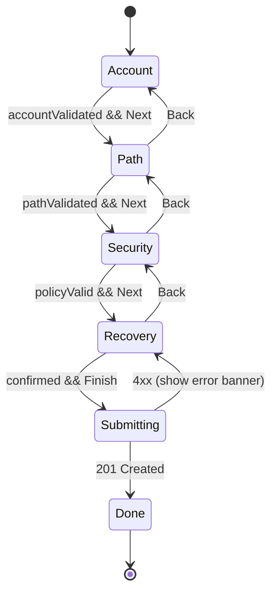
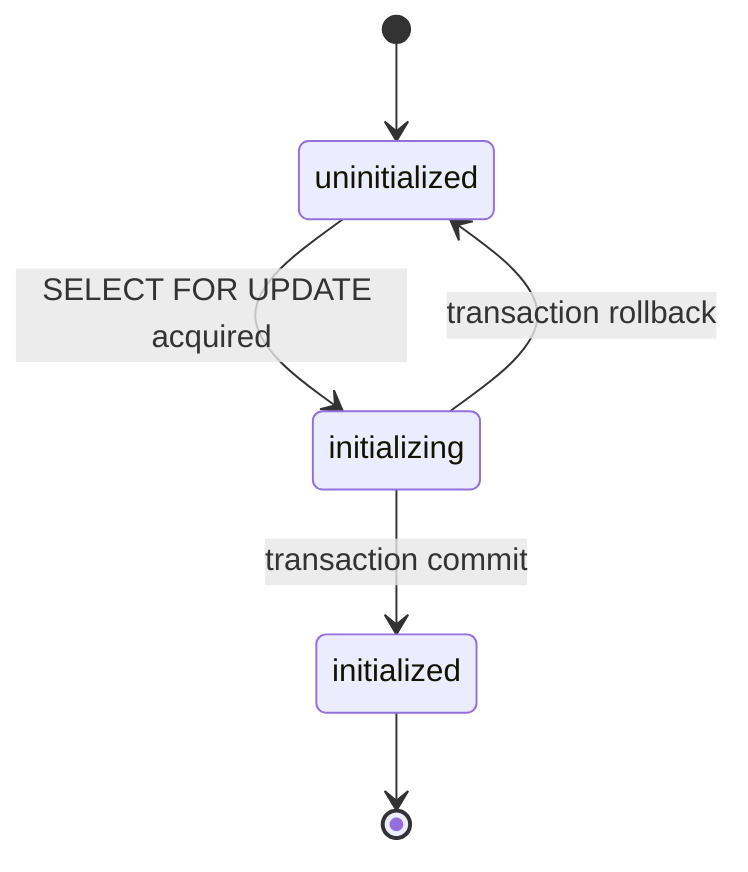

# Design Document — Admin Setup Wizard

## Overview

Tài liệu thiết kế cho **Admin Setup Wizard** trong LumiBase Studio. Tính năng cung cấp luồng cấu hình lần đầu cho instance, bao gồm tạo Bootstrap Admin, đặt Custom Admin Path (Hide Login pattern), và cấu hình Lockout/Anomaly Detection. Setup chỉ chạy được khi `system_state='uninitialized'`. Sau setup, Studio chỉ phục vụ tại Admin_Path đã chọn; mọi path mặc định trả 404 indistinguishable. Mọi requirement được trace tới component cụ thể trong các section dưới (xem §"Traceability" trong Architecture).

## Architecture

## 1. Tổng quan kiến trúc

Tính năng được chia thành ba lớp: **Studio (React)** — UI wizard và recovery; **CMS (Hono on Cloudflare Workers / Node)** — toàn bộ business logic và security guard; **Storage (Postgres + Drizzle ORM)** — persistence cho state, baseline, audit. Sliding-window counter dùng bảng Postgres làm nguồn sự thật, có cache in-memory tối ưu hot path.

```
┌────────────────────────────── Browser ──────────────────────────────┐
│  Studio SPA  (apps/studio)                                          │
│  ┌─────────────┐  ┌──────────────┐  ┌────────────────┐              │
│  │ /setup/*    │  │ /admin-path/*│  │ /recovery/*    │              │
│  │ Setup_Wizard│  │ AppShell     │  │ RecoveryFlow   │              │
│  └──────┬──────┘  └──────┬───────┘  └────────┬───────┘              │
│         │ TanStack Query / fetch                                    │
└─────────┼──────────────────┼─────────────────┼───────────────────── ┘
          ▼                  ▼                 ▼
┌──────────────────────── CMS (Hono) ─────────────────────────────────┐
│  request-id → audit-context → admin-path-guard → router             │
│                                                                     │
│  /api/v1/setup/*           → Setup_Service                          │
│  /api/v1/auth/login        → Login_Guard → Anomaly_Detector → auth  │
│  /api/v1/admin/security/*  → Recovery_Service / Unlock APIs         │
│  /api/v1/admin/security/audit-log/* → Audit_Logger query API        │
│                                                                     │
│  Background:  AuditRotator (cron)  •  NotificationDispatcher        │
└─────────┬───────────────────────┬──────────────────┬────────────────┘
          ▼                       ▼                  ▼
   Postgres (Drizzle)     GeoIP mmdb (file)   SMTP / Webhook target
   ───────────────────
   system_state · users · admin_backup_codes
   login_attempts · login_baselines
   audit_log · settings(login_security_policy)
```

Ba luồng request chính:

**Luồng A — Hoàn tất setup (atomic):** Studio gửi `POST /api/v1/setup/complete` chứa toàn bộ payload (account, admin path, lockout policy). CMS bắt row-lock trên `system_state`, validate, hash password + backup codes, insert/update trong cùng transaction Drizzle, sau commit mới phát Audit_Log `setup_completed` và phản hồi 201 với danh sách backup code plaintext (chỉ trả một lần). Nếu transaction rollback, mọi side-effect khác bị huỷ.

**Luồng B — Login với anomaly check:** Login_Guard middleware chạy trước handler `/auth/login`: kiểm `userLockedUntil` và `ipBlockedUntil`; nếu vượt qua, gọi handler verify password; nếu credentials hợp lệ, Anomaly_Detector tính `geoSubscore`, `timeSubscore`, `deviceSubscore` từ `login_baselines`; aggregate `score = max(...)` so ngưỡng và áp `anomalyAction`. Mọi nhánh ghi `login_attempts` + Audit_Log; reset counter khi success đầy đủ.

**Luồng C — Recovery qua backup code:** `POST /api/v1/admin/security/recover` rate-limit theo IP, hash backup code và quét `admin_backup_codes WHERE used_at IS NULL`, set `used_at`, xoá lockout, trả `adminPath` + `oneTimeUnlockToken` 15 phút. Mọi nhánh thất bại trả 401 generic sau random delay 200–500ms.

## 2. Tham chiếu requirements ↔ thiết kế (Traceability Matrix)

| Req | Tiêu đề ngắn | Section thiết kế chính |
|-----|--------------|------------------------|
| 1   | System state detection | §3 (`system_state`), §4 (`GET /setup/state`), §6 (Setup_Service), §11 (state machine) |
| 2   | Wizard access control | §5 (`SetupStateGate`, route layout), §4 (`/setup/state`, `/setup/capabilities`), §7 (Setup_Token) |
| 3   | Bootstrap admin | §3 (`users` extension), §4 (`/setup/complete`), §5 (StepAccount), §7 (PBKDF2) |
| 4   | Custom admin path | §4 (`/setup/complete`), §6 (Setup_Service path normalize), §7 (validation + secret handling) |
| 5   | Route guard | §6 (`adminPathGuard` middleware), §7 (constant-time compare, indistinguishable 404) |
| 6   | Lockout policy config | §3 (`settings`), §4 (`/setup/complete`), §5 (StepSecurity), §16 (round-trip) |
| 7   | User lockout | §3 (`users.lockedUntil`, `login_attempts`), §6 (LoginGuard), §10 (audit) |
| 8   | IP rate limit | §3 (`login_attempts.ip`), §6 (LoginGuard sliding window), §10 (audit) |
| 9   | Geo anomaly | §8 (geoSubscore, GeoIP mmdb), §3 (`login_baselines.countries`) |
| 10  | Time anomaly | §8 (timeSubscore, hourHistogram), §3 (`login_baselines.hour_histogram`) |
| 11  | Device anomaly | §8 (deviceSubscore, fingerprint pipeline), §3 (`login_baselines.device_fingerprints`) |
| 12  | Score aggregation | §8 (aggregate), §6 (LoginGuard action dispatch) |
| 13  | Notifications | §9 (NotificationDispatcher, channels, retry, rate-limit) |
| 14  | Recovery | §3 (`admin_backup_codes`), §4 (`/recover`, `/forgot-path`), §6 (RecoveryService), §7 (PBKDF2 backup, token expiry) |
| 15  | Audit log | §3 (`audit_log`), §10 (write path, retention, export) |
| 16  | Round-trip serialize | §6 (Setup_Service `serializeLockoutPolicy`/`parseLockoutPolicy`), §13 (property test) |

## Components and Interfaces

(Chi tiết components, services, và interfaces được trình bày ở các section §4 (API Contract), §5 (Frontend), §6 (Backend), §8 (Anomaly), §9 (Notification), §10 (Audit). Đây là entry-point trỏ đọc.)

## Data Models

## 3. Mô hình dữ liệu (Data Model)

Project hiện dùng **Drizzle ORM + Postgres** (`packages/database/src/schema/core.ts`). Bảng `users` đã tồn tại với cột `passwordHash`, `email`, `firstName`, `lastName`. Phần dưới mô tả các cột và bảng cần thêm. Migration đặt trong `packages/database/migrations/` theo pattern hiện tại.

### 3.1. Mở rộng `users` (Drizzle)

```ts
// packages/database/src/schema/core.ts
export const users = pgTable('users', {
  // ...existing columns...
  isBootstrap:           boolean('is_bootstrap').default(false).notNull(),
  lockedUntil:           timestamp('locked_until'),
  failedCount:           integer('failed_count').default(0).notNull(),
  failedCountWindowStart:timestamp('failed_count_window_start'),
}, (t) => ({
  bootstrapUnique: uniqueIndex('users_is_bootstrap_unique')
    .on(t.isBootstrap).where(sql`${t.isBootstrap} = true`), // partial index — tối đa 1 bootstrap
  emailLower: uniqueIndex('users_email_lower_unique')
    .on(sql`lower(${t.email})`),
  lockedUntilIdx: index('users_locked_until_idx').on(t.lockedUntil),
}));
```

### 3.2. `system_state`

```ts
export const systemState = pgTable('system_state', {
  id:             text('id').primaryKey().default('singleton'), // CHECK id='singleton'
  state:          text('state', { enum: ['uninitialized','initializing','initialized'] })
                    .default('uninitialized').notNull(),
  adminPath:      text('admin_path'),                       // null khi uninitialized
  setupTokenHash: text('setup_token_hash'),                 // sha256 hex; null sau init
  initializedAt:  timestamp('initialized_at'),
  updatedAt:      timestamp('updated_at').defaultNow().notNull(),
}, (t) => ({
  adminPathUnique: uniqueIndex('system_state_admin_path_unique').on(t.adminPath),
  singletonCheck:  check('system_state_singleton_chk', sql`${t.id} = 'singleton'`),
}));
```

Chỉ một row `id='singleton'`. Mọi truy cập setup mở row-lock `SELECT ... FOR UPDATE` để xử lý concurrency Req 1.7.

### 3.3. `admin_backup_codes`

```ts
export const adminBackupCodes = pgTable('admin_backup_codes', {
  id:           id(),
  userId:       text('user_id').notNull().references(() => users.id, { onDelete: 'cascade' }),
  codeHash:     text('code_hash').notNull(),     // pbkdf2$100000$<salt>$<hash>
  createdAt:    createdAt(),
  usedAt:       timestamp('used_at'),
  usedFromIp:   text('used_from_ip'),
}, (t) => ({
  userUnused: index('admin_backup_codes_user_unused_idx')
    .on(t.userId).where(sql`${t.usedAt} IS NULL`),
}));
```

### 3.4. `login_attempts` (sliding window source-of-truth + audit input)

```ts
export const loginAttempts = pgTable('login_attempts', {
  id:               id(),
  emailLower:       text('email_lower').notNull(),  // chuẩn hoá lowercase trước insert
  userId:           text('user_id').references(() => users.id, { onDelete: 'set null' }),
  ip:               text('ip').notNull(),
  userAgent:        text('user_agent'),
  countryCode:      text('country_code'),           // ISO-3166 alpha-2 hoặc null
  geoLookupStatus:  text('geo_lookup_status', { enum: ['ok','unavailable','timeout'] }),
  result:           text('result', { enum: ['success','fail'] }).notNull(),
  reason:           text('reason'),                 // invalid_credentials | account_locked | ip_blocked | anomaly_lock | mfa_required
  anomalyScore:     numeric('anomaly_score', { precision: 4, scale: 2 }),
  anomalyTriggered: boolean('anomaly_triggered').default(false).notNull(),
  baselineWarmup:   boolean('baseline_warmup').default(false).notNull(),
  createdAt:        createdAt(),
}, (t) => ({
  emailWindowIdx: index('login_attempts_email_window_idx').on(t.emailLower, t.createdAt),
  ipWindowIdx:    index('login_attempts_ip_window_idx').on(t.ip, t.createdAt),
}));
```

Retention: rotate cùng job với `audit_log` (>90 ngày → delete).

### 3.5. `login_baselines`

```ts
export const loginBaselines = pgTable('login_baselines', {
  userId:             text('user_id').primaryKey()
                        .references(() => users.id, { onDelete: 'cascade' }),
  countries:          jsonb('countries').default([]).notNull(),       // string[]
  hourHistogram:      jsonb('hour_histogram').default(Array(24).fill(0)).notNull(), // number[24]
  deviceFingerprints: jsonb('device_fingerprints').default([]).notNull(), // {fp:string, lastSeenAt:string}[] LRU
  successfulLogins:   integer('successful_logins').default(0).notNull(),
  updatedAt:          updatedAt(),
});
```

### 3.6. `audit_log`

```ts
export const auditLog = pgTable('audit_log', {
  id:           id(),
  timestamp:    timestamp('timestamp').defaultNow().notNull(),
  event:        text('event').notNull(),         // enum 15 giá trị từ Req 15.1
  actorEmail:   text('actor_email'),
  targetEmail:  text('target_email'),
  ip:           text('ip'),
  userAgent:    text('user_agent'),
  countryCode:  text('country_code'),
  metadata:     jsonb('metadata').default({}).notNull(), // ≤ 4KB serialized
  requestId:    text('request_id'),
}, (t) => ({
  tsIdx:    index('audit_log_ts_idx').on(t.timestamp),
  eventIdx: index('audit_log_event_idx').on(t.event, t.timestamp),
  actorIdx: index('audit_log_actor_idx').on(t.actorEmail, t.timestamp),
}));
```

### 3.7. `settings` — key `login_security_policy`

Project đã có module `routes/settings.ts`; sử dụng schema sẵn có (key/value JSON). Key dành riêng: `login_security_policy` lưu policy theo Req 6.3 dạng JSON canonical.

## 4. Hợp đồng API (API Contract)

Mọi response error theo envelope chuẩn dự án `{ errors: [{ code, message?, details? }] }`. Status code và rate-limit ghi rõ trong từng endpoint.

### 4.1. `GET /api/v1/setup/state` — Public
```ts
// 200 OK (latency P95 ≤ 500ms)
{ state: 'uninitialized' | 'initialized', requiresSetupToken: boolean }
// Rate limit: 60 req/min/IP. Response chỉ chứa hai field này.
```

### 4.2. `GET /api/v1/setup/capabilities` — Public, only when uninitialized
```ts
{ geoip: { available: boolean, source?: 'maxmind' }, smtp: { available: boolean } }
// 404 nếu state='initialized' (giống mọi /setup/* khác)
```

### 4.3. `POST /api/v1/setup/complete` — Public, only when uninitialized
```ts
// Request
{
  setupToken?: string,                       // bắt buộc nếu requiresSetupToken=true
  account: { email, password, firstName, lastName },
  adminPath: string,                          // dạng /<slug>
  policy: LockoutPolicy,                      // theo Req 6.3
}
// 201 Created
{
  user: { id, email, firstName, lastName },
  adminPath: string,
  backupCodes: string[],                      // 8 plaintext, chỉ trả một lần
  setupToken: null
}
// Errors: 400 VALIDATION_ERROR, 404 ALREADY_INITIALIZED, 409 SETUP_IN_PROGRESS,
//         422 với code chi tiết (PATH_PREDICTABLE, PATH_RESERVED, …)
// Idempotency: row-lock SELECT FOR UPDATE trên system_state — duplicate request thứ hai nhận 404/409.
// Timeout: transaction ≤ 10s; nếu vượt → rollback, state giữ uninitialized.
```

### 4.4. `POST /api/v1/auth/login` — Public (mở rộng route hiện tại)
```ts
{ email, password }
// 200 OK { token, user } — login OK, anomaly notify_only có thể đính kèm
// 401 INVALID_CREDENTIALS                          (response body + latency đồng nhất giữa email tồn tại / không)
// 423 ACCOUNT_LOCKED { retryAfterSeconds }
// 423 ANOMALY_LOCK
// 429 + Retry-After header (IP_BLOCKED)
// 401 MFA_REQUIRED                                  (chỉ khi MFA module được cài)
```

### 4.5. `POST /api/v1/admin/security/unlock-user` — Admin only
```ts
{ email: string }
// 200 OK { unlocked: true } | 401 UNAUTHENTICATED | 403 FORBIDDEN | 404 USER_NOT_FOUND
```

### 4.6. `POST /api/v1/admin/security/unblock-ip` — Admin only
```ts
{ ip: string }   // IPv4 hoặc IPv6
// 200 OK { unblocked: true } | 401 | 403 | 400 INVALID_IP
```

### 4.7. `POST /api/v1/admin/security/recover` — Public, rate-limit 3/IP/h
```ts
{ email: string, backupCode: string }
// 200 OK { adminPath, oneTimeUnlockToken }    (token TTL 15 phút, single-use)
// 401 — generic, 200–500ms random delay
// 429 RATE_LIMITED + Retry-After
```

### 4.8. `POST /api/v1/admin/security/forgot-path` — Public, rate-limit 3/IP/h
```ts
{ email: string }
// 200 OK { sent: true }                         // generic response, không phân biệt enum
// 429 RATE_LIMITED + Retry-After
```

### 4.9. `GET /api/v1/admin/security/audit-log` — Admin only
```
Query: ?event=&email=&from=&to=&cursor=&limit=    (limit 1–100, default 50; range ≤ 366 ngày)
200 OK { items: AuditLogEntry[], nextCursor: string|null }
401 | 403 | 400 INVALID_RANGE
P95 ≤ 2s
```

### 4.10. `GET /api/v1/admin/security/audit-log/export` — Admin only
```
Query: ?from=&to=&event=        (cap 100,000 rows / ≤ 366 ngày)
200 OK Content-Type: application/x-ndjson — streamed
401 | 403 | 413 EXPORT_TOO_LARGE
```

## 5. Thiết kế Frontend (Studio)

### 5.1. Routes mới (`apps/studio/src/router.tsx`)

Wizard và recovery routes phải nằm **bên ngoài** `rootRoute` mặc định (vì rootRoute hiện wrap AppShell). Tách thành cấu trúc layout-route:

```
rootRoute (no UI)
├── adminLayoutRoute (component: AppShell)             ← các module hiện có
│   ├── /  /content/...  /data-model/...  v.v.
└── publicLayoutRoute (component: BareLayout)          ← KHÔNG render AppShell
    ├── /setup           (SetupShell + SetupStateGate)
    │   ├── /setup/account
    │   ├── /setup/path
    │   ├── /setup/security
    │   ├── /setup/recovery
    │   └── /setup/done
    └── /recovery
        ├── /recovery/backup-code
        └── /recovery/forgot-path
```

`SetupStateGate` chạy `useQuery(['setup','state'])` trước khi render bất kỳ child nào: nếu `state='initialized'` → render component 404 cứng (không redirect, không leak Studio). Nếu `state='uninitialized' && requiresSetupToken && !validToken` → render `SetupTokenPrompt`. Nếu `5xx/network` → render `RetryUI` với nút "Thử lại".

### 5.2. Cây component (`apps/studio/src/modules/setup/`)

```
setup/
├── setup-layout.tsx          // BareLayout + ProgressIndicator (5 steps)
├── setup-state-gate.tsx      // gọi /setup/state, /setup/capabilities
├── setup-store.ts            // zustand store (đã có dep), persist:'sessionStorage'
├── steps/
│   ├── step-account.tsx      // email/password/firstName/lastName + zxcvbn meter
│   ├── step-path.tsx         // adminPath input + Generate Random + preview warning
│   ├── step-security.tsx     // preset chooser + 4 nhóm form + GeoIP warning
│   ├── step-recovery.tsx     // hiển thị 8 backup codes + checkbox xác nhận
│   └── step-done.tsx         // nhắc save adminPath + link tới Studio mới
├── schemas/
│   ├── account.ts            // Zod schema
│   ├── admin-path.ts         // Zod + normalize util
│   ├── policy.ts             // Zod khớp Req 6.3
│   └── index.ts
└── hooks/
    ├── use-setup-state.ts
    ├── use-setup-capabilities.ts
    └── use-complete-setup.ts // mutation + optimistic state
```

### 5.3. Quản lý trạng thái

- **Server state**: TanStack Query (đã sẵn). `staleTime: 30s` mặc định, `/setup/state` đặt `staleTime: 0` để gate luôn fresh.
- **Form state liên-bước**: dùng **Zustand** (đã trong deps) với middleware `persist` lưu vào `sessionStorage` key `lumibase.setup`. Lý do chọn Zustand: dự án đã import; persist middleware tránh mất state khi user F5; clear store sau khi `/setup/complete` thành công. Không lưu plaintext password vào sessionStorage — chỉ giữ `accountValid: boolean` và shadow form ephemeral trong React Hook Form local state.

### 5.4. Step state machine (Mermaid)



Deep-link guard (Req 3.11): khi user vào `/setup/security` mà `accountValid=false` hoặc `pathValid=false` → redirect về step thiếu sớm nhất.

### 5.5. Validation và UX

- Mỗi step có Zod schema co-located. Client validate ở submit + onBlur cho field critical.
- Password strength: lazy-load `zxcvbn` (~400KB) chỉ khi step Account mount để tránh ảnh hưởng bundle Studio chính. Show meter realtime; chặn submit khi `score < 3` (Req 3.7).
- Generate Random Path: gọi crypto API trên client (`crypto.getRandomValues`) chọn 1 word từ wordlist tĩnh (≥256 từ, đặt tại `apps/studio/src/modules/setup/wordlist.ts`) + 6 hex chars. Retry tối đa 8 lần nếu trùng blacklist client.
- Inline error: theo pattern `aria-invalid` + text bên dưới field, ID liên kết `aria-describedby` (khớp pattern access trong codebase hiện tại).
- Banner lỗi server: top-of-step với `role="alert"`.

### 5.6. i18n keys (`apps/studio/src/locales/en/setup.json`, `vi/setup.json`)

```
setup.title, setup.subtitle
setup.steps.account.title, setup.steps.account.fields.{email,password,confirmPassword,firstName,lastName}
setup.steps.path.title, setup.steps.path.warning, setup.steps.path.generate
setup.steps.security.preset.{standard,strict,lenient}
setup.steps.security.groups.{failedAttempts,geo,time,device,notifications}
setup.steps.recovery.title, setup.steps.recovery.confirmCheckbox
setup.steps.done.savePathReminder
setup.errors.{validation,server,network,initialized,token-required,token-invalid}
recovery.backupCode.{title,emailLabel,codeLabel,submit}
recovery.forgotPath.{title,emailLabel,sent}
```

## 6. Thiết kế Backend (CMS)

### 6.1. Module layout (mới)

```
apps/cms/src/
├── modules/
│   ├── setup/
│   │   ├── service.ts              // SetupService class
│   │   ├── policy-codec.ts         // serializeLockoutPolicy / parseLockoutPolicy
│   │   ├── path-validator.ts       // normalize + blacklist
│   │   └── routes.ts               // /api/v1/setup/*
│   ├── login-guard/
│   │   ├── middleware.ts           // gắn vào /auth/login
│   │   ├── counter.ts              // sliding window queries
│   │   └── ip-extract.ts           // CF-Connecting-IP → X-Forwarded-For → remote
│   ├── anomaly/
│   │   ├── detector.ts             // aggregate
│   │   ├── geo.ts                  // GeoIP lookup, timeout 2s
│   │   ├── time.ts                 // hour histogram check
│   │   ├── device.ts               // UA normalize + fingerprint
│   │   └── baseline-store.ts       // upsert login_baselines
│   ├── recovery/
│   │   ├── service.ts
│   │   └── routes.ts               // /admin/security/recover, /forgot-path
│   ├── audit/
│   │   ├── logger.ts               // sync write within 1s budget
│   │   ├── rotator.ts              // cron / scheduled trigger
│   │   └── routes.ts               // /admin/security/audit-log{,/export}
│   └── notifications/
│       ├── dispatcher.ts
│       ├── email-channel.ts
│       └── webhook-channel.ts      // HMAC-SHA256
└── middleware/
    └── admin-path-guard.ts         // mới — đặt sớm trong chain
```

### 6.2. Thứ tự middleware (cập nhật `apps/cms/src/index.ts`)

```
app.use('*', requestId)                 // sinh requestId, gắn vào ctx
app.use('*', auditContext)              // attach { ip, userAgent, requestId } vào ctx
app.use('*', adminPathGuard)            // (mới) chỉ check khi state='initialized' và path nằm trong scope Studio
// existing: db, tenant, rls, auth (per-route)
app.route('/api/v1/setup', setupRouter)              // KHÔNG qua auth
app.route('/api/v1/auth', authRouter)                // login route gắn loginGuardMiddleware riêng
app.route('/api/v1/admin/security', securityRouter)  // qua auth() role=admin trừ /recover, /forgot-path
```

### 6.3. Interface (chỉ ký, không impl)

```ts
interface SetupService {
  getState(): Promise<{ state: SystemStateValue; requiresSetupToken: boolean }>;
  getCapabilities(): Promise<{ geoip: { available: boolean }; smtp: { available: boolean } }>;
  complete(input: SetupCompleteInput, ctx: RequestContext):
    Promise<{ user: PublicUser; adminPath: string; backupCodes: string[] }>;
}

interface LoginGuard {
  precheck(email: string, ip: string): Promise<{ allow: true } | { allow: false; status: 423|429; body: ErrorEnvelope }>;
  onFailure(email: string, ip: string, reason: string): Promise<void>;
  onSuccess(userId: string, email: string, ip: string, attempt: LoginAttemptInsert): Promise<void>;
}

interface AnomalyDetector {
  geoSubscore(userId: string, ip: string, attempt: LoginAttemptInsert): Promise<Subscore>;
  timeSubscore(userId: string, now: Date): Promise<Subscore>;
  deviceSubscore(userId: string, userAgent: string, acceptLanguage: string): Promise<Subscore>;
  aggregate(scores: Subscore[]): { score: number; baselineWarmup: boolean };
}
type Subscore = { value: 0 | 1; baselineWarmup: boolean };

interface RecoveryService {
  recover(email: string, backupCode: string, ip: string):
    Promise<{ adminPath: string; oneTimeUnlockToken: string } | null>;
  forgotPath(email: string, ip: string): Promise<void>;
  validateUnlockToken(token: string): Promise<{ userId: string } | null>;
}

interface AuditLogger {
  write(entry: Omit<AuditLogEntry,'id'|'timestamp'>): Promise<void>;
  query(filter: AuditFilter): Promise<{ items: AuditLogEntry[]; nextCursor: string|null }>;
  exportNdjson(filter: AuditFilter, sink: WritableStreamDefaultWriter): Promise<void>;
  rotate(): Promise<{ deleted: number }>;
}

interface NotificationDispatcher {
  dispatch(event: SecurityEvent, channels: NotificationChannel[], payload: NotificationPayload): Promise<void>;
}
```

### 6.4. Sliding-window counter

Self-hosted LumiBase mặc định **không có Redis**. Thiết kế: `LoginGuard.counter` dùng query trên `login_attempts` index `(email_lower, created_at)` và `(ip, created_at)`:

```sql
-- userFailedCount trong cửa sổ trượt
SELECT count(*) FROM lumibase_login_attempts
WHERE email_lower = $1 AND result='fail'
  AND created_at >= now() - ($2 || ' seconds')::interval;
```

Query trả nhanh nhờ index range scan (≤ 5ms với <100k rows/giờ). Cleanup: cùng job rotate `audit_log` xoá `login_attempts` >90 ngày. Opt-in Redis: nếu env `LUMIBASE_REDIS_URL` được set, counter wrapper chuyển sang INCR + EXPIRE; thiết kế interface `CounterStore` để thay thế minh bạch.

### 6.5. Transaction cho `/setup/complete`

```
begin transaction
  acquire row lock: SELECT * FROM lumibase_system_state WHERE id='singleton' FOR UPDATE
  if state != 'uninitialized': rollback; return 404 ALREADY_INITIALIZED
  set state='initializing', updatedAt=now()
  validate input (account, adminPath, policy)
  hash password (PBKDF2 helper từ apps/cms/src/services/auth/password.ts — extract từ routes/auth.ts)
  insert users {..., isBootstrap: true}
  insert admin_backup_codes × 8 (mỗi code: per-record salt 16B, PBKDF2 100k)
  upsert settings.login_security_policy = serializeLockoutPolicy(policy)
  update system_state set state='initialized', adminPath=normalized, initializedAt=now(),
                          setupTokenHash=null
commit
// post-commit, ngoài transaction:
auditLogger.write({ event: 'setup_completed', ... })
notificationDispatcher.dispatch (best-effort)
return 201 { user, adminPath, backupCodes: plaintext[] }
```

Drizzle hỗ trợ `db.transaction(async (tx) => {...})`. Nếu commit fail hoặc bất kỳ insert fail → rollback toàn bộ; không phát Audit_Log (Req 1.5).

### 6.6. Concurrency

Row lock trên `system_state.id='singleton'` đảm bảo single-winner (Req 1.7). Request thứ hai đến đồng thời sẽ block trên lock; khi unlock thấy `state='initialized'` → trả 404. Nếu lock chờ >5s → trả 409 `SETUP_IN_PROGRESS`.

## 7. Kiến trúc bảo mật (Security Architecture)

### 7.1. Constant-time path comparison

`adminPathGuard` không dùng `===` để compare. Dùng helper:

```ts
async function pathEqualsConstantTime(a: string, b: string): Promise<boolean> {
  const enc = new TextEncoder();
  // Pad cả hai về 64 byte fixed (max admin path 64 ký tự + leading '/')
  const pad = (s: string) => {
    const buf = new Uint8Array(64);
    buf.set(enc.encode(s.slice(0, 64)));
    return buf;
  };
  const A = pad(a), B = pad(b);
  let diff = (a.length ^ b.length); // length-leak protection: vẫn compare 64 byte
  for (let i = 0; i < 64; i++) diff |= (A[i]! ^ B[i]!);
  return diff === 0;
}
```

Length-padding tránh leak độ dài admin path qua thời gian compare. Đo kiểm: §13 timing test.

### 7.2. Indistinguishable 404 (Req 5.1, 5.7)

Khi path nằm trong `Default_Admin_Paths` nhưng không khớp `adminPath`, guard:
- trả cùng status 404, cùng body `{ errors: [{ code: 'NOT_FOUND' }] }`,
- cùng tập header (Content-Type: application/json, không có cache header riêng, không X-Powered-By),
- chạy một query DB no-op (`SELECT 1`) trước khi trả response để latency profile khớp với route hợp lệ — đo bằng integration test §13.

### 7.3. Secret handling

| Secret | Vị trí | Quy tắc |
|--------|--------|---------|
| `adminPath` | `system_state.admin_path` (DB) | Không bao giờ ghi vào client bundle. Vite config kiểm: tuyệt đối không có `VITE_ADMIN_PATH`. Studio fetch path qua `/api/v1/me/admin-path` (auth required) sau khi login để hiển thị bookmark. |
| `setupToken` | sinh lúc startup khi `state=uninitialized && LUMIBASE_REQUIRE_SETUP_TOKEN=true`, in stdout đúng một lần, lưu hash sha256 vào `setup_token_hash` | Compare bằng constant-time hash compare. Hết hạn ngay khi state→initialized. |
| `password` | hash PBKDF2-SHA256 100k iter, salt 16B | Không log, không trả response, không debug endpoint. Code review check: grep `password|passwordHash` trong logger calls. |
| `backupCode` | hash PBKDF2 per-code salt 16B | Plaintext chỉ trả một lần ở response `/setup/complete`, sau đó không thể recover. |
| `recoveryToken` / `oneTimeUnlockToken` | sinh CSPRNG 32 byte → base64url; lưu hash sha256 + `expiresAt` | Token gốc gửi qua email/response duy nhất một lần. |

### 7.4. HMAC webhook signing

```
X-LumiBase-Signature: sha256=<hex>
X-LumiBase-Timestamp: <unix-seconds>
body = canonical JSON
hex = HMAC_SHA256(secret, `${timestamp}.${body}`).toString('hex')
```

Bao gồm timestamp trong payload signed để chống replay (receiver từ chối skew >5 phút). Secret rotate qua `Lockout_Policy.webhookSecret` field trong settings; rotate đặt `webhookSecretPrev` 24h grace để zero-downtime.

### 7.5. Threat model summary

| Threat | Mitigation | Req |
|--------|------------|-----|
| Setup wizard bị chạy lại để cướp quyền | Row lock + `is_bootstrap` partial unique index | 1, 2 |
| Bot dò `/admin` | Custom admin path + indistinguishable 404 + constant-time compare | 4, 5 |
| Brute-force password trên 1 user | User lockout sliding-window | 7 |
| Credential stuffing từ 1 IP | IP rate limit | 8 |
| Compromise credential từ vùng khác | Geo anomaly + alert | 9, 13 |
| Compromise credential dùng giờ khác | Time anomaly + alert | 10, 13 |
| Token leak sang máy khác | Device fingerprint anomaly | 11, 13 |
| User enumeration | Identical body + latency cho `INVALID_CREDENTIALS` | 7.5 |
| Backup code brute-force | Hash + rate limit 3/IP/h | 14.8 |
| Replay webhook | Timestamp-in-signature, 5 phút skew | 13 |
| Audit tamper | Append-only writes, no UPDATE/DELETE từ API (chỉ rotator job) | 15 |

## 8. Phát hiện anomaly (Anomaly Detection Design)

### 8.1. Geo subscore

- Library: `maxmind` (MMDB reader, MIT license, ~30KB) — **flag**: GeoLite2-Country.mmdb từ MaxMind cần EULA và API key download. Triển khai khuyến nghị: provision file vào volume `/var/lib/lumibase/geoip/GeoLite2-Country.mmdb`; CMS đọc lazy ở startup; nếu thiếu → `geoip.available=false`, `geoSubscore=0`, `geoLookupStatus='unavailable'`.
- Timeout: lookup MMDB là sync, in-process; "timeout 2 giây" trong Req 9.1 áp cho cả Promise wrapper trong trường hợp dùng external service thay thế (e.g. ip-api.com nếu thay).
- Private/loopback (RFC1918 + ::1 + 127.0.0.0/8): skip lookup, `geoLookupStatus='unavailable'`.
- Baseline cap 50 country/user (Req 9.6).

### 8.2. Time subscore

- `hourHistogram: number[24]` lưu UTC.
- Trigger chỉ khi `successfulLogins >= 10` (Req 10.4).
- `totalLogins = sum(hourHistogram)` derive lại để test reproducible.
- Update atomic: dùng Drizzle SQL `UPDATE login_baselines SET hour_histogram = jsonb_set(hour_histogram, '{<h>}', (COALESCE(hour_histogram->><h>::int,0)+1)::text::jsonb), successful_logins=successful_logins+1`.

### 8.3. Device subscore

```ts
function normalizeUA(ua: string): string {
  return ua
    .slice(0, 1024)               // Req 11: bound length
    .toLowerCase()
    .replace(/\b\d+(\.\d+)+\b/g, '#') // strip version digits
    .replace(/\s+/g, ' ')             // collapse whitespace
    .trim();
}
function fingerprint(ua: string, acceptLanguage: string): string {
  const input = `${normalizeUA(ua)}|${acceptLanguage.slice(0, 64).toLowerCase()}`;
  const digest = sha256(input);
  return digest.slice(0, 16); // 64-bit truncate
}
```

UA missing/empty → `deviceLookupStatus='unavailable'`, subscore 0 (không đánh dấu warmup). LRU cap 20 (Req 11.5): chứa `{fp, lastSeenAt}[]`; khi push mới mà len=20 → drop entry có `lastSeenAt` cũ nhất.

Timing budgets: fingerprint ≤ 100ms, subscore assignment ≤ 50ms (đo bằng `performance.now()` trong unit test).

### 8.4. Aggregation

```ts
function aggregate(g: Subscore, t: Subscore, d: Subscore) {
  const baselineWarmup = g.baselineWarmup || t.baselineWarmup || d.baselineWarmup;
  const score = Math.max(g.value, t.value, d.value); // 0 hoặc 1, sau đó → 0.00 hoặc 1.00
  return { score: Number(score.toFixed(2)), baselineWarmup };
}
```

Khi cả 3 detector tắt → `score = 0`, không trigger action. Khi `baselineWarmup=true` → bỏ qua kiểm threshold (Req 12.5).

### 8.5. Alert path

Sau aggregate, nếu `score >= threshold && !baselineWarmup`:
- `notify_only`: cho phép login, set `anomaly_triggered=true` trong `login_attempts`, dispatch event `anomaly_triggered` (≤ 5s budget, async non-blocking).
- `lock`: trả 423, set `users.lockedUntil = now() + userLockoutDurationSeconds`, audit `anomaly_lock`, dispatch event.
- `require_mfa`: trả 401 `MFA_REQUIRED`, không phát JWT, audit `mfa_required`.

## 9. Thiết kế thông báo (Notification Design)

### 9.1. Channel abstraction

```ts
interface NotificationChannel {
  readonly name: 'email' | 'webhook';
  send(payload: NotificationPayload): Promise<{ ok: boolean; error?: string }>;
}
```

### 9.2. EmailChannel

- Library: **nodemailer** (~80KB, MIT). **Flag dependency add** vào `apps/cms/package.json` — chưa có. Trên Cloudflare Workers env, nodemailer không chạy — cần adapter `mailchannels` (Cloudflare's email API) khi `runtime='cloudflare'`. Thiết kế: `EmailChannelFactory.fromEnv()` trả về `NodemailerChannel` cho self-hosted Node, `MailchannelsChannel` cho Workers.
- Subject: `[LumiBase Security] <event_code>` (ví dụ `[LumiBase Security] anomaly_triggered`).
- Body template (text + HTML), substitution variables: `{timestamp, email, ip, country, userAgent, anomalyScore, recoveryUrl}`. Không bao giờ inject password hash hay token gốc.

### 9.3. WebhookChannel

- Hono fetch tới `webhookUrl` với header HMAC theo §7.4.
- Timeout 10s. Status 2xx = success, ngược lại = retry.

### 9.4. Retry queue

In-process queue (không cần dependency mới). Mỗi event tạo `DispatchTask` với `attempts: 0`, push vào array `pending`. Worker tick mỗi 250ms: với mỗi task chưa đến `nextAttemptAt`, skip; ngược lại gọi `channel.send`, nếu fail tăng `attempts`, set `nextAttemptAt = now + 1000 * 2^attempts` (1s/2s/4s), drop sau 3 lần. Mỗi drop ghi audit `notification_delivery_failed`. **Flag**: trên Cloudflare Workers không có long-running process; cần dùng `ctx.waitUntil(retryWithBackoff(...))` cho mỗi event và chấp nhận giới hạn worker execution (30s). Self-hosted Node có thể chạy worker nền dài hơn.

### 9.5. Rate-limiting `(event, email)`

Map in-memory `Map<string, number>` key = `${event}:${emailLower}`, value = timestamp lần cuối dispatch. TTL 60s (Req 13.5). Eviction: lazy — kiểm khi insert mới, nếu key cũ >60s thì xoá. Khi rate-limit hit, drop notification và ghi audit `notification_rate_limited` (rõ ràng, không silent drop).

## 10. Thiết kế audit log

### 10.1. Write path

`AuditLogger.write` chạy `INSERT INTO lumibase_audit_log` đồng bộ trong handler hoàn tất transaction nghiệp vụ chính. Budget 1s; nếu DB write fail (rất hiếm), fallback `console.error` JSON structured `{ level:'error', source:'audit-fallback', entry: {...} }` để log aggregator có thể replay. Audit không nên block flow login (theo Req 13.4 cũng vậy với notification).

Mọi giá trị nhạy cảm mask: `passwordHash → null`, `setupToken → sha256(token).slice(0,8)`, `backupCode → sha256(code).slice(0,8)`, `recoveryToken → sha256(token).slice(0,8)`. Helper `maskSensitive(metadata: object)` chạy trước insert.

### 10.2. Retention rotation

Job `auditRotator.rotate()` chạy:
- Cron mỗi 1h (cron syntax `0 * * * *`) — self-hosted dùng `node-cron` hoặc OS cron gọi `lumibase audit:rotate`.
- Hoặc trigger khi `count(*) > 10,000` từ middleware audit-context (best-effort, throttle 1/h).

```sql
DELETE FROM lumibase_audit_log WHERE timestamp < now() - ($retentionDays || ' days')::interval;
DELETE FROM lumibase_login_attempts WHERE created_at < now() - ($retentionDays || ' days')::interval;
```

`LUMIBASE_AUDIT_RETENTION_DAYS` default 90, range 1–3650.

### 10.3. Query API

Cursor-based pagination: cursor = base64(`${timestamp_iso}|${id}`). Filter: validate `event` enum, `email` lowercase normalize, `from`/`to` ≤ 366 ngày. Query dùng index `(timestamp)` hoặc `(event, timestamp)` tuỳ filter. Budget P95 ≤ 2s.

### 10.4. Export NDJSON streaming

Hono `c.body(new ReadableStream(...))` với pull-based reader query DB theo batch 500 row, JSON.stringify từng row + `\n`. Cap 100,000 rows/export, 366 ngày range; vượt → 413.

## 11. State machine

### 11.1. `system_state.state`



`initializing` là trạng thái transient chỉ tồn tại trong scope transaction. Request thứ hai khi gặp `initializing` → block trên lock; khi unlock thấy `initialized` → 404; thấy `uninitialized` (rollback case) → có thể thử lại.

### 11.2. Wizard step machine

Đã trình bày §5.4. Deep-link guard logic chi tiết:

```ts
function guardStep(target: Step, store: SetupStore): Redirect | null {
  if (target === 'path' && !store.accountValid)         return redirect('account');
  if (target === 'security' && !store.pathValid)        return redirect('path');
  if (target === 'recovery' && !store.policyValid)      return redirect('security');
  if (target === 'done' && !store.completed)            return redirect('account');
  return null;
}
```

## Error Handling

## 12. Xử lý lỗi (Error Handling)

### 12.1. Error code taxonomy

| Code | HTTP | Khi dùng |
|------|------|---------|
| `NOT_FOUND` | 404 | route không tồn tại; setup endpoint sau khi initialized |
| `ALREADY_INITIALIZED` | 404 | chính xác hơn cho `/setup/complete` race lose |
| `SETUP_IN_PROGRESS` | 409 | concurrent setup, lock chờ >5s |
| `VALIDATION_ERROR` | 400 | Zod parse fail; chi tiết trong `errors[].details` |
| `PATH_PREDICTABLE` | 422 | adminPath ∈ Default_Admin_Paths |
| `PATH_RESERVED` | 422 | adminPath conflict /api, /setup, ... |
| `INVALID_CREDENTIALS` | 401 | login fail |
| `ACCOUNT_LOCKED` | 423 | userLockedUntil > now |
| `ANOMALY_LOCK` | 423 | anomaly action='lock' |
| `IP_BLOCKED` | 429 | với header `Retry-After` |
| `MFA_REQUIRED` | 401 | placeholder, MFA chưa cài |
| `RATE_LIMITED` | 429 | recovery endpoints, setup state |
| `INVALID_BACKUP_CODE` | 401 | recover fail (generic body, không tiết lộ field nào sai) |
| `RECOVERY_TOKEN_EXPIRED` | 401 | token >30 phút hoặc đã used |
| `EXPORT_TOO_LARGE` | 413 | audit export vượt cap |
| `INVALID_RANGE` | 400 | from/to >366 ngày hoặc đảo ngược |

### 12.2. Standard envelope

```ts
{ errors: [{ code: string, message?: string, details?: unknown }] }
```

Đã thống nhất với `apps/cms/src/routes/auth.ts`.

### 12.3. Degraded mode

| Subsystem | Khi không khả dụng | Hành vi |
|-----------|---------------------|---------|
| GeoIP mmdb | file thiếu / load fail | `geo.available=false`, `geoSubscore=0`, status `unavailable`, không update country baseline. Wizard hiển thị warning ở step Security. |
| SMTP | `LUMIBASE_SMTP_URL` chưa set | `email` channel skip, audit `notification_channel_unavailable`. Forgot-path vẫn trả 200 generic. |
| Webhook URL | chưa set trong policy | `webhook` channel skip silent. |
| Tất cả notification channel cùng down | event vẫn được audit log; login flow không bị block. |

## Testing Strategy

## 13. Chiến lược kiểm thử (Testing Strategy)

### 13.1. Unit tests

- `apps/cms/src/modules/setup/__tests__/policy-codec.test.ts` — round-trip property test với `fast-check` (đã trong devDeps): `forAll(validPolicy, p => parseLockoutPolicy(serializeLockoutPolicy(p)) deepEqual p)`.
- `apps/cms/src/modules/setup/__tests__/path-validator.test.ts` — bảng input/expected cho regex, blacklist, normalization, edge cases (whitespace, control chars).
- `apps/cms/src/modules/anomaly/__tests__/{geo,time,device}.test.ts` — fixture user với baseline biết trước, assert subscore.
- `apps/cms/src/modules/login-guard/__tests__/counter.test.ts` — sliding window correctness với time-mock.

### 13.2. Integration tests

- `apps/cms/src/__tests__/setup-flow.integration.test.ts` — full happy path (POST /complete) + verify Audit_Log + verify subsequent /setup/state returns initialized.
- Concurrent setup: spawn 5 promises cùng gọi /complete; assert chính xác 1 thắng, 4 còn lại nhận 404 hoặc 409.
- Lockout end-to-end: 5 fail attempts → 423; success sau lockout duration → 200 + counter reset.
- Recovery end-to-end: lock user → recover với backup code → unlock + adminPath returned.

### 13.3. Security / timing tests

- `path-compare.timing.test.ts`: 10,000 iteration đo `pathEqualsConstantTime` cho cặp diff-at-pos-1 vs diff-at-pos-63; assert standard deviation chênh lệch < 1ms.
- `404-indistinguishable.test.ts`: gửi 500 req tới valid Default_Admin_Path không match vs random path không match; đo latency p50/p95; assert delta ≤ 5ms.
- `user-enum.test.ts`: 500 fail login với email tồn tại vs email random; assert response body byte-equal và latency p95 delta ≤ 50ms.

### 13.4. Load test (k6)

`apps/cms/k6/login-brute-force.js`: simulate 50 VU spam `/auth/login` với password sai; assert IP bị block đúng sau N attempts; throughput không degrade route khác.

### 13.5. Property test

Đã nêu §13.1 cho policy codec. Bổ sung: `adminPathNormalize` property — `normalize(normalize(x)) === normalize(x)` (idempotent).

## Correctness Properties

Các thuộc tính bất biến (invariant) phải đúng trong mọi trường hợp.

### Property 1: Single Bootstrap Admin
Tối đa một row trong `users` có `is_bootstrap=true` tại mọi thời điểm (enforced bằng partial unique index `users_is_bootstrap_unique`).

**Validates: Requirements 1.5, 3.1**

### Property 2: State Monotonicity
`system_state` chuyển `uninitialized → initialized` đúng một lần, không thể quay lại trừ khi reset DB hoàn toàn.

**Validates: Requirements 1.2, 1.3, 1.4, 1.5**

### Property 3: Atomic Setup
Nếu transaction `/setup/complete` rollback, không có Audit_Log entry nào ghi `setup_completed` được phát ra. Mọi side-effect (notification, audit) phát sau commit thành công.

**Validates: Requirements 1.5, 1.7, 6.8**

### Property 4: Backup Code Single-Use
Với mọi row trong `admin_backup_codes`, `used_at` là monotonic (NULL → timestamp), không bao giờ revert.

**Validates: Requirements 14.4, 14.7**

### Property 5: Round-Trip Serialization
`parseLockoutPolicy(serializeLockoutPolicy(p)) deepEqual p` cho mọi `p` hợp lệ. Property test với fast-check.

**Validates: Requirements 16.1, 16.2, 16.3**

### Property 6: Constant-Time Path Compare
Timing variance giữa hai cặp diff-position bất kỳ ≤ 1ms qua 1,000 đo.

**Validates: Requirements 5.7**

### Property 7: 404 Indistinguishability
Latency p95 delta ≤ 5ms giữa "Default_Admin_Path không khớp" và "random path không tồn tại".

**Validates: Requirements 5.1, 5.6**

### Property 8: No-Enumeration on Login Fail
Response body byte-equal và latency p95 delta ≤ 50ms giữa email tồn tại và email không tồn tại trên login fail.

**Validates: Requirements 7.5**

### Property 9: Anomaly Score Bound
`anomalyScore ∈ {0.00, 1.00}` với chính xác 2 chữ số thập phân.

**Validates: Requirements 12.1**

### Property 10: Audit Immutability
API không expose UPDATE/DELETE trên `audit_log`; chỉ rotator job xoá theo retention policy.

**Validates: Requirements 15.1, 15.5**

### Property 11: Path Normalize Idempotent
`normalizeAdminPath(normalizeAdminPath(x)) === normalizeAdminPath(x)` cho mọi input `x`.

**Validates: Requirements 4.8**

### Property 12: Sliding Window Correctness
Counter cho `email`/`ip` trong cửa sổ `lockoutWindowSeconds` luôn = `count(login_attempts WHERE result='fail' AND created_at >= now() - window)`.

**Validates: Requirements 7.1, 7.2, 8.1, 8.2**

## 14. Kế hoạch triển khai từng bước (rollout sketch)

Phân cụm cho tương lai khi viết tasks.md:

- **Phase A — Foundation**: schema migrations (system_state, users extensions, audit_log, settings); shared password helper extract; `GET /setup/state`, `GET /setup/capabilities`, `POST /setup/complete` (chưa có lockout); Studio: SetupStateGate, StepAccount, StepPath, StepDone routes.
- **Phase B — Admin Path Guard**: `adminPathGuard` middleware, constant-time compare, 404 indistinguishable, latency parity tests; `GET /me/admin-path` endpoint cho Studio fetch path post-login.
- **Phase C — Lockout core**: `login_attempts` table, LoginGuard middleware, user lockout + IP rate limit; admin unlock APIs; StepSecurity (failed-attempt fields chỉ).
- **Phase D — Anomaly subscores**: `login_baselines` table, geo/time/device modules, aggregate, action dispatch (notify_only); StepSecurity (anomaly fields).
- **Phase E — Notifications + Recovery**: NotificationDispatcher, EmailChannel, WebhookChannel, retry queue; admin_backup_codes table, /recover, /forgot-path; StepRecovery; recovery routes Studio.
- **Phase F — Audit log + Export**: AuditLogger query API, NDJSON export, retention rotator job; Activity-page extension hiển thị audit cho admin.

## 15. Câu hỏi mở (Open Questions)

1. **DB target**: project hiện neo Drizzle + Postgres (`packages/database/src/schema/core.ts` dùng `pgTable`). Confirm setup spec target Postgres only, hay cần fallback SQLite cho local dev? (Anh hưởng partial unique index syntax.)
2. **Redis**: có sẵn sàng làm dependency optional không? Nếu yes, viết `CounterStore` interface cho cả Postgres và Redis ngay từ Phase C; nếu no, cố định Postgres.
3. **GeoIP source**: MaxMind GeoLite2 yêu cầu account + EULA. Confirm cách phân phối file: docker volume mount? Init container download lúc start? Hay support external service (ip-api.com, ipinfo.io) qua adapter? — quyết định trước Phase D.
4. **SMTP**: dự án **chưa có mailer**. Add `nodemailer` cho self-hosted + adapter Mailchannels cho Cloudflare Workers? Hay yêu cầu user cấu hình external service (Postmark/Resend) qua webhook-only? — quyết định trước Phase E.
5. **Studio serving**: Studio assets được CMS serve hay deployed riêng (CDN)? Nếu serve riêng, `adminPathGuard` chỉ áp ở reverse proxy / edge (Cloudflare Worker route) — cần Worker config riêng. Nếu CMS serve, guard đặt trong Hono app như §6.2.
6. **Edge runtime**: notification retry queue và audit rotator phụ thuộc long-running process; trên Cloudflare Workers cần Durable Objects hoặc Cron Triggers. Confirm trước Phase E/F: target runtime chính là Workers hay Node self-hosted?
7. **MFA roadmap**: `require_mfa` action được giữ chỗ nhưng disabled. Có phải Phase G (sau spec này) sẽ bổ sung TOTP/WebAuthn? Nếu có, schema `users.tfa` (đã có jsonb) sẽ extend ra sao?
8. **Multi-tenancy**: project có `sites` table (multi-site). Setup wizard này áp dụng instance-wide (bootstrap admin = super-admin), không gắn `siteId`. Confirm intent: bootstrap admin có truy cập mọi site theo mặc định, hay là admin của site default duy nhất?
9. **Wordlist**: dùng wordlist gì cho Generate Random Path (BIP39? EFF wordlist?)? Cần là asset tĩnh không gây lo ngại license.
10. **i18n coverage**: chỉ EN/VI hay phải khớp full locale set hiện hữu của Studio? — quyết định trong Phase A.
