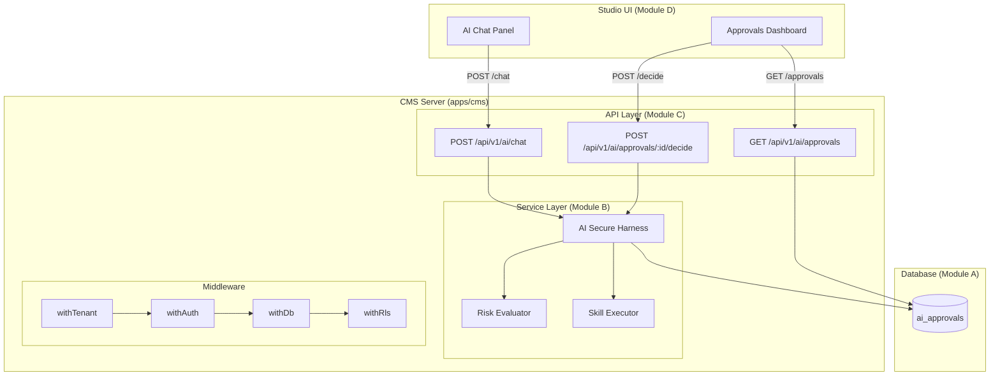
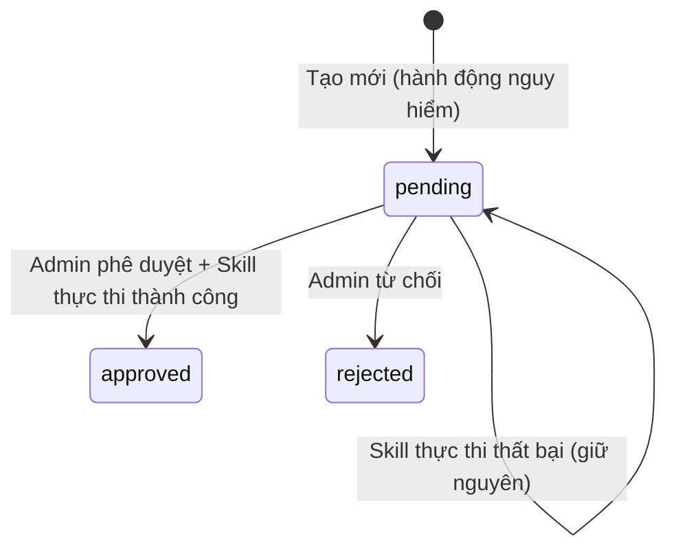

# Tài liệu Thiết kế: AI-First CMS Engine

## Overview

AI-First CMS Engine là hệ thống cho phép AI Agent tương tác an toàn với Lumibase CMS thông qua cơ chế Human-in-the-Loop (HITL). Hệ thống bao gồm 4 module chính:

- **Module A**: Database schema (`ai_approvals` table) — lưu trữ bản ghi phê duyệt
- **Module B**: AI Secure Harness — lớp điều phối an toàn kiểm tra quyền hạn, đánh giá rủi ro
- **Module C**: AI HTTP API Routes — cổng giao tiếp HTTP cho Studio UI
- **Module D**: Studio UI — giao diện chat AI và bảng phê duyệt

Luồng xử lý chính:
1. Quản trị viên gửi tin nhắn qua AI Chat Panel
2. API phân tích ý định (intent) → xác định Skill + arguments
3. AI Harness kiểm tra quyền hạn và đánh giá rủi ro
4. Nếu an toàn → thực thi trực tiếp; nếu nguy hiểm → tạo Approval_Record chờ duyệt
5. Quản trị viên phê duyệt/từ chối qua Approvals Dashboard
6. Sau phê duyệt → Harness thực thi Skill với arguments đã lưu

## Architecture



### Quyết định kiến trúc

1. **Tái sử dụng middleware hiện có**: AI routes được mount trong `api` sub-app đã có sẵn `withTenant`, `withAuth`, `withDb`, `withRls` — đảm bảo multi-tenancy và xác thực tự động.
2. **Harness là stateless service**: Mỗi request tạo instance mới của `AISecureHarness` với `db` và `siteId` từ context — không cần singleton hay dependency injection phức tạp.
3. **Risk evaluation dựa trên rules tĩnh**: Sử dụng quy tắc đơn giản (capability `schema:write` hoặc skill name bắt đầu bằng `delete`) thay vì ML model — dễ kiểm thử và dự đoán.
4. **Schema mới trong file riêng**: Tạo `packages/database/src/schema/ai.ts` thay vì thêm vào `platform.ts` — giữ mỗi file dưới 300 LOC theo quy ước dự án.

## Components and Interfaces

### Module A: Database Schema

```typescript
// packages/database/src/schema/ai.ts
import { pgTable, text, timestamp, jsonb, index } from 'drizzle-orm/pg-core';
import { nanoid } from 'nanoid';
import { sites, users } from './core';

export const aiApprovals = pgTable(
  'ai_approvals',
  {
    id: text('id').$defaultFn(() => nanoid()).primaryKey(),
    siteId: text('site_id')
      .notNull()
      .references(() => sites.id, { onDelete: 'cascade' }),
    agentName: text('agent_name').default('lumibase-copilot').notNull(),
    skillName: text('skill_name').notNull(),
    arguments: jsonb('arguments').default({}).notNull(),
    status: text('status').default('pending').notNull(),
    context: text('context'),
    createdAt: timestamp('created_at').defaultNow().notNull(),
    decidedAt: timestamp('decided_at'),
    decidedBy: text('decided_by').references(() => users.id, { onDelete: 'set null' }),
  },
  (t) => ({
    siteStatusIdx: index('ai_approvals_site_status_idx').on(t.siteId, t.status),
  }),
);
```

### Module B: AI Secure Harness Service

```typescript
// apps/cms/src/services/ai-harness.ts

export interface SkillDefinition {
  name: string;
  description: string;
  requiredCapabilities: string[];
  handler: (args: Record<string, unknown>) => Promise<unknown>;
}

export interface HarnessExecutionResult {
  status: 'executed' | 'pending_approval' | 'denied';
  data?: unknown;
  approvalId?: string;
  message?: string;
}

export interface AISecureHarnessConfig {
  db: Database;
  siteId: string;
}

export class AISecureHarness {
  constructor(private config: AISecureHarnessConfig) {}

  /** Đánh giá và thực thi skill */
  async execute(
    skillName: string,
    args: Record<string, unknown>,
    userCapabilities: string[],
    contextMessage?: string,
  ): Promise<HarnessExecutionResult>;

  /** Thực thi sau phê duyệt */
  async executeApproved(
    approvalId: string,
    userId: string,
  ): Promise<HarnessExecutionResult>;

  /** Từ chối approval */
  async rejectApproval(
    approvalId: string,
    userId: string,
  ): Promise<void>;
}
```

**Phương thức nội bộ:**

- `validateSkill(skillName)`: Kiểm tra skill có trong CORE_SKILLS
- `checkCapabilities(skill, userCapabilities)`: Kiểm tra quyền hạn (hỗ trợ wildcard `*`)
- `evaluateRisk(skill, skillName)`: Phân loại nguy hiểm/an toàn
- `runSkill(skillName, args)`: Thực thi skill với error handling và timeout 30s

### Module C: AI HTTP API Routes

```typescript
// apps/cms/src/routes/ai.ts
import { Hono } from 'hono';
import { z } from 'zod';
import type { AppEnv } from '../env';

export const aiRouter = new Hono<AppEnv>();

// Zod schemas
const chatSchema = z.object({
  message: z.string().min(1).max(2000).transform((s) => s.trim()),
});

const decideSchema = z.object({
  decision: z.enum(['approved', 'rejected']),
});
```

**Endpoints:**

| Method | Path | Mô tả | Response |
|--------|------|--------|----------|
| POST | `/chat` | Nhận tin nhắn, phân tích intent, thực thi | `{ data: HarnessExecutionResult }` |
| GET | `/approvals` | Danh sách pending approvals (max 100) | `{ data: ApprovalRecord[] }` |
| POST | `/approvals/:id/decide` | Phê duyệt hoặc từ chối | `{ data: HarnessExecutionResult \| { success: true } }` |

### Module D: Studio UI Components

**AI Chat Panel** (`apps/studio/src/components/ai-assistant.tsx`):
- Floating button 48×48px, góc dưới phải (bottom: 24px, right: 24px)
- Panel 320×480px với glassmorphism (backdrop-blur)
- Quản lý state: `open`, `messages[]`, `input`, `loading`
- Giới hạn 50 tin nhắn trong history

**Approvals Dashboard** (`apps/studio/src/modules/settings/ai-approvals.tsx`):
- Card list hiển thị pending approvals
- Mỗi card: skillName, arguments (JSON pretty-print), context
- Hai nút: Approve / Reject với loading state

## Data Models

### Bảng `ai_approvals`

| Cột | Kiểu | Ràng buộc | Mô tả |
|-----|------|-----------|--------|
| id | text | PK, nanoid(21) | Khóa chính |
| site_id | text | NOT NULL, FK → sites(id) CASCADE | Multi-tenancy |
| agent_name | text | NOT NULL, default 'lumibase-copilot' | Tên AI agent |
| skill_name | text | NOT NULL | Tên skill cần thực thi |
| arguments | jsonb | NOT NULL, default {} | Đối số của skill |
| status | text | NOT NULL, default 'pending' | 'pending' \| 'approved' \| 'rejected' |
| context | text | nullable | Ngữ cảnh/lý do từ AI |
| created_at | timestamp | NOT NULL, default now() | Thời điểm tạo |
| decided_at | timestamp | nullable | Thời điểm quyết định |
| decided_by | text | FK → users(id) SET NULL | Người quyết định |

**Index:** `ai_approvals_site_status_idx` ON (site_id, status)

### Kiểu dữ liệu TypeScript

```typescript
// Approval status enum
type ApprovalStatus = 'pending' | 'approved' | 'rejected';

// Harness execution result
type HarnessStatus = 'executed' | 'pending_approval' | 'denied';

// Chat API request
interface ChatRequest {
  message: string; // 1-2000 chars, trimmed
}

// Decide API request
interface DecideRequest {
  decision: 'approved' | 'rejected';
}

// Chat message (UI state)
interface ChatMessage {
  role: 'user' | 'assistant';
  text: string;
  status?: HarnessStatus;
  approvalId?: string;
}
```

### Luồng trạng thái Approval_Record



## Correctness Properties

*Một thuộc tính (property) là một đặc điểm hoặc hành vi phải đúng trong mọi lần thực thi hợp lệ của hệ thống — về bản chất là một phát biểu hình thức về những gì hệ thống phải làm. Các thuộc tính đóng vai trò cầu nối giữa đặc tả con người đọc được và đảm bảo đúng đắn có thể kiểm chứng bằng máy.*

### Property 1: Skill validation — tên skill không hợp lệ bị từ chối

*Với bất kỳ* chuỗi `skillName` nào không tồn tại trong danh sách `CORE_SKILLS`, khi gọi `harness.execute(skillName, ...)`, kết quả trả về phải có `status === 'denied'` và `message` chứa tên skill không hợp lệ.

**Validates: Requirements 2.1, 2.2**

### Property 2: Capability checking với wildcard

*Với bất kỳ* skill hợp lệ và *bất kỳ* tập hợp capabilities của người dùng, harness SHALL cho phép thực thi khi và chỉ khi: (a) mọi capability yêu cầu của skill đều nằm trong tập capabilities của người dùng, HOẶC (b) tập capabilities chứa wildcard `'*'`. Ngược lại, kết quả phải là `status === 'denied'`.

**Validates: Requirements 2.3, 2.4**

### Property 3: Risk classification và execution flow

*Với bất kỳ* skill hợp lệ mà người dùng có đủ capabilities: nếu skill yêu cầu capability `'schema:write'` hoặc tên skill bắt đầu bằng `'delete'`, thì kết quả phải có `status === 'pending_approval'` kèm `approvalId` hợp lệ; ngược lại kết quả phải có `status === 'executed'` kèm `data`.

**Validates: Requirements 2.5, 2.6, 2.7**

### Property 4: Execution error handling

*Với bất kỳ* skill an toàn mà handler ném exception, khi gọi `harness.execute(...)`, kết quả phải có `status === 'denied'` kèm thông báo lỗi, và không có thay đổi nào trong cơ sở dữ liệu.

**Validates: Requirements 2.8**

### Property 5: Approval execution flow — phê duyệt thực thi đúng

*Với bất kỳ* Approval_Record ở trạng thái `'pending'` thuộc siteId hiện tại, khi gọi `harness.executeApproved(approvalId, userId)` và skill thực thi thành công, thì: (a) kết quả có `status === 'executed'`, (b) Approval_Record được cập nhật thành `status === 'approved'`, (c) `decidedAt` được ghi nhận, (d) `decidedBy === userId`.

**Validates: Requirements 3.1, 3.2, 6.1**

### Property 6: Invalid approval denial

*Với bất kỳ* `approvalId` mà Approval_Record không tồn tại, không thuộc siteId hiện tại, hoặc có trạng thái khác `'pending'`, khi gọi `harness.executeApproved(...)`, kết quả phải có `status === 'denied'` và không có thay đổi nào trong cơ sở dữ liệu.

**Validates: Requirements 3.3, 6.6**

### Property 7: Execution failure preserves pending state

*Với bất kỳ* Approval_Record ở trạng thái `'pending'` mà skill handler ném exception hoặc timeout, khi gọi `harness.executeApproved(...)`, Approval_Record phải giữ nguyên `status === 'pending'` và kết quả trả về có `status === 'denied'`.

**Validates: Requirements 3.5, 6.7**

### Property 8: Multi-tenancy isolation

*Với bất kỳ* hai siteId khác nhau (siteA, siteB) và *bất kỳ* Approval_Record thuộc siteA, khi thực hiện bất kỳ thao tác nào (query, execute, approve, reject) từ context của siteB, hệ thống SHALL không trả về, không thực thi, và không tiết lộ sự tồn tại của bản ghi đó.

**Validates: Requirements 3.4, 9.1, 9.2, 9.3, 9.4**

### Property 9: Chat message validation

*Với bất kỳ* chuỗi input: nếu sau khi trim chuỗi có độ dài từ 1 đến 2000 ký tự thì request được chấp nhận (không trả về 400); nếu chuỗi rỗng sau trim hoặc vượt quá 2000 ký tự thì API trả về HTTP 400 với mảng `errors`.

**Validates: Requirements 4.1, 4.2**

### Property 10: Chat API response structure

*Với bất kỳ* kết quả thành công từ AI_Harness, response của endpoint `/chat` phải có cấu trúc `{ data: { status } }` trong đó `status` là một trong ba giá trị: `'executed'`, `'pending_approval'`, hoặc `'denied'`.

**Validates: Requirements 4.7**

### Property 11: Approvals list query — chỉ trả về pending của site hiện tại

*Với bất kỳ* tập hợp Approval_Record trong database (bao gồm nhiều site và nhiều trạng thái), endpoint GET `/approvals` chỉ trả về các bản ghi có `status === 'pending'` AND `siteId === currentSiteId`, sắp xếp theo `createdAt` giảm dần, tối đa 100 bản ghi.

**Validates: Requirements 5.1, 5.2**

### Property 12: Decision validation

*Với bất kỳ* giá trị `decision` khác `'approved'` và `'rejected'`, endpoint `/approvals/:id/decide` phải từ chối request. Chỉ hai giá trị `'approved'` và `'rejected'` được chấp nhận.

**Validates: Requirements 6.2, 6.5**

### Property 13: Message history limit

*Với bất kỳ* chuỗi tin nhắn được thêm vào AI Chat Panel, số lượng tin nhắn trong history không bao giờ vượt quá 50.

**Validates: Requirements 7.8**

### Property 14: Approval card rendering completeness

*Với bất kỳ* Approval_Record hợp lệ, khi render thành card trong Approvals Dashboard, card phải hiển thị đầy đủ: `skillName`, `arguments` dưới dạng JSON pretty-printed (thụt lề 2 spaces), và `context`.

**Validates: Requirements 8.2**

### Property 15: Approval record round-trip

*Với bất kỳ* dữ liệu Approval_Record hợp lệ (skillName, arguments, context, siteId), khi insert vào database rồi query lại bằng id, tất cả các trường phải giữ nguyên giá trị ban đầu, id phải có đúng 21 ký tự, và status mặc định là `'pending'`.

**Validates: Requirements 1.1, 1.3, 1.6**

## Error Handling

### Chiến lược xử lý lỗi theo tầng

| Tầng | Loại lỗi | Xử lý | HTTP Status |
|------|-----------|--------|-------------|
| Validation (Zod) | Input không hợp lệ | Trả về chi tiết lỗi validation | 400 |
| Tenant middleware | Thiếu siteId | Từ chối toàn bộ request | 400 |
| Auth middleware | Chưa xác thực | Từ chối request | 401 |
| Harness - Skill not found | Skill không tồn tại | `{ status: 'denied', message }` | 200 |
| Harness - Permission denied | Thiếu capability | `{ status: 'denied', message }` | 200 |
| Harness - Execution error | Skill handler throw | `{ status: 'denied', message }` | 200 |
| Harness - Timeout | Skill > 30s | `{ status: 'denied', message }` | 200 |
| API - Internal error | Unhandled exception | `{ errors: [...] }` | 500 |
| Multi-tenancy violation | Cross-site access | Từ chối, không tiết lộ | 403 |

### Nguyên tắc xử lý lỗi

1. **Không tiết lộ thông tin nội bộ**: Lỗi multi-tenancy trả về thông báo chung, không cho biết bản ghi có tồn tại ở site khác.
2. **Idempotent failure**: Khi skill thực thi thất bại sau phê duyệt, Approval_Record giữ nguyên `'pending'` — admin có thể thử lại.
3. **Structured errors**: Mọi lỗi HTTP đều trả về dạng `{ errors: [{ code, message }] }` theo convention của dự án.
4. **Timeout handling**: Skill execution có timeout 30s (sử dụng `AbortController` hoặc `Promise.race`).

## Testing Strategy

### Phương pháp kiểm thử kép

Hệ thống sử dụng kết hợp **unit tests** (ví dụ cụ thể) và **property-based tests** (thuộc tính phổ quát) để đảm bảo coverage toàn diện.

### Property-Based Testing

**Thư viện**: [fast-check](https://github.com/dubzzz/fast-check) (TypeScript PBT library)

**Cấu hình**:
- Tối thiểu 100 iterations mỗi property test
- Mỗi test phải có comment tham chiếu đến property trong design document
- Tag format: `Feature: ai-first-cms-engine, Property {number}: {property_text}`

**Phạm vi PBT áp dụng**:
- Module B (AI Harness): Properties 1-8 — logic thuần, input space lớn
- Module C (API Routes): Properties 9-12 — validation và response format
- Module D (UI): Properties 13-14 — state management và rendering

### Unit Tests (Example-Based)

| Module | Test Focus | Ví dụ |
|--------|-----------|-------|
| A | Schema definition, migrations | Verify table structure, index existence |
| B | Specific skill execution scenarios | Mock skill handlers, verify exact outputs |
| C | API integration with middleware | Auth flow, tenant resolution |
| D | Component interactions | Click handlers, API call mocking |

### Integration Tests

| Scope | Mô tả |
|-------|--------|
| DB cascade | Xóa site → verify approvals bị xóa |
| DB set null | Xóa user → verify decidedBy = null |
| Full flow | Chat → Harness → DB → Approve → Execute |
| Multi-tenancy | Cross-site isolation end-to-end |

### Test Runner

- **Vitest** với flag `--run` (single execution, không watch mode)
- Cấu trúc: `__tests__/` cùng cấp với source files
- Naming: `*.test.ts` cho unit tests, `*.property.test.ts` cho PBT

### CI Pipeline

```
pnpm -r typecheck → pnpm -r lint → pnpm -r test → pnpm -r build
```

Tất cả property tests chạy trong CI với seed cố định để reproducible. Khi test fail, fast-check cung cấp counterexample để debug.
