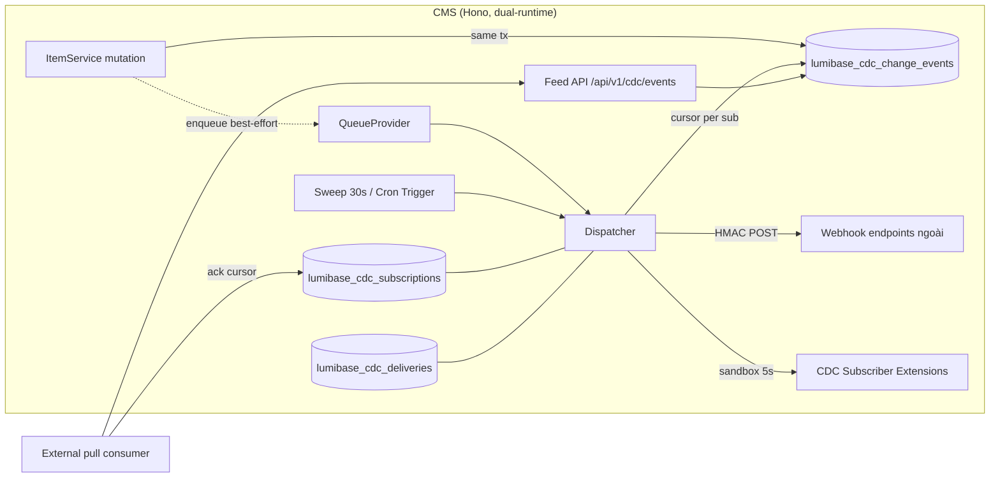

# Design Document — CDC Extension Integration (Change Feed & Connectors)

## 1. Tổng quan

Change Feed là một **transactional outbox + relay** first-party cho dữ liệu nội dung LumiBase: mỗi mutation item ghi một `Change_Event` bất biến trong cùng transaction; một Dispatcher đọc log này theo checkpoint của từng Subscription và phân phối qua ba đường — pull API (cursor), webhook (HMAC-signed push), extension subscriber (sandbox). Trên nền đó, extension author viết sink connector đồng bộ LumiBase sang hệ thống ngoài.

Nguyên tắc thiết kế:

- **Outbox, không WAL** — WAL-tailing cần long-lived connection và replication slot, không chạy trên Workers và đã có control plane riêng (spec `clickhouse-cdc`) cho analytics. Outbox chạy trên mọi runtime, atomic với mutation, và cho phép mask PII *trước khi* dữ liệu rời transaction boundary.
- **Log là nguồn sự thật, consumer giữ checkpoint** — event bất biến, append-only; mỗi Subscription chỉ là một cursor + filter. Replay = lùi cursor. Không có trạng thái "đã gửi" trên event.
- **At-least-once + idempotency key** — không hứa exactly-once; mọi delivery mang `event.id` (nanoid) làm idempotency key, consumer dedup. Thứ tự feed đến từ keyset `(occurred_at, id)`, không từ id.
- **Tái dụng, không phát minh lại** — bảng `webhooks` sẵn có làm delivery target; `QueueProvider` cho job nền; `scheduler-worker` pattern cho sweep; ExtensionSandbox + capability model cho subscriber; `validateOutboundUrl` cho SSRF; notifications module cho cảnh báo; masking theo `fields.classification`.
- **An toàn theo mặc định** — feed off-by-default per site; payload mode mặc định `reference` (thin event — consumer tự fetch bằng quyền của chính nó); chữ ký HMAC bắt buộc với webhook; PII/PHI mask trước khi lưu outbox.

## 2. Kiến trúc thành phần



```
apps/cms/src/
  modules/cdc/change-feed/            ← thư mục mới trong module cdc hiện có
    routes.ts                         ← router con: events (capability guard) + subscriptions (admin guard)
    outbox-writer.ts                  ← ghi Change_Event trong tx mutation; site-flag cache; masking
    envelope.ts                       ← build/validate Event_Envelope, schemaVersion
    dispatcher.ts                     ← relay: đọc theo cursor, batch, fan-out webhook/extension
    webhook-sender.ts                 ← HMAC ký + guardedFetch (SSRF, timeout 30s)
    extension-sender.ts               ← gọi sandbox handler, capability enforce, timeout 5s
    subscription-service.ts           ← CRUD + ack + replay + lag + state machine (active/paused/dead/stale)
    retention.ts                      ← prune idempotent theo cutoff + đánh dấu stale
    index.ts                          ← barrel + đăng ký worker/sweep
  services/item-service.ts            ← +gọi outbox-writer trong create/update/delete (tx khi driver hỗ trợ)
  serve.ts                            ← +registerCdcDispatchWorker (BullMQ, pattern content-indexing)

packages/
  database/src/schema/cdc.ts          ← +cdcChangeEvents, cdcSubscriptions, cdcDeliveries
  shared/src/schemas/cdc-feed.ts      ← Zod: EventEnvelopeSchema, SubscriptionCreateSchema, AckSchema, ReplaySchema
  extension-sdk/src/index.ts          ← +defineCdcSubscriber, CdcSubscriberDefinition, CdcEvent types
  ai-skills/src/skills.ts             ← +listCdcSubscriptions, getCdcSubscriptionStatus, createCdcSubscription,
                                         replayCdcSubscription, deleteCdcSubscription (HITL)
  mcp-server/src/tools/cdc.ts         ← +registerCdcTools (wire vào registerAllTools) — MCP coverage feed/subscriptions

apps/studio/src/modules/
  settings/change-feed-page.tsx       ← panel: subscriptions list + detail deliveries + pause/resume/replay
```

## 3. Data model

> **Quy ước tên (ADR-010)**: tên vật lý mọi bảng mang prefix `lumibase_`; export Drizzle giữ camelCase (`cdcChangeEvents` → `'lumibase_cdc_change_events'`). Index literal không prefix (theo ADR-010). Thêm bảng qua migration incremental trên `0000_lumibase_init`.

### 3.1 `lumibase_cdc_change_events` (append-only outbox)

| Cột | Kiểu | Ghi chú |
|---|---|---|
| `id` | text PK | `nanoid()` — theo convention `audit_log`/`regulated.ts` (repo chủ ý không mang dependency uuidv7); KHÔNG kiêm cursor |
| `siteId` | text NOT NULL | FK → sites, multi-tenancy |
| `collection` | text NOT NULL | |
| `itemId` | text NOT NULL | |
| `operation` | text NOT NULL | `'create' \| 'update' \| 'delete'` |
| `payload` | jsonb NULL | snapshot sau mutation, **đã mask** pii/phi; NULL với delete |
| `changedFields` | jsonb NULL | string[] với update |
| `schemaVersion` | integer NOT NULL | default 1 |
| `actorType` / `actorId` | text | `'user' \| 'api_key' \| 'agent' \| 'system'` / id tương ứng |
| `source` | text NOT NULL | `'api' \| 'agent' \| 'flow' \| 'system'` |
| `occurredAt` | timestamptz NOT NULL | default Postgres `now()` — khóa chính keyset (một đồng hồ DB duy nhất) |

Index: `(siteId, occurredAt, id)`, `(siteId, collection, occurredAt, id)`. Không FK tới `items` (event sống lâu hơn item bị xoá). Không UPDATE/DELETE ngoài prune.

### 3.2 `lumibase_cdc_subscriptions`

| Cột | Kiểu | Ghi chú |
|---|---|---|
| `id` | text PK | `nanoid()` (bảng domain) |
| `siteId` | text NOT NULL | FK |
| `name` | text NOT NULL | unique per site |
| `kind` | text NOT NULL | `'pull' \| 'webhook' \| 'extension'` |
| `collections` / `operations` | jsonb | filter; `[]` = tất cả |
| `payloadMode` | text NOT NULL | `'reference' \| 'snapshot'`, default `'reference'` |
| `cursorOccurredAt` / `cursorId` | timestamptz / text NULL | checkpoint keyset — event cuối đã ack/deliver thành công; NULL = từ head lúc tạo |
| `status` | text NOT NULL | `'active' \| 'paused' \| 'dead' \| 'stale'` |
| `webhookId` | text NULL | FK → `lumibase_webhooks` (kind=webhook) |
| `extensionName` | text NULL | kind=extension |
| `consecutiveFailures` | integer NOT NULL | default 0 |
| `lastDeliveredAt` | timestamptz NULL | |
| `createdAt` / `updatedAt` | timestamptz | |

Index: unique `(siteId, name)`, `(siteId, status)`.

**State machine**: `active ⇄ paused` (admin); `active → dead` (10 consecutive failures); `active/paused → stale` (cursor < retention floor); `dead/stale → active` chỉ qua replay/resume tường minh. Mỗi transition dead/stale phát notification đúng một lần.

### 3.3 `lumibase_cdc_deliveries` (append-only log)

| Cột | Kiểu | Ghi chú |
|---|---|---|
| `id` | text PK | `nanoid()` |
| `siteId` / `subscriptionId` | text NOT NULL | FK |
| `eventIdFrom` / `eventIdTo` | text | biên batch (nanoid) |
| `eventCount` | integer | |
| `attempt` | integer | 1..5 |
| `status` | text | `'success' \| 'failed'` |
| `httpStatus` | integer NULL | webhook |
| `errorMessage` | text NULL | masked |
| `durationMs` | integer | |
| `createdAt` | timestamptz | |

Index: `(siteId, subscriptionId, createdAt)`. Prune cùng chính sách retention.

## 4. Event Envelope & versioning

```jsonc
{
  "id": "V1StGXR8_Z5jdHi6B-myT",                    // nanoid = idempotency key (KHÔNG phải cursor)
  "cursor": "MTc1MTk0MjQwMDAwMDpWMVN0R1hSOF9aNWpkSGk2Qi1teVQ",  // keyset token (occurredAtMs:id) — ack được mid-batch
  "type": "items.update",                          // items.<operation>
  "schemaVersion": 1,
  "siteId": "s_abc",
  "collection": "posts",
  "itemId": "itm_xyz",
  "operation": "update",
  "occurredAt": "2026-07-03T04:12:09.123Z",
  "actor": { "type": "agent", "id": "run_123" },
  "source": "agent",
  "changedFields": ["title", "status"],
  "data": { "...": "chỉ khi payloadMode='snapshot'; đã mask pii/phi" }
}
```

- `payloadMode='reference'` (default): bỏ `data` — consumer fetch `GET /items/:collection/:id` bằng token của nó → RBAC của consumer quyết định nó thấy gì. An toàn theo mặc định.
- `payloadMode='snapshot'`: kèm `data` từ outbox (đã mask lúc ghi). Dùng khi consumer không gọi ngược được (fan-out một chiều).
- **Versioning policy**: thay đổi thêm-field là non-breaking (giữ `schemaVersion`); đổi/xoá field → tăng `schemaVersion`, giữ khả năng serialize version cũ ≥ 1 minor release. `EventEnvelopeSchema` (Zod, shared) là nguồn sự thật, dùng chung CMS + SDK + extension-sdk.
- Batch webhook body: `{ "events": [Envelope...], "subscription": { "id", "name" } }`.

## 5. Capture — outbox writer

Điểm chèn: `ItemService.create/update/delete`, ngay cạnh dispatch `items.*.after` hooks hiện có.

1. **Site-flag check** (Req 1.5): `outbox-writer` giữ cache per-site (`CacheProvider`, TTL 60s, invalidate khi Subscription CRUD / setting đổi): `enabled = có subscription active || settings.cdc_feed.enabled`. Off → return sớm, chi phí ~0.
2. **Masking**: đọc field classification của collection (đã cache sẵn trong schema service); field `pii`/`phi` → thay bằng `"[masked]"` trong `payload` và loại khỏi `changedFields` values (tên field vẫn giữ).
3. **Atomicity**:
   - Driver hỗ trợ transaction (node-postgres/Docker, Hyperdrive TCP): bọc `mutation + INSERT outbox` trong `db.transaction` — mutation fail → không event, event fail → mutation rollback. Đây là đường chuẩn.
   - Driver HTTP (không multi-statement tx): INSERT outbox ngay sau mutation trong cùng request; fail → audit warning `cdc_event_write_failed` (Req 1.3), mutation giữ nguyên. Trade-off chấp nhận: xác suất mất event rất thấp, và consumer có thể chạy reconcile định kỳ (so `updatedAt` items với feed) — ghi vào docs.
4. **Không chặn mutation**: outbox writer không gọi network, không gọi extension — chỉ 1 INSERT. Fan-out là việc của Dispatcher, async.

## 6. Dispatcher & delivery semantics

**Vòng dispatch cho một Subscription** (tuần tự per subscription — bảo toàn thứ tự):

```
1. SELECT events WHERE siteId = s AND (occurredAt, id) > (cursorOccurredAt, cursorId) [AND collection IN filter...] ORDER BY occurredAt ASC, id ASC LIMIT 100  -- kèm safety lag: chỉ đọc event có occurredAt < now() - 2s để không vượt mặt transaction đang commit dở
2. Rỗng → xong. Có → build envelopes (payloadMode)
3. Gửi (webhook-sender | extension-sender)
4. 2xx/handler ok → UPDATE subscription SET (cursorOccurredAt, cursorId) = keyset(last), consecutiveFailures = 0, lastDeliveredAt = now()
   → còn backlog thì lặp
5. Fail → ghi lumibase_cdc_deliveries(failed), tăng attempt; retry backoff 30s·2^n (max 5);
   hết retry → consecutiveFailures++; đạt 10 → status='dead' + notification
```

- **Trigger**: (a) sau mutation, enqueue `cdc-dispatch {siteId}` qua `QueueProvider` (best-effort, dedup theo siteId trong cửa sổ ngắn — key tenant-prefixed theo DoD); (b) sweep 30s quét subscription có backlog (nguồn sự thật, giống `status-poller`); (c) `POST .../dispatch` on-demand. Queue chỉ là tối ưu độ trễ — đúng đắn không phụ thuộc queue (Req 4.7).
- **Concurrency guard**: lock per subscription (cache-based, key `cdc:dispatch:{siteId}:{subId}`, TTL ngắn) để hai worker không dispatch chồng — chồng nhau không phá đúng đắn (at-least-once + cursor advance có điều kiện) nhưng gây delivery trùng vô ích.
- **Ordering**: một subscription một dòng tuần tự; không advance cursor khi batch fail → không bao giờ skip event (gap-free). Cross-subscription độc lập. **Safety lag 2s**: dispatcher/pull chỉ đọc tới `now() - 2s` để transaction dài đang giữ `now()` sớm hơn không bị reader vượt qua rồi bỏ sót.
- **Pull consumer**: tự đọc `GET /events` + `POST /:id/ack`; ack lùi bị từ chối (chỉ replay được lùi). Lag = `count(events) sau cursor` + `now − occurredAt(head sau cursor)`.

## 7. Webhook sender

- HMAC-SHA256 trên raw body, key = `webhooks.secret`; header `X-LumiBase-Signature: t=<unix>,v1=<hex(hmac(t + "." + body))>` — chống replay bằng timestamp (consumer nên từ chối |now−t| > 5 phút; ghi docs kèm code verify mẫu).
- WebCrypto (`crypto.subtle`) — chạy cả Workers lẫn Node, cùng cách token-vault/Web Push đã làm.
- `guardedFetch`: `validateOutboundUrl` (SSRF — chặn private IP/metadata endpoints) + timeout 30s + không follow redirect. Response body không được log (chỉ status).
- `webhooks.headers` được merge nhưng KHÔNG cho phép override `X-LumiBase-Signature`/`Content-Type`.

## 8. Extension subscriber surface

`packages/extension-sdk`:

```typescript
export interface CdcEvent<TData = Record<string, unknown>> {
  id: string; type: string; schemaVersion: number;
  collection: string; itemId: string;
  operation: 'create' | 'update' | 'delete';
  occurredAt: string;
  actor: { type: 'user' | 'api_key' | 'agent' | 'system'; id?: string };
  changedFields?: string[];
  data?: TData; // chỉ khi payloadMode='snapshot'
}

export interface CdcSubscriberDefinition {
  collections: string[];                       // phải khớp capability cdc:subscribe:<collection>
  operations?: Array<'create' | 'update' | 'delete'>;
  payloadMode?: 'reference' | 'snapshot';
  handler: (input: { events: CdcEvent[]; ctx: HookContext }) => Promise<void>;
}

export function defineCdcSubscriber(def: CdcSubscriberDefinition): CdcSubscriberDefinition;
```

- Manifest: type `hook` hiện có, entry export thêm `cdcSubscriber`; capability bắt buộc `cdc:subscribe:<collection>` (hoặc `cdc:subscribe:*`) — validator upload/enable kiểm tra collections khai báo ⊆ capabilities.
- Enable extension → `subscription-service` upsert Subscription `kind='extension'` (name = `ext:<extensionName>`); disable → `paused`. Grant capability vẫn qua flow admin review hiện có của extensions system.
- `extension-sender` enforce filter theo capability **ở phía host** trước khi đưa event vào sandbox (không tin extension tự lọc); timeout 5s/batch qua `withTimeout` (tái dùng của HookDispatcher); lỗi → failed batch → retry/dead theo §6.
- Khác biệt với hook sync hiện có (ghi rõ trong docs): `items.*.before/after` = sync, trong request, best-effort, có thể chặn mutation; `cdcSubscriber` = async, sau commit, at-least-once, có replay, không bao giờ chặn mutation.

## 8b. Tích hợp MCP & Harness

- **MCP**: MCP server (`packages/mcp-server`) đăng ký tool theo domain qua `register*Tools(server, client)` trong `registerAllTools` — REST passthrough qua `LumiBaseClient`. Hiện **chưa có** tool CDC nào. Thêm `tools/cdc.ts`: dùng `registerCrud` cho `/cdc/subscriptions` (create/get/list/delete) + `registerTool` cho `GET /cdc/events` (cursor) và `POST .../replay`. Vì đi qua REST, MCP tool **thừa hưởng nguyên** chuỗi auth/tenant + capability guard + HITL — agent qua MCP không bypass được (`deleteCdcSubscription` vẫn vào `ai_approvals`).
- **Harness**: skill khai trong `packages/ai-skills` theo `SkillDefinition` (`requiredCapabilities`, `dangerous?`). `isControlPlaneSkill` (ai-harness) phân loại control-plane khi `dangerous`, có `schema:*` mutating, hoặc **tên bắt đầu `delete`** → `deleteCdcSubscription` tự động HITL, không cần cờ. Cân nhắc: nếu muốn cấm autopilot tuyệt đối, thêm vào `IRREVERSIBLE_SKILLS` (hard-cap L2) — mặc định KHÔNG, vì xoá subscription tái tạo được (chỉ mất checkpoint cursor).
- **Chuẩn bị extension để dùng được** (khớp `extensions-system`): manifest `hook` khai `capabilities: ["cdc:subscribe:<collection>"]` → build ESM → upload Studio → **admin grant capability + enable** → enable upsert Subscription `kind='extension'` → runtime nạp qua sandbox (context capability-filtered). Extension không tự cấp quyền; `extension-sender` enforce filter theo capability ở host trước sandbox.

## 9. API surface

| Method | Path | Capability | Mô tả |
|---|---|---|---|
| GET | `/api/v1/cdc/events` | `cdc:subscribe` | Đọc feed theo cursor (filter collections/operations, limit ≤ 500) |
| GET | `/api/v1/cdc/subscriptions` | site admin | List + lag mỗi subscription |
| POST | `/api/v1/cdc/subscriptions` | site admin | Tạo (max 50/site; webhook phải có secret) |
| GET | `/api/v1/cdc/subscriptions/:id` | site admin | Chi tiết + lag |
| PATCH | `/api/v1/cdc/subscriptions/:id` | site admin | Sửa filter/payloadMode/pause/resume |
| DELETE | `/api/v1/cdc/subscriptions/:id` | site admin | Xoá (audit) |
| POST | `/api/v1/cdc/subscriptions/:id/ack` | `cdc:subscribe` | Pull consumer commit cursor (không lùi) |
| POST | `/api/v1/cdc/subscriptions/:id/replay` | site admin | Lùi cursor trong retention window (audit) |
| POST | `/api/v1/cdc/subscriptions/:id/dispatch` | site admin | Dispatch on-demand (fallback không queue) |
| GET | `/api/v1/cdc/subscriptions/:id/deliveries` | site admin | Lịch sử delivery, phân trang |

Router con mount trong `modules/cdc/index.ts` cạnh `cdcRouter` hiện có — **không** dùng chung guard admin toàn-router của control plane; guard theo từng nhóm route như bảng trên. Response format `{ data, meta? }` / `{ errors }` chuẩn. Lỗi: 400 validation (field list), 403 capability, 404 not-found, 409 trùng name, 410 `CURSOR_EXPIRED`.

## 10. Studio UI

`apps/studio/src/modules/settings/change-feed-page.tsx` (v1 tối giản, pattern theo trang deployment-targets):

- Bảng Subscription: name, kind badge, status badge (active/paused/dead/stale), lag (events + duration), lastDeliveredAt.
- Detail drawer: filter, payloadMode, cursor, deliveries gần nhất (status, httpStatus, attempt, durationMs, errorMessage).
- Hành động: pause/resume, replay (dialog nhập mốc thời gian/cursor + confirm), dispatch now. Xoá có confirm dialog liệt kê hệ quả.
- Wizard tạo subscription webhook: chọn webhook có sẵn (hoặc link tới trang webhooks để tạo — bắt buộc secret), chọn collections/operations.

## 11. Bảo mật & multi-tenancy (tóm tắt mapping)

| Mối lo | Cơ chế | Req |
|---|---|---|
| Rò dữ liệu chéo tenant | `siteId` mọi bảng + RLS + two-site smoke test; queue/cache/lock key prefix `siteId` | 7.1, 7.2 |
| Consumer đọc quá quyền | default `reference` mode → RBAC của token consumer quyết định; capability `cdc:subscribe` | 2.3, §4 |
| Frontend end-user chạm feed | ADR-011: feed là realm studio/API-key; token audience `frontend`/`subscriber` bị `withStudioAccess` từ chối | 7.3 |
| PII/PHI lọt ra ngoài | mask theo `fields.classification` TRƯỚC khi ghi outbox; snapshot chỉ chứa bản đã mask | 1.4 |
| Webhook giả mạo / MITM | HMAC-SHA256 bắt buộc + timestamp chống replay; secret write-only | 4.2, 7.5 |
| SSRF qua webhook URL | `validateOutboundUrl` + timeout + no-redirect | 4.3 |
| Extension vượt quyền | capability enforce ở host trước sandbox; sandboxed fetch host-whitelist hiện có | 5.2 |
| Agent xoá subscription bừa | `deleteCdcSubscription` → HITL `ai_approvals` (rule #4) | 7.4 |
| Secret trong log | masking audit hiện có áp cho errorMessage/config diff | 7.5 |

## 12. Correctness Properties

*Mỗi property là một bất biến kiểm chứng được bằng fast-check (≥100 iterations), tag `Feature: cdc-extension-integration, Property {N}: {title}`.*

1. **Outbox atomicity (tx driver)** — *Với mọi* chuỗi mutation thành công khi feed bật, số Change_Event sinh ra = số mutation, đúng collection/itemId/operation; mutation rollback → không event. *(Req 1.2)*
2. **Cursor pagination gap-free** — *Với mọi* tập event và mọi cách chia trang bằng `nextCursor`, hợp các trang = đúng tập event khớp filter, đúng thứ tự `id` tăng, không trùng không sót. *(Req 2.1, 2.2)*
3. **Envelope round-trip** — *Với mọi* Change_Event hợp lệ, build → `EventEnvelopeSchema.parse` thành công và giữ nguyên mọi field; `payloadMode='reference'` không bao giờ chứa `data`. *(Req 2.1, §4)*
4. **Masking bất biến** — *Với mọi* item có field classification `pii`/`phi`, giá trị gốc không xuất hiện ở bất kỳ đâu trong `payload`/envelope/delivery body. *(Req 1.4)*
5. **HMAC verify round-trip** — *Với mọi* body và secret, chữ ký sinh ra verify đúng với secret đó và fail với mọi secret khác / body bị sửa. *(Req 4.2)*
6. **Cursor advance có điều kiện** — *Với mọi* chuỗi kết quả delivery (success/fail xen kẽ), cursor chỉ tiến sau success, không bao giờ vượt quá event đã deliver thành công, và không event nào bị skip. *(Req 4.4)*
7. **Retry/backoff đúng lịch** — *Với mọi* batch fail liên tục, số lần thử = 5 với khoảng cách 30s·2^n; `consecutiveFailures` đạt 10 → đúng một transition sang `dead` + đúng một notification. *(Req 4.5, 8.2)*
8. **Filter đúng và đủ** — *Với mọi* filter (collections × operations) và tập event, consumer nhận đúng tập event khớp filter — không thừa, không thiếu. *(Req 3.1, 5.2)*
9. **Tenant isolation** — *Với mọi* cặp site A/B và tập event xen kẽ, feed/delivery của A chỉ chứa event của A. *(Req 7.1, 7.2)*
10. **Retention & stale** — *Với mọi* cấu hình retention và trạng thái cursor, prune chỉ xoá event cũ hơn cutoff; subscription có cursor < floor chuyển `stale` và không được dispatch âm thầm. *(Req 6.1, 6.3, 6.4)*
11. **Ack không lùi** — *Với mọi* chuỗi ack, cursor là đơn điệu không giảm; lùi chỉ xảy ra qua replay trong retention window. *(Req 3.3, 6.2)*
12. **Subscriber isolation** — *Với mọi* tập subscriber trong đó một số handler ném lỗi/treo, các subscription khác vẫn nhận đủ event của chúng. *(Req 5.4)*

## 13. Kiểm thử

- **Property (fast-check)**: 12 properties ở §12 — outbox, pagination, envelope, masking, HMAC, cursor, retry, filter, tenant, retention, ack, isolation.
- **Unit**: state machine subscription (transitions hợp lệ/không hợp lệ); lag computation; site-flag cache invalidation; header merge không override chữ ký; error→HTTP mapping (400/403/404/409/410); Zod schemas biên (limit 500, retention 1–90).
- **Integration**: route handlers với fake services (pattern `cdc-routes.test.ts` — parent Hono set `auth`/`siteId`); dispatch end-to-end với `InMemory*` deps (publisher giả nhận HMAC verify được); extension subscriber qua sandbox thật với manifest capability thiếu → bị chặn.
- **HITL**: agent gọi `deleteCdcSubscription` dưới ngưỡng autonomy → tạo `ai_approvals`, không xoá ngay.
- **Multi-tenancy**: two-site smoke test — mutation site A không xuất hiện trong feed/delivery site B; queue/lock key có prefix site.
- **Contract**: fixture Event_Envelope v1 vàng (golden file) — thay đổi schema không chủ đích làm fail test.

## 14. Rủi ro & quyết định mở

| # | Vấn đề | Phân tích | Trạng thái |
|---|---|---|---|
| 1 | Atomicity trên HTTP driver (Workers) | Không có multi-statement tx → best-effort write + audit warning + hướng dẫn reconcile. *Chốt: chấp nhận trade-off, ghi rõ docs; đường Docker/Hyperdrive TCP dùng tx chuẩn.* | Chốt |
| 2 | ItemService chưa bọc transaction sẵn | Chỉ `access-import`/`schema-service` dùng `db.transaction`. Cần refactor điểm mutation của ItemService nhận optional tx — làm trong Phase B, giữ backward-compatible. | Chốt (scope Phase B) |
| 3 | CF Queues consumer cần cấu hình wrangler | Binding + consumer config nằm ngoài code. *Chốt: queue là tối ưu độ trễ; đúng đắn dựa trên sweep (Cron Trigger đã có pattern) — thiếu queue vẫn chạy.* | Chốt |
| 4 | Outbox phình khi site lớn | Retention 7 ngày default + prune + index `(siteId, id)`; snapshot mode làm row to → khuyến nghị `reference` cho collection lớn. Theo dõi sau khi ship, cân nhắc partition theo tháng nếu cần. | Theo dõi |
| 5 | Thứ tự & bỏ sót khi transaction chồng lấn | `occurredAt` do Postgres `now()` đóng dấu (một đồng hồ, hết lệch app-clock). Rủi ro còn lại: tx dài commit muộn với `now()` sớm → reader đã lướt qua. *Chốt (phương án B, 2026-07-10):* keyset `(occurred_at, id)` + **safety lag 2s** ở mọi đường đọc; sweep re-read từ cursor bền nên không mất event. | Chốt |
| 6 | Mở rộng capture cho `collections`/`fields`/settings | Out of scope v1 — envelope `type` đã namespace (`items.*`) nên mở rộng không breaking. | Follow-up |
| 7 | Realtime fan-out (WS) cho change events | Ride trên `RealtimeProvider` audience plane — spec riêng khi có nhu cầu. | Follow-up |
