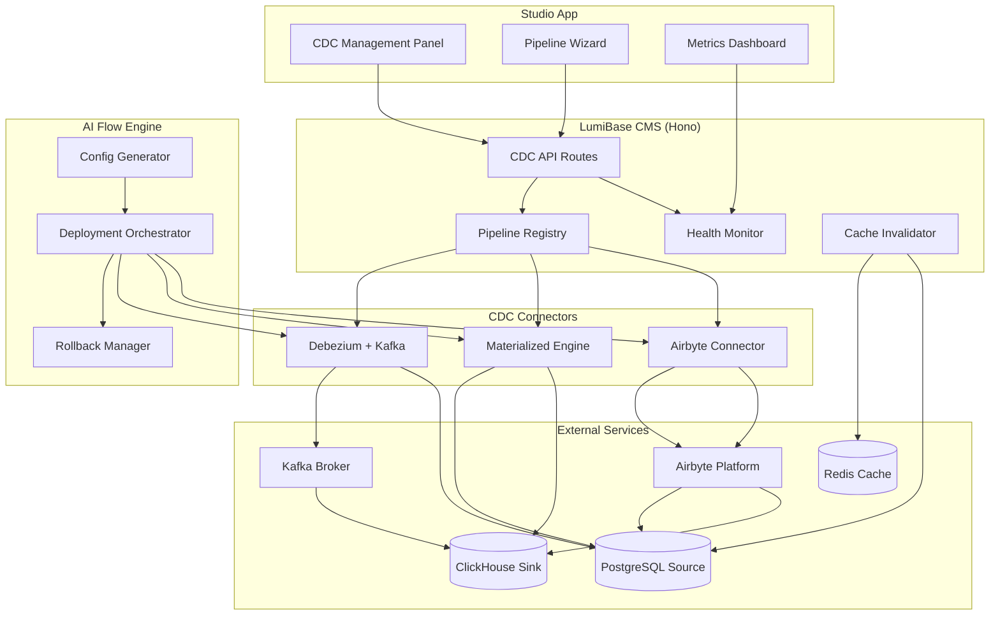

# Design Document: ClickHouse CDC

## Overview

The ClickHouse CDC system provides real-time data replication from PostgreSQL to ClickHouse for OLAP/analytics workloads within the LumiBase platform. It is a multi-layered system comprising:

1. **Pipeline Registry** — A configuration store for CDC pipeline definitions, persisted in PostgreSQL with encrypted connection parameters.
2. **CDC Connectors** — Three pluggable replication strategies (Debezium+Kafka, ClickHouse Materialized Engine, Airbyte) abstracted behind a common interface.
3. **Cache Invalidator** — A CDC event consumer that automatically refreshes Redis cache when configuration tables change.
4. **Studio CDC Panel** — A React-based management UI in the Studio app for pipeline CRUD, monitoring, and guided setup.
5. **AI Flow Engine** — An automation layer that generates deployment configurations and orchestrates infrastructure provisioning.
6. **Health Monitor** — A metrics emission and alerting subsystem that tracks pipeline health and triggers notifications.

The system integrates into the existing LumiBase monorepo architecture, extending `@lumibase/runtime` with a new `CdcProvider` interface and adding a `cdc` module under `apps/cms/src/modules/`.

## Architecture



### Deployment Topology

The CDC system supports two deployment targets that map to a scoped split of responsibilities, aligned with LumiBase's existing dual-runtime architecture:

- **Docker Compose / managed-services target (`docker_compose`)**: Hosts the **full stateful CDC stack** — Kafka_Broker, Debezium_Connector, ClickHouse_Sink, Materialized_Engine, and Airbyte_Connector. These run either as containers orchestrated via Docker Compose on a shared network, or as external managed services (e.g., Confluent Cloud for Kafka, ClickHouse Cloud for the sink, Airbyte Cloud). All stateful connectors, the message bus, and replication engines live here because they require long-lived TCP connections, persistent local buffers, and replication-slot ownership.
- **Cloudflare Workers target (`cloudflare_workers`)**: Hosts **only the lightweight edge components** — the CDC API/control-plane endpoints and the Cache_Invalidator (webhook/event-driven logic). The Workers runtime communicates with the stateful stack over HTTPS endpoints. Because of V8 isolate CPU/memory limits and the absence of long-lived TCP connections, Cloudflare Workers **CANNOT** host stateful CDC connectors, the Kafka message bus, or the PostgreSQL/ClickHouse replication engines; a `cloudflare_workers` deployment therefore always depends on a companion `docker_compose` (or managed-services) deployment for the stateful stack.

## Components and Interfaces

### 1. Pipeline Registry (`packages/database/src/schema/cdc.ts`)

The registry is a Drizzle ORM schema extension that stores pipeline configurations in PostgreSQL. It follows the existing pattern in `packages/database/src/schema/platform.ts`.

```typescript
// Core interface for pipeline CRUD operations
interface PipelineRegistryService {
  create(siteId: string, config: PipelineCreateInput): Promise<PipelineRecord>;
  get(siteId: string, pipelineId: string): Promise<PipelineRecord | null>;
  list(siteId: string): Promise<PipelineRecord[]>;
  update(siteId: string, pipelineId: string, patch: PipelinePatchInput): Promise<PipelineRecord>;
  delete(siteId: string, pipelineId: string): Promise<void>;
  updateStatus(pipelineId: string, status: PipelineStatus, message?: string): Promise<void>;
}
```

**Delete flow**: `delete(siteId, pipelineId)` MUST resolve the pipeline's connector and invoke `connector.destroy(pipelineId)` before removing the registry record. For replication-slot-based approaches (Debezium+Kafka and Materialized Engine), `destroy()` releases and drops the corresponding PostgreSQL replication slot(s) on the Source_Database (e.g. via `pg_drop_replication_slot`) so that no orphaned slot remains and the Source_Database does not retain WAL files indefinitely. The registry record is deleted only after `destroy()` (including slot cleanup) completes successfully.

### 2. CDC Connector Interface (`apps/cms/src/modules/cdc/connectors/`)

A strategy pattern abstracting the three CDC approaches behind a common interface:

```typescript
interface CdcConnector {
  readonly type: CdcConnectorType;
  provision(config: ConnectorConfig): Promise<ProvisionResult>;
  start(pipelineId: string): Promise<void>;
  stop(pipelineId: string): Promise<void>;
  healthCheck(pipelineId: string): Promise<HealthCheckResult>;
  getMetrics(pipelineId: string): Promise<PipelineMetrics>;
  destroy(pipelineId: string): Promise<void>;
}

type CdcConnectorType = 'debezium_kafka' | 'materialized_engine' | 'airbyte';
```

Concrete implementations:
- `DebeziumKafkaConnector` — Manages Debezium connector registration, Kafka topic creation, and ClickHouse Kafka table engine setup. Because this approach is replication-slot-based, its `destroy(pipelineId)` MUST release and drop the corresponding PostgreSQL replication slot on the Source_Database (e.g. via `pg_drop_replication_slot`) after removing the Debezium connector, so that the Source_Database does not retain WAL files indefinitely.
- `MaterializedEngineConnector` — Manages ClickHouse `MaterializedPostgreSQL` database/table creation and replication slot lifecycle. Because this approach is replication-slot-based, its `destroy(pipelineId)` MUST detach the `MaterializedPostgreSQL` database and release/drop the corresponding PostgreSQL replication slot on the Source_Database (e.g. via `pg_drop_replication_slot`) so that WAL files are not retained.
- `AirbyteConnector` — Manages Airbyte source/destination/connection creation via the Airbyte API. This approach is not replication-slot-based, so `destroy(pipelineId)` removes the Airbyte connection/source/destination without any PostgreSQL replication-slot cleanup.

> **Replication slot cleanup**: For replication-slot-based connectors (`DebeziumKafkaConnector` and `MaterializedEngineConnector`), `destroy(pipelineId)` is responsible for releasing and dropping the PostgreSQL replication slot(s) it created. Failure to drop a slot causes the Source_Database to retain WAL files indefinitely, eventually exhausting disk. The destroy flow MUST treat slot removal as a required cleanup step (see Error Handling).

### 3. Cache Invalidator (`apps/cms/src/modules/cdc/cache-invalidator.ts`)

Consumes CDC change events from the pipeline and translates them into Redis cache operations:

```typescript
interface CacheInvalidator {
  handleEvent(event: CdcChangeEvent): Promise<void>;
  flush(): Promise<void>;
  getQueueDepth(): number;
}

interface CdcChangeEvent {
  table: string;
  recordId: string;
  operation: 'INSERT' | 'UPDATE' | 'DELETE';
  payload?: Record<string, unknown>;
  timestamp: number;
}
```

Key behaviors:
- **Deduplication window**: Collapses consecutive UPDATE events for the same cache key within a 1-second window into a single refresh. INSERT and DELETE events for that key are never deduplicated — they are processed immediately to preserve operation ordering and data integrity. An intervening INSERT or DELETE flushes any pending UPDATE for that key first.
- **Bounded queue**: Holds up to 10,000 events during Redis outage; discards oldest on overflow.
- **Key derivation**: Maps `(table, recordId)` → Redis cache key using the existing `CacheProvider` key namespace.

### 4. Health Monitor (`apps/cms/src/modules/cdc/health-monitor.ts`)

Periodically collects metrics from active pipelines and manages alerting:

```typescript
interface HealthMonitor {
  start(pipelineId: string, config: MonitorConfig): void;
  stop(pipelineId: string): void;
  checkHealth(pipelineId: string): Promise<HealthCheckResult>;
  getHistory(pipelineId: string, since: Date): Promise<HealthMetricEntry[]>;
}

interface MonitorConfig {
  emitIntervalMs: number;        // default: 30_000
  lagThresholdMs: number;        // default: 60_000, range [10_000, 3_600_000]
  retentionDays: number;         // default: 7
}
```

### 5. AI Flow Engine (`apps/cms/src/modules/cdc/ai-flow/`)

Generates deployment configurations and orchestrates provisioning:

```typescript
interface AiFlowEngine {
  generateConfig(approach: CdcConnectorType, target: DeploymentTarget): Promise<EnvironmentConfig>;
  deploy(config: EnvironmentConfig): Promise<DeploymentResult>;
  rollback(deploymentId: string): Promise<RollbackResult>;
  validateEnvVars(approach: CdcConnectorType, vars: Record<string, string>): ValidationResult;
}

type DeploymentTarget = 'docker_compose' | 'cloudflare_workers';
// 'docker_compose'   → full stateful stack (Kafka, Debezium, ClickHouse, Materialized Engine, Airbyte),
//                      via Docker Compose or external managed services (Confluent/ClickHouse/Airbyte Cloud).
// 'cloudflare_workers' → edge components ONLY (CDC API/control-plane endpoints + Cache_Invalidator);
//                      cannot host stateful connectors, the message bus, or replication engines.

interface EnvironmentConfig {
  approach: CdcConnectorType;
  target: DeploymentTarget;
  variables: EnvVarDefinition[];
  services: ServiceDefinition[];
}
```

### 6. Studio CDC Panel (`apps/studio/src/features/cdc/`)

React components for the management UI:

- `CdcPipelineList` — Table view of all pipelines with status badges.
- `CdcPipelineWizard` — Multi-step form with approach-specific fields and recommendation engine.
- `CdcPipelineDetail` — Metrics dashboard with real-time charts (replication lag, throughput, error rate).
- `CdcApproachRecommender` — Logic component that maps (volume, latency) → recommended approach.

### 7. CDC API Routes (`apps/cms/src/modules/cdc/routes.ts`)

RESTful endpoints mounted under `/api/v1/cdc/`:

| Method | Path | Description |
|--------|------|-------------|
| POST | `/pipelines` | Create a new pipeline |
| GET | `/pipelines` | List all pipelines for site |
| GET | `/pipelines/:id` | Get pipeline details |
| PATCH | `/pipelines/:id` | Update pipeline config |
| DELETE | `/pipelines/:id` | Delete pipeline |
| POST | `/pipelines/:id/start` | Start replication |
| POST | `/pipelines/:id/stop` | Stop replication |
| GET | `/pipelines/:id/health` | Run health check |
| GET | `/pipelines/:id/metrics` | Get current metrics |
| GET | `/pipelines/:id/metrics/history` | Get historical metrics |
| POST | `/deploy` | Trigger AI deployment flow |
| POST | `/deploy/validate-env` | Validate environment variables |
| POST | `/deploy/:id/rollback` | Rollback a deployment |

## Data Models

### Pipeline Registry Schema (PostgreSQL)

```typescript
// packages/database/src/schema/cdc.ts
export const cdcPipelines = pgTable(
  'cdc_pipelines',
  {
    id: text('id').$defaultFn(() => nanoid()).primaryKey(),
    siteId: text('site_id').notNull().references(() => sites.id, { onDelete: 'cascade' }),
    pipelineName: text('pipeline_name').notNull(),
    connectorType: text('connector_type').notNull(), // 'debezium_kafka' | 'materialized_engine' | 'airbyte'
    status: text('status').default('provisioning').notNull(), // 'active' | 'paused' | 'error' | 'provisioning'
    statusMessage: text('status_message'),
    sourceConnection: text('source_connection').notNull(), // encrypted
    sinkConnection: text('sink_connection').notNull(),     // encrypted
    intermediaryConnection: text('intermediary_connection'), // encrypted (Kafka or Airbyte URL)
    replicationTables: jsonb('replication_tables').default([]).notNull(), // string[]
    config: jsonb('config').default({}).notNull(), // approach-specific config
    lastSyncAt: timestamp('last_sync_at'),
    lastSyncRecordCount: integer('last_sync_record_count'),
    createdAt: timestamp('created_at').defaultNow().notNull(),
    updatedAt: timestamp('updated_at').defaultNow().notNull(),
  },
  (t) => ({
    siteNameUnique: uniqueIndex('cdc_pipelines_site_name_unique').on(t.siteId, t.pipelineName),
    siteStatusIdx: index('cdc_pipelines_site_status_idx').on(t.siteId, t.status),
  }),
);

export const cdcPipelineHealth = pgTable(
  'cdc_pipeline_health',
  {
    id: text('id').$defaultFn(() => nanoid()).primaryKey(),
    pipelineId: text('pipeline_id').notNull().references(() => cdcPipelines.id, { onDelete: 'cascade' }),
    replicationLagMs: integer('replication_lag_ms').notNull(),
    eventsPerSecond: integer('events_per_second').notNull(),
    errorCount: integer('error_count').default(0).notNull(),
    recordedAt: timestamp('recorded_at').defaultNow().notNull(),
  },
  (t) => ({
    pipelineTimeIdx: index('cdc_health_pipeline_time_idx').on(t.pipelineId, t.recordedAt),
  }),
);

export const cdcDeployments = pgTable(
  'cdc_deployments',
  {
    id: text('id').$defaultFn(() => nanoid()).primaryKey(),
    pipelineId: text('pipeline_id').references(() => cdcPipelines.id, { onDelete: 'set null' }),
    siteId: text('site_id').notNull().references(() => sites.id, { onDelete: 'cascade' }),
    approach: text('approach').notNull(),
    target: text('target').notNull(), // 'docker_compose' | 'cloudflare_workers'
    status: text('status').default('pending').notNull(), // 'pending' | 'running' | 'completed' | 'failed' | 'rolled_back'
    steps: jsonb('steps').default([]).notNull(), // DeploymentStep[]
    envConfig: jsonb('env_config').default({}).notNull(),
    errorMessage: text('error_message'),
    createdAt: timestamp('created_at').defaultNow().notNull(),
    completedAt: timestamp('completed_at'),
  },
  (t) => ({
    siteIdx: index('cdc_deployments_site_idx').on(t.siteId, t.status),
  }),
);
```

### Zod Validation Schemas (`packages/shared/src/schemas/cdc.ts`)

```typescript
import { z } from 'zod';

export const CdcConnectorTypeSchema = z.enum(['debezium_kafka', 'materialized_engine', 'airbyte']);

export const PipelineCreateSchema = z.object({
  pipeline_name: z.string().min(1).max(128),
  cdc_connector_type: CdcConnectorTypeSchema,
  source_database_connection: z.string().min(1),
  clickhouse_sink_connection: z.string().min(1),
  replication_tables: z.array(z.string().min(1)).min(1),
  intermediary_connection: z.string().optional(),
  config: z.record(z.unknown()).optional(),
});

export const SyncScheduleSchema = z.object({
  interval_seconds: z.number().int().min(300).max(86400), // 5 min to 24 hours
  sync_mode: z.enum(['full_refresh', 'incremental_cdc']),
});

export const MonitorConfigSchema = z.object({
  lag_threshold_ms: z.number().int().min(10_000).max(3_600_000).default(60_000),
  emit_interval_ms: z.number().int().default(30_000),
  retention_days: z.number().int().min(1).default(7),
});

export const EnvVarSchema = z.object({
  key: z.string().regex(/^[A-Z_][A-Z0-9_]*$/),
  value: z.string(),
  required: z.boolean().default(true),
});
```

### Cache Invalidation Event Model

```typescript
interface CdcChangeEvent {
  table: string;
  recordId: string;
  operation: 'INSERT' | 'UPDATE' | 'DELETE';
  payload?: Record<string, unknown>;
  timestamp: number; // Unix ms
}

// Key derivation: table + recordId → cache key
// Example: "settings" + "abc123" → "config:settings:abc123"
// Example: "collections" + "xyz789" → "config:collections:xyz789"
```

### Approach Recommendation Model

```typescript
interface RecommendationInput {
  estimatedRowsPerSecond: number;
  maxLatencySeconds: number;
  hasKafkaInfrastructure: boolean;
  preferManagedService: boolean;
}

interface RecommendationOutput {
  recommended: CdcConnectorType;
  rationale: string;
  alternatives: Array<{ type: CdcConnectorType; tradeoff: string }>;
}

// Decision logic:
// - rowsPerSecond > 10,000 OR need < 5s latency → debezium_kafka
// - rowsPerSecond < 5,000 AND no Kafka infra AND latency < 30s → materialized_engine
// - preferManagedService OR minimal infra management → airbyte
```

## Correctness Properties

*A property is a characteristic or behavior that should hold true across all valid executions of a system — essentially, a formal statement about what the system should do. Properties serve as the bridge between human-readable specifications and machine-verifiable correctness guarantees.*

### Property 1: Pipeline registration round-trip

*For any* valid pipeline configuration (with all required fields populated, name ≤ 128 characters, and a valid connector type), submitting it to the Pipeline Registry SHALL persist the configuration and return a retrievable record with a valid nanoid string identifier (length 11–21) that matches the submitted fields.

**Validates: Requirements 1.1**

### Property 2: Validation completeness for missing fields

*For any* non-empty subset of required pipeline fields that is omitted from a submission, the Pipeline Registry SHALL reject the request and the error response SHALL list exactly the names of the omitted fields — no more, no fewer.

**Validates: Requirements 1.3**

### Property 3: Connection parameter encryption round-trip

*For any* connection string stored in the Pipeline Registry, encrypting then decrypting SHALL produce the original string, and the encrypted stored value SHALL not equal the plaintext input.

**Validates: Requirements 1.4**

### Property 4: Pipeline name uniqueness per site

*For any* pipeline name and site (identified by site_id), if a pipeline with that name already exists for that site, a second registration attempt with the same name SHALL be rejected with a duplicate error.

**Validates: Requirements 1.6**

### Property 5: Kafka topic routing by table name

*For any* table name in the replication configuration, change events from that table SHALL be published to a Kafka topic whose name is deterministically derived from the table name, and events from different tables SHALL never share a topic.

**Validates: Requirements 2.2**

### Property 6: Event ordering preservation during outages

*For any* sequence of CDC events, if the downstream sink (Kafka broker or ClickHouse) becomes temporarily unavailable, events SHALL be buffered and delivered in their original order upon recovery.

**Validates: Requirements 2.4, 2.6**

### Property 7: PostgreSQL-to-ClickHouse schema mapping

*For any* valid PostgreSQL table schema (columns with supported types), the Materialized Engine connector SHALL generate a ClickHouse table definition that preserves all column names and maps each PostgreSQL type to its correct ClickHouse equivalent.

**Validates: Requirements 3.3**

### Property 8: Schema drift detection

*For any* schema change (column addition, column removal, or type alteration) on a replicated table, the CDC pipeline SHALL detect the change and report both the affected table name and the type of schema modification.

**Validates: Requirements 3.6**

### Property 9: Sync schedule interval validation

*For any* integer interval value, the system SHALL accept it if and only if it falls within [300, 86400] seconds. Values outside this range SHALL be rejected with a validation error indicating the allowed range.

**Validates: Requirements 4.3, 4.7**

### Property 10: Sync metadata update on completion

*For any* Airbyte sync job that completes successfully with N records, the Pipeline Registry SHALL be updated with the completion timestamp and the exact record count N.

**Validates: Requirements 4.5**

### Property 11: Cache invalidation correctness by operation type

*For any* CDC change event (INSERT, UPDATE, or DELETE) on a configuration table, the Cache Invalidator SHALL derive the correct cache key and apply the corresponding Redis operation: SET for INSERT (pre-warm), SET for UPDATE (refresh), and DEL for DELETE (remove).

**Validates: Requirements 5.1, 5.2, 5.3**

### Property 12: Cache event deduplication within time window

*For any* cache key that receives multiple consecutive UPDATE events within a 1-second window, the Cache Invalidator SHALL collapse them and process only the final UPDATE state. IF an INSERT or DELETE event for that key occurs within the window, THEN the Cache Invalidator SHALL process it immediately (flushing any pending UPDATE first), so that no INSERT or DELETE is dropped and the relative ordering of INSERT/DELETE operations is never reordered.

**Validates: Requirements 5.6**

### Property 13: Cache event queue ordering and replay

*For any* sequence of invalidation events queued during a Redis outage, when connectivity is restored the events SHALL be replayed in their original chronological order.

**Validates: Requirements 5.4**

### Property 14: Cache invalidation log completeness

*For any* invalidation event processed by the Cache Invalidator, the emitted log entry SHALL contain the affected table name, record identifier, and operation type.

**Validates: Requirements 5.8**

### Property 15: Approach recommendation consistency

*For any* combination of estimated data volume (rows/second) and maximum latency requirement, the recommendation engine SHALL return a deterministic result that is consistent with the decision criteria matrix (high volume → Debezium+Kafka, low volume + no Kafka → Materialized, managed preference → Airbyte).

**Validates: Requirements 6.3**

### Property 16: Form validation preserves valid data

*For any* pipeline wizard submission containing a mix of valid and invalid fields, the validation response SHALL list errors only for invalid fields, and the valid field values SHALL be preserved (not discarded or reset).

**Validates: Requirements 6.7**

### Property 17: Environment config generation completeness

*For any* valid CDC approach and deployment target combination, the AI Flow Engine SHALL generate an Environment Config containing all required environment variables for that approach, with no missing required keys.

**Validates: Requirements 7.1**

### Property 18: Environment variable schema validation

*For any* set of environment variables submitted for a given CDC approach, the validator SHALL correctly identify each variable that violates its schema constraint and report the specific violated rule.

**Validates: Requirements 7.4, 7.5**

### Property 19: Deployment rollback completeness

*For any* deployment sequence where step N fails (1 ≤ N ≤ total steps), the rollback SHALL undo steps 1 through N-1 in reverse order, and no partially-provisioned resources SHALL remain.

**Validates: Requirements 7.6**

### Property 20: Replication lag threshold alerting

*For any* replication lag measurement and configured threshold value, a warning notification SHALL be emitted if and only if the lag exceeds the threshold.

**Validates: Requirements 8.2**

### Property 21: Pipeline recovery notification on state transition

*For any* pipeline that transitions from `error` status to `active` status, the system SHALL emit exactly one recovery notification.

**Validates: Requirements 8.6**

### Property 22: Replication slot cleanup on deletion

*For any* replication-slot-based pipeline (Debezium+Kafka or Materialized Engine) that is deleted, no PostgreSQL replication slot associated with that pipeline SHALL remain on the Source_Database after the delete operation completes.

**Validates: Requirements 1.8**

## Error Handling

### Pipeline Registration Errors

| Error Condition | Response | Recovery |
|----------------|----------|----------|
| Missing required fields | 400 with field list | User corrects input |
| Duplicate pipeline name | 409 Conflict | User chooses different name |
| Name exceeds 128 chars | 400 validation error | User shortens name |
| Site at 50 pipeline limit | 403 Forbidden | User deletes unused pipelines |
| Connectivity check fails | 400 with unreachable endpoint | User fixes connection string |
| Connectivity check timeout (10s) | 408 Timeout | User verifies network access |

### CDC Connector Errors

| Error Condition | Behavior | Alert |
|----------------|----------|-------|
| Kafka broker unavailable | Buffer locally (1h / 500MB cap) | Warning after 5 min |
| Debezium replication slot failure (3x) | Status → error | Critical notification |
| Materialized Engine connection lost (5 retries) | Status → error | Critical notification |
| Schema drift detected | Status → error | Warning with table/change details |
| Airbyte sync failure (3 retries) | Status → error | Critical notification |
| Airbyte provisioning timeout (120s) | Status → error, release resources | Critical notification |
| Replication slot cleanup fails on delete | Retry `pg_drop_replication_slot`; surface error, keep record until slot dropped | Warning with slot name + pipeline id |

### Cache Invalidator Errors

| Error Condition | Behavior | Logging |
|----------------|----------|---------|
| Redis unavailable | Queue events (max 10,000) | Warning on queue start |
| Queue overflow | Discard oldest events | Warning with discard count |
| Single key operation fails (3 retries) | Skip to next event | Error with table/record/operation |
| Redis reconnection | Replay queue in order | Info on replay start/end |

### Health Monitor Errors

| Error Condition | Behavior | Alert |
|----------------|----------|-------|
| Metrics emission missed (3 intervals) | Status → error | Critical alert |
| Lag exceeds threshold | Continue operating | Warning notification |
| Error state > 5 minutes | Continue monitoring | Critical alert |
| Error → active transition | Resume normal monitoring | Recovery notification |

### AI Flow Engine Errors

| Error Condition | Behavior | Recovery |
|----------------|----------|----------|
| Env var validation failure | Reject update | Return invalid fields + constraints |
| Deployment step failure | Rollback all prior steps (60s) | Report failed step + error |
| Health check failure post-deploy | Report per-service status | User investigates failed services |

## Testing Strategy

### Property-Based Testing (fast-check)

The project already includes `fast-check` as a dev dependency. Property-based tests will be used for the core logic components where input variation reveals edge cases:

**Library**: `fast-check` (already in `apps/cms/package.json` devDependencies)
**Configuration**: Minimum 100 iterations per property test
**Tag format**: `Feature: clickhouse-cdc, Property {N}: {title}`

Target components for PBT:
- Pipeline validation logic (Properties 1–4)
- Kafka topic routing (Property 5)
- Event ordering guarantees (Property 6)
- Schema mapping (Property 7)
- Schema drift detection (Property 8)
- Interval validation (Property 9)
- Cache key derivation and operation mapping (Properties 11–14)
- Recommendation engine (Property 15)
- Form validation (Property 16)
- Env var validation (Property 18)
- Threshold alerting logic (Property 20)
- Replication slot cleanup on deletion (Property 22)

### Unit Tests (vitest)

Example-based tests for:
- Connector type enumeration (Req 1.2)
- Exponential backoff timing sequences (Req 3.4, 4.4)
- State machine transitions (error after N failures) (Req 2.5, 3.5, 8.3, 8.7)
- Airbyte sync mode support (Req 4.2)
- Studio panel rendering with sample data (Req 6.1, 6.2, 6.4, 6.5, 6.8)
- Deployment target enumeration (Req 7.2)

### Integration Tests

- End-to-end pipeline registration with real PostgreSQL (Req 1.5)
- Debezium connector configuration against test Kafka (Req 2.1, 2.3)
- Materialized Engine replication lag measurement (Req 3.2)
- Airbyte provisioning against test instance (Req 4.1)
- Health metrics emission timing (Req 8.1)
- Docker Compose deployment flow (Req 7.3)

### Edge Case Tests

- Pipeline name at exactly 128 characters (Req 1.7)
- 50th pipeline creation succeeds, 51st fails (Req 1.7)
- Cache queue at exactly 10,000 events (Req 5.5)
- Lag threshold at boundary values (10s, 3600s) (Req 8.2)

### Smoke Tests

- Documentation files exist with required sections (Req 9.1–9.4)
- Health retention policy configured (Req 8.4)
- All connector types registered in system (Req 9.5)
