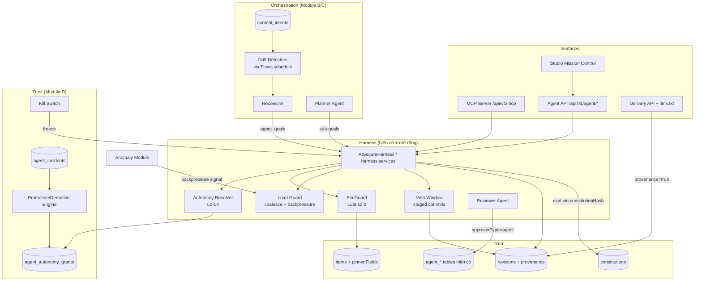
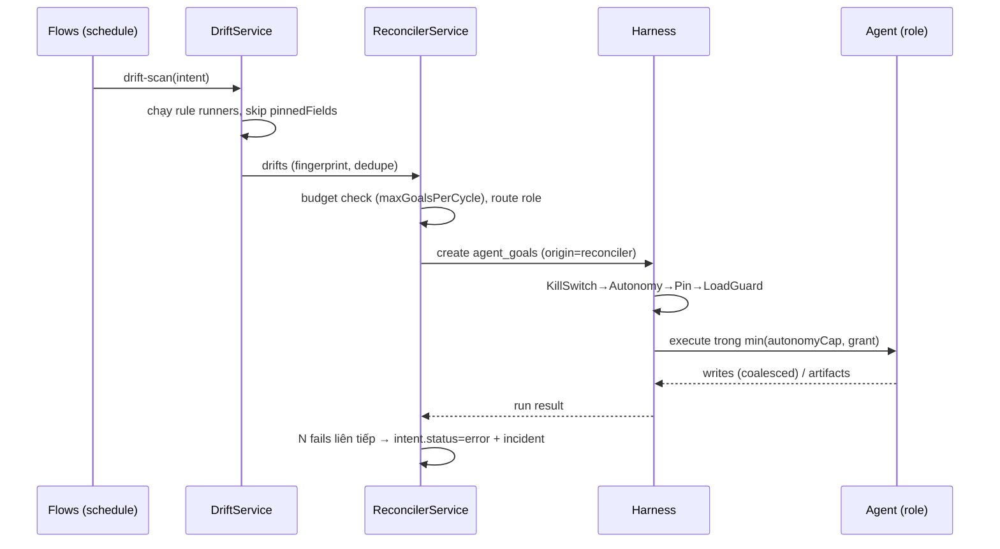

# Tài liệu Thiết kế: Content OS

## Overview

Content OS nâng Agent Harness Layer hiện có thành hệ điều hành nội dung tự trị có kiểm soát. Thiết kế gồm 5 module, mỗi module ship độc lập theo thứ tự phụ thuộc:

- **Module A — Foundation**: provenance trên revisions, thật hoá 5 stub skills, run qua queue, MCP server, llms.txt.
- **Module B — Reconciliation**: `content_intents` (SLO), drift detectors, reconciler, override-is-law (Pin), load-aware autonomy.
- **Module C — Multi-agent org**: `parentGoalId`, `agent_roles`, Planner, agent-as-reviewer.
- **Module D — Trust ledger**: `agent_autonomy_grants` (L0–L4), `agent_incidents`, promotion/demotion engine, Veto Window, Kill Switch.
- **Module E — Mission Control**: Exception Inbox, SLO health, trust ledger UI, Constitution editor, Intent composer.

Nguyên tắc xuyên suốt:
1. **Một codepath**: mọi đường vào (Copilot chat, MCP, Reconciler, Flows) đều thực thi qua `AISecureHarness`/harness services — không có đường tắt.
2. **Luật số 0**: human edit thắng tuyệt đối; enforce tại Harness (tool-call level), không phụ thuộc thiện chí của agent.
3. **Autonomy là dữ liệu**: mức tự trị đọc từ `agent_autonomy_grants`, promote cần người duyệt, demote tự động.
4. **Load-aware**: hệ tạo tải phải cảm nhận tải — backpressure từ anomaly module là first-class input của scheduler.

## Architecture



### Quyết định kiến trúc

1. **Reconciler chạy trên Flows engine** thay vì scheduler mới: Drift Detector là flow operation type mới (`drift-scan`), tận dụng trigger `schedule`, retry và run history sẵn có. Giảm bề mặt code mới và đồng nhất observability.
2. **Pin enforce ở Harness, không ở agent prompt**: `PinGuard` chặn tool call ghi vào pinned field trước khi handler chạy. Prompt chỉ là tối ưu (agent biết trước để tránh lãng phí), không phải cơ chế an toàn.
3. **Veto Window dùng revisions staging, không bảng mới cho nội dung**: staged commit là revision với flag `staged=true` + approval `autoCommitAt`; commit job qua `QueueProvider`. Rollback = không promote staging, tái dùng cơ chế revisions sẵn có.
4. **Autonomy Resolver là pure function**: `resolveAutonomy(siteId, role, capability, intentCap?) → level`, lấy `min(grant.level, intentCap, hardCeiling)`. `hardCeiling=2` cho hành động không revert được. Dễ property-test.
5. **MCP server là adapter mỏng**: dịch MCP protocol ↔ Harness execute; tool list sinh từ `agent_tools` registry. Không logic nghiệp vụ riêng.
6. **Promotion cần người, demotion tự động**: bất đối xứng có chủ đích — tin tưởng tăng chậm có kiểm soát, giảm tức thì khi có bằng chứng xấu.
7. **Constitution tách khỏi `agent_evaluations`**: `constitutions` lưu định nghĩa evaluator (versioned); `agent_evaluations` tiếp tục lưu kết quả chạy. Run pin `constitutionHash` để kết quả tái lập được.

## Data Model

Bảng mới (tất cả: id nanoid PK, `siteId` text NOT NULL FK → sites CASCADE, index theo siteId; timestamp `createdAt`/`updatedAt`):

### `content_intents`
| Cột | Kiểu | Ghi chú |
|---|---|---|
| name | text NOT NULL | |
| collection | text NOT NULL | collection áp dụng |
| rules | jsonb NOT NULL | mảng rule, validate theo JSON Schema `intent-rule.v1` |
| schedule | text NOT NULL | cron |
| budget | jsonb NOT NULL | `{ maxGoalsPerCycle, maxWritesPerMinute, maxCostUsd }` |
| autonomyCap | int NOT NULL default 2 | 0–4 |
| maintenanceWindow | jsonb | `{ tz, windows: [{dow, start, end}] }`, nullable |
| status | text NOT NULL default 'active' | `active/paused/error` |

Rule types v1: `required_fields`, `freshness`, `translations`, `link_health`, `field_constraint`, `glossary_compliance`.

### `content_drifts`
| Cột | Kiểu | Ghi chú |
|---|---|---|
| intentId | FK → content_intents CASCADE | |
| itemId | text NOT NULL | |
| ruleType / ruleKey | text NOT NULL | |
| fingerprint | text NOT NULL | unique (siteId, fingerprint) — dedupe |
| status | text NOT NULL | `open/assigned/resolved/stale` |
| goalId | FK → agent_goals SET NULL | goal đang xử lý |

### `agent_roles`
name, description, systemPromptRef (text — key trong prompt store), model (nullable override), capabilities (jsonb string[]), enabled (bool). Unique (siteId, name).

### `agent_autonomy_grants`
agentRole, capability, level (int 0–4), evidence (jsonb), grantedBy (FK users SET NULL), grantedAt, expiresAt (nullable). Unique (siteId, agentRole, capability).

### `agent_incidents`
agentRole, capability (nullable), source (`veto/eval_fail/human_report/load_guard/runtime_error`), severity (`low/medium/high`), runId (FK agent_runs SET NULL), detail (jsonb), resolvedAt (nullable).

### `constitutions`
version (int), evaluators (jsonb), hash (text — sha256 của evaluators chuẩn hoá), status (`draft/active/archived`), createdBy. Partial unique: một `active` per site.

### Cột bổ sung trên bảng hiện có
- `revisions`: `authorType` text NOT NULL default 'human', `createdByRunId` FK agent_runs SET NULL, `model`, `constitutionHash`, `sources` jsonb, `confidence` real, `staged` bool default false, `autoCommitAt` timestamp nullable.
- `items`: `pinnedFields` jsonb NOT NULL default '[]'.
- `agent_goals`: `parentGoalId` self-FK nullable, `origin` text default 'user' (`user/reconciler/planner/flow`), `intentId` FK nullable, `driftFingerprint` text nullable, `agentRole` text nullable.
- `agent_approvals`: `approverType` text default 'human', `approverRunId` nullable, `kind` mở rộng thêm `veto`, `autoCommitAt` timestamp nullable.
- `agent_runs`: status mở rộng `queued/cancelled`, `stopReason` thêm `frozen/backpressure/write_budget`.
- `sites` (hoặc settings): `agentRuntime` text default 'active' (`active/paused/frozen`).

## Components

### Service layer (`apps/cms/src/services/`)

| Service | File | Trách nhiệm |
|---|---|---|
| IntentService | `intent-service.ts` | CRUD intents, compile NL → rules (LLM), validate JSON Schema |
| DriftService | `drift-service.ts` | Rule runners per type, fingerprint, partial-scan resume, skip pinned fields |
| ReconcilerService | `reconciler-service.ts` | drift → goals (dedupe), role routing, budget per cycle, circuit breaker (N fails → intent error) |
| PinService | `pin-service.ts` | pin/release, exception-vs-rule prompt record, PinGuard hook cho Harness |
| AutonomyService | `autonomy-service.ts` | resolveAutonomy(), grants CRUD, defaults (safe→L2, dangerous→L1), hardCeiling |
| TrustLedgerService | `trust-ledger-service.ts` | promotion checks (đề xuất approval), demotion tự động từ incidents |
| VetoService | `veto-service.ts` | staged revision, veto approval (`autoCommitAt`), commit job, veto → rollback + incident |
| LoadGuardService | `load-guard-service.ts` | write coalescing per (run, collection), write rate budget, backpressure subscribe anomaly, hold-down resume |
| KillSwitchService | `kill-switch-service.ts` | cancel/pause/freeze 4 mức, enforce tại tool-call boundary |
| ConstitutionService | `constitution-service.ts` | versions, hash, dry-run evaluator, publish gate hook vào evaluation pipeline |
| McpService | `mcp-service.ts` | MCP protocol adapter → Harness |

Điểm móc vào Harness hiện có (`ai-harness.ts` / harness services): trước khi `runSkill`, pipeline kiểm tra theo thứ tự —
`KillSwitch → Capability (role ∩ grant) → AutonomyResolver → PinGuard → LoadGuard → Risk/Veto routing`.
Mỗi guard từ chối đều ghi denial reason riêng vào `agent_tool_calls`.

### Routes (`apps/cms/src/routes/`)

```
/api/v1/agent/intents          CRUD + POST /:id/pause /:id/resume + POST /compile (NL→rules)
/api/v1/agent/roles            CRUD (admin)
/api/v1/agent/autonomy         GET grants, POST grant (đề xuất → approval), GET ledger
/api/v1/agent/incidents        GET list, POST /:id/resolve
/api/v1/agent/staged           GET list (veto window), POST /:id/veto
/api/v1/agent/constitution     GET versions, POST draft, POST /:id/dry-run, POST /:id/activate
/api/v1/agent/kill-switch      POST { scope: run|intent|role|site, targetId, reason? }
/api/v1/items/:collection/:id/pins   GET, DELETE (release)
/api/v1/mcp                    MCP server endpoint (Streamable HTTP)
/:site llms.txt                public delivery index
```

Tất cả mount sau middleware chain hiện có (`withTenant → withAuth → withDb → withRls`).

### Studio (`apps/studio/src/modules/`)

- `mission-control/` — inbox (approvals, veto countdown, escalations, incidents, intents lỗi), diff viewer, hành động inline.
- `mission-control/slo-health.tsx` — % items đạt rule per collection.
- `mission-control/trust-ledger.tsx` — ma trận role × capability, level, evidence, lịch sử.
- `mission-control/constitution-editor.tsx` — NL → evaluator → dry-run → activate, version diff.
- `mission-control/intent-composer.tsx` — primary CTA.
- `mission-control/kill-switch.tsx` — 4 mức, confirm 2 bước cho freeze.
- Item editor: badge Pin per field + release.

## Key Flows

### Reconciliation cycle


### Veto window (L3)
```
dangerous action @L3
  → staged revision (staged=true) + approval(kind=veto, autoCommitAt=now+T)
  → notify users có quyền veto (deep-link diff)
  → [không veto] queue job lúc autoCommitAt: kiểm tra pinnedFields mới
        → field bị pin sau staging: bỏ phần đó, giữ giá trị người
        → promote staging → live, ghi provenance
  → [veto] huỷ staging + rollback partial + incident(source=veto) + demotion signal
```

### Promotion / demotion
```
TrustLedgerService (chạy định kỳ qua Flows):
  promote-check: evals pass streak ≥ N && approve-rate ≥ X% && incidents=0 trong window
      → tạo approval "nâng (role,cap) Lx→Lx+1" — chỉ effective khi human approve
  demotion (event-driven, từ agent_incidents insert):
      → level -1 (severity high → về L1) ngay lập tức, notify, ghi evidence
```

## Error Handling

- Mọi guard denial trả mã riêng: `frozen`, `pinned_by_human`, `write_budget_exceeded`, `backpressure`, `autonomy_insufficient`, `outside_maintenance_window` — ghi vào `agent_tool_calls.denialReason`.
- Reconciler circuit breaker: 3 goal fail liên tiếp cùng intent → `status='error'` + incident; cần người resume.
- Veto commit job retry exponential backoff, tối đa 5 lần → incident, staging giữ nguyên.
- LLM provider lỗi trong skill thật: trả lỗi tường minh, không fallback stub, run `failed` có audit.
- MCP call lỗi protocol → JSON-RPC error chuẩn MCP; lỗi nghiệp vụ → kết quả Harness (`denied/pending_approval`) trong tool result, không phải protocol error.

## Testing Strategy

Theo chuẩn property-based testing của repo (fast-check, ≥100 iterations). Correctness Properties:

1. **Tenant isolation**: với mọi cặp site A≠B, mọi API/service mới không bao giờ trả bản ghi của site khác.
2. **Pin supremacy (Luật số 0)**: với mọi item có pinnedFields P và mọi tool call ghi field f ∈ P, Harness từ chối với `pinned_by_human`; f ∉ P thì Pin không ảnh hưởng.
3. **Autonomy resolver**: resolveAutonomy = min(grant, intentCap, hardCeiling); không grant → default L2 (safe) / L1 (dangerous); hành động không revert được luôn ≤ L2.
4. **Drift fingerprint dedupe**: cùng (intent, item, ruleType, ruleKey) không bao giờ sinh 2 goal open đồng thời.
5. **Pinned field không sinh drift**: mọi rule runner bỏ qua field bị pin.
6. **Veto window**: staging không bao giờ tự commit trước autoCommitAt; veto luôn thắng nếu xảy ra trước commit; field pin sau staging không bị staging ghi đè.
7. **Demotion bất biến**: insert incident (role, cap) → level mới < level cũ (hoặc đã L1/L0); promotion không bao giờ effective thiếu human approval.
8. **Self-review cấm**: approval thuộc goal-tree G không thể được quyết bởi run thuộc G.
9. **Write coalescing**: một run ghi N lần vào collection C → đúng 1 lần invalidate tag của C.
10. **Kill switch**: sau freeze(scope), không tool call mới nào của scope đó thực thi; tool call đang giữa handler hoàn thành nhưng call kế tiếp bị chặn.
11. **Budget per cycle**: reconciler không bao giờ tạo quá maxGoalsPerCycle goal trong một chu kỳ.
12. **Constitution pinning**: mọi evaluation của một run dùng đúng constitutionHash đã pin lúc run start, kể cả khi active version đổi giữa run.
13. **Provenance round-trip**: revision agent-authored luôn có createdByRunId hợp lệ; revision human-authored luôn authorType='human'.
14. **MCP parity**: cùng tool + cùng input qua MCP và qua Agent API cho cùng kết quả quyết định (executed/pending/denied).

Integration tests: reconciliation cycle end-to-end (seed intent → inject drift → goal → fix → drift resolved), veto flow end-to-end, backpressure pause/resume với anomaly signal giả lập.

## Migration & Rollout

- Tất cả thay đổi schema là additive (cột mới có default, bảng mới) — không breaking migration.
- Feature flags per site: `contentOs.reconciler`, `contentOs.vetoWindow`, `contentOs.agentReview`, `contentOs.mcp` — mặc định off, bật dần.
- Khi mọi flag off, hành vi hệ thống giống hệt hiện tại (Copilot + harness L1/L2) — đảm bảo backward compatibility.
