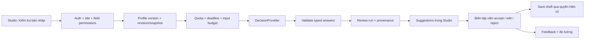

# Jev content decisions — Thiết kế triển khai dự kiến

Epic: [#507](https://github.com/khuepm/LumiBase/issues/507).
Thiết kế này là kế hoạch; tên endpoint/bảng mới cần chốt trong task contract trước khi code.

## Luồng MVP

Provider lỗi đi vào explicit error/unknown, không vào nhánh nội dung an toàn. Raw `/ai/decisions` là primitive; review API gắn với item/profile để người dùng không phải tự cung cấp câu hỏi và context.

## Các ranh giới

1. **Provider adapter:** HTTP contract, retry/deadline, runtime validation, probabilities/score semantics. Không có quyền ghi CMS.
2. **Governed decision service:** principal/site authorization, quota/cost, field projection, audit, kill switch. Raw API, review và Flows tái dùng lớp này.
3. **Review profiles và runs:** criteria version, allowed taxonomy, content revision, provenance và feedback. Tái dùng schema/service hiện có nếu đáp ứng yêu cầu; tránh bảng hoặc lớp governance trùng.
4. **Studio/SDK:** hiển thị kết quả, stale state và human feedback; không giữ provider secret. Write qua luồng CMS hiện có.
5. **Automation:** có explicit branches và action gate, tách phán đoán khỏi authorization. Chỉ mở sau measurement gate.

## Contract cần chốt ở J05/J07

- Request nhận profile reference + item revision hoặc validated unsaved snapshot; site/principal lấy từ middleware, không tin siteId do body tự khai.
- Run lưu id, site, principal, item/snapshot hash, revision, profile version, actual model/provider, answers, calibrated flag, status và usage/latency nếu biết.
- Status phân biệt success, error/unavailable, unknown/abstained và stale; không dùng cùng shape để giả success.
- Feedback gắn run và từng suggestion; accept/edit/reject có idempotency và quyền riêng.
- Profile configuration là authoritative input; nội dung bài là untrusted data. Không cho nội dung bài thay quyền, rubric hoặc system instruction.
- Versioned model được ưu tiên khi benchmark/automation; đổi alias/model/profile cần đánh giá lại ngưỡng và cache invalidation.
- Nếu có cache, key gồm site, projection/permission boundary, profile/model version và content hash; không chia kết quả qua tenant/principal không được phép.

## Thứ tự giao việc

- A: J01 → J02; J03 sau J01. Cùng ownership provider file nên tích hợp tuần tự.
- B: J04 → J05 → J07 → J08. J06 cần provider/profile ổn định; chuẩn bị dataset trước được, live evaluation sau dependencies. J09 chỉ nghiệm thu sau J06 + J08.
- C: J10 sau J09; J11 và J12 sau J10 + J06. Chưa dispatch khi phase B chưa đạt gate.

Không tự spawn agent hoặc mở các phiên triển khai từ kế hoạch này. Mỗi lần giao việc cần exact file ownership và baseline mới; tôn trọng edits của người khác.

## Verification và rollout

- Unit/property: malformed output, probability invariants, deadline/retry, weighted score.
- API/DB: deny trước fetch, cross-tenant/field access, quota race, stale revisions, idempotency, migrations trên DB riêng.
- SDK/Studio: error contracts, browser/shell API base/auth, editor review/apply/feedback, không tự publish.
- Flows: chứng minh node thực thi ở true/false/unknown/error và async quyền được re-resolve.
- Live contract: TypeSafe/OpenRouter với synthetic/permitted samples, key opt-in, không log credential.
- Product eval: VI/EN held-out + pilot baseline; báo sample counts, failures và uncertainty, không quảng bá số chưa đo.
- Rollout: opt-in suggestion → measured pilot → shadow automation → low-risk automation theo gate. Kill switch được thử ở mọi entry point.

## Backlog và Projects

GitHub Issues là backlog đang dùng. Project #7 không truy cập được bằng credentials hiện có; tạo project mới dưới owner `khuepm` cũng bị từ chối. Token owner thiếu `read:project`; account đang active thiếu quyền tạo project cho owner. Không thay đổi token scopes, login hoặc gắn vào project khác trong lượt lập kế hoạch.

Khi có quyền Projects, thêm epic và 12 child issues hiện có vào board, giữ issue IDs. Không tạo bản sao hoặc migration trạng thái bằng suy đoán. Trước đó scope/acceptance nằm trên issue, tất cả task mới ở backlog và chưa assign.
