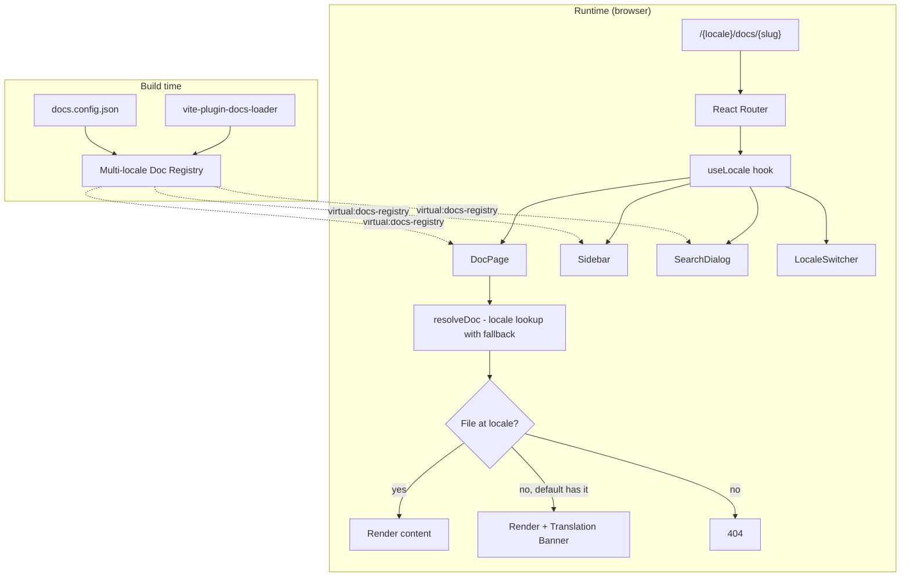

# Tài liệu Thiết kế: LumiBase Docs i18n

## Overview

Mở rộng `apps/docs` để phục vụ Markdown ở nhiều ngôn ngữ qua URL prefix `/{locale}/docs/{slug}`. Default locale là `en`. Cấu trúc thư mục `docs/{locale}/...` mirror nhau giữa các locale. Khi file thiếu ở locale active, viewer fallback về default locale và hiển thị banner. Locale list khai báo trong `docs.config.json.i18n` để mở rộng dễ dàng.

Triển khai chia 5 layer:

- **Layer 1 — Filesystem migration**: move `docs/*` → `docs/en/*`.
- **Layer 2 — Plugin (build-time)**: `vite-plugin-docs-loader` đọc tất cả locale folder, build registry per-locale + cross-locale fallback metadata.
- **Layer 3 — Routing**: thêm prefix locale vào React Router, redirect từ URL legacy.
- **Layer 4 — UI**: `useLocale` hook, `LocaleSwitcher`, UI strings dictionary, translation banner trong DocPage.
- **Layer 5 — Search**: index theo locale, switch index khi locale thay đổi.

Triển khai không yêu cầu backend — toàn bộ logic xảy ra ở build time và client side.

## Architecture



### Quyết định kiến trúc

1. **Locale là first-class citizen ở plugin layer**: registry chứa `docIndexByLocale: Record<locale, Record<slug, DocEntry>>` thay vì flatten — giúp fallback và search per-locale rẻ.
2. **Fallback xảy ra ở component layer (DocPage)**, không ở plugin: registry chỉ mô tả "ở đâu có gì". Component query theo logic `(locale, slug)` rồi quyết định fallback hay 404.
3. **Sidebar tree là union của tất cả locale**: hiển thị toàn bộ slug của default locale (giúp user thấy mọi tài liệu hiện có); slug nào thiếu ở locale active được mark visually.
4. **localStorage chỉ ảnh hưởng `/`** (entry point), không override URL có prefix — tránh xung đột giữa URL canonical và preference.
5. **`docs.config.json` mở rộng tương thích**: cho phép `label` là string (cũ) hoặc object `{[locale]: string}` (mới) — không break config hiện tại.

## Components and Interfaces

### Layer 1 — Filesystem migration

Move `docs/*` → `docs/en/*`. Giữ git history bằng `git mv`. Sau migration:

```
docs/
├── en/
│   ├── README.md
│   ├── architecture/
│   ├── data-model.md
│   ├── features/
│   │   ├── ai-copilot.md
│   │   └── ...
│   └── roadmap/
└── vi/      # rỗng ban đầu, sẽ thêm dần
```

### Layer 2 — Multi-locale plugin

```typescript
// apps/docs/src/plugins/vite-plugin-docs-loader.ts (mở rộng)

export interface DocEntry {
  slug: string;
  locale: string;          // mới
  title: string;
  filePath: string;        // tương đối với docsRootDir, vd "en/features/ai-copilot.md"
  content: string;
  lastModified?: string;
}

export interface MultiLocaleDocRegistry {
  /** locales[] và defaultLocale tham chiếu config */
  locales: string[];
  defaultLocale: string;
  /** Tất cả entries, flat */
  docList: DocEntry[];
  /** Index per locale */
  docIndexByLocale: Record<string, Record<string, DocEntry>>;
  /** Tree per locale — chỉ chứa slug đã có file ở locale ấy */
  docTreeByLocale: Record<string, DocNode[]>;
  /** Tree union — slug union của tất cả locale, dùng cho Sidebar UI */
  docTreeUnion: DocNode[];
  /** Set slug theo locale, để UI mark "missing" */
  docSlugsByLocale: Record<string, Set<string>>;
}

export interface VitePluginDocsLoaderOptions {
  docsDir?: string;        // root của tất cả locale, default ../../docs
  config?: { i18n: { locales: string[]; defaultLocale: string } };
}
```

Plugin discover: `glob(docsDir + '/{locale}/**/*.md')` cho mỗi locale trong `i18n.locales`. Slug = path relative to `docs/{locale}/` without `.md`.

Virtual module export đầy đủ:

```typescript
declare module 'virtual:docs-registry' {
  export const locales: string[];
  export const defaultLocale: string;
  export const localeNames: Record<string, string>;
  export const docList: DocEntry[];
  export const docIndexByLocale: Record<string, Record<string, DocEntry>>;
  export const docTreeByLocale: Record<string, DocNode[]>;
  export const docTreeUnion: DocNode[];
  export const docSlugsByLocale: Record<string, string[]>;  // serialize set as array

  // Backward-compat aliases (default locale view)
  export const docIndex: Record<string, DocEntry>;
  export const docTree: DocNode[];
}
```

### Layer 3 — Routing

```typescript
// apps/docs/src/router.tsx
const knownLocales = locales;   // từ registry
const defaultLocale = registry.defaultLocale;

export const router = createBrowserRouter([
  // Root → default locale README
  { path: '/', element: <Navigate to={`/${defaultLocale}/docs/README`} replace /> },

  // Legacy prefix-less URL → redirect to default locale
  { path: '/docs/*', element: <LegacyRedirect /> },

  // Locale-prefixed routes
  {
    path: '/:locale',
    element: <LocaleGuard><Layout /></LocaleGuard>,
    children: [
      { index: true, element: <Navigate to="docs/README" replace /> },
      { path: 'docs/*', element: <DocPage /> },
    ],
  },

  { path: '*', element: <NotFoundPage /> },
]);
```

`LocaleGuard` validate `params.locale` ∈ `knownLocales`, ngược lại render NotFoundPage. `LegacyRedirect` đọc slug từ wildcard và redirect về `/{defaultLocale}/docs/{slug}`.

### Layer 4 — Hooks & Components

```typescript
// apps/docs/src/hooks/useLocale.ts
export function useLocale(): {
  locale: string;
  defaultLocale: string;
  locales: string[];
  setLocale: (next: string, slug?: string) => void;
};
```

- Đọc locale từ `useParams().locale`. Nếu thiếu hoặc không hợp lệ, return `defaultLocale`.
- `setLocale(next, slug)` → `navigate('/' + next + '/docs/' + (slug ?? 'README'))`.
- Side-effect: ghi `localStorage['lumibase-docs:locale'] = next` cho lần sau truy cập `/`.

```typescript
// apps/docs/src/components/LocaleSwitcher.tsx
export function LocaleSwitcher() {
  const { locale, locales, setLocale } = useLocale();
  const slug = useCurrentSlug();           // helper extract slug from pathname
  // Render dropdown — items với localeNames[loc] ?? loc
}
```

```typescript
// apps/docs/src/translations/ui.ts
export const ui = {
  'navbar.docs':       { en: 'Docs',     vi: 'Tài liệu' },
  'search.placeholder': { en: 'Search documentation…', vi: 'Tìm tài liệu…' },
  'search.no-results':  { en: 'No results found for "{q}"', vi: 'Không có kết quả cho "{q}"' },
  'search.min-chars':   { en: 'Type at least 2 characters to search', vi: 'Gõ ít nhất 2 ký tự để tìm' },
  'notfound.title':     { en: 'Document Not Found', vi: 'Không tìm thấy tài liệu' },
  'notfound.home':      { en: 'Back to home', vi: 'Về trang chủ' },
  'banner.translation-pending': {
    en: 'This page has not been translated yet. Showing the {default} version.',
    vi: 'Trang này chưa được dịch. Đang hiển thị bản {default}.',
  },
  'sidebar.empty':      { en: 'No documents found.', vi: 'Chưa có tài liệu.' },
  'footer.copyright':   { /* fallback to docs.config */ } /* ... */,
} satisfies Record<string, Record<string, string>>;

export function t(key: keyof typeof ui, locale: string, params?: Record<string, string>): string {
  const dict = ui[key];
  const raw = dict[locale] ?? dict[defaultLocale] ?? key;
  return params ? raw.replace(/\{(\w+)\}/g, (_, k) => params[k] ?? '') : raw;
}
```

### Layer 5 — Search

```typescript
// apps/docs/src/lib/search.ts (mở rộng)
const indexes: Map<string, MiniSearch> = new Map();

export function getSearchIndex(locale: string): MiniSearch {
  if (indexes.has(locale)) return indexes.get(locale)!;
  const docs = docIndexByLocale[locale] ?? {};
  const idx = new MiniSearch({ /* ... */ });
  idx.addAll(Object.values(docs));
  indexes.set(locale, idx);
  return idx;
}

export function search(locale: string, query: string): SearchResult[] {
  const idx = getSearchIndex(locale);
  return idx.search(query, { /* ... */ }).map(/* ... */);
}
```

`SearchDialog` consume `useLocale()` rồi gọi `search(locale, query)`. Index khác nhau lazy build, không tốn build-time CPU.

## Data Models

### Multi-locale Doc Registry (in-memory)

```json
{
  "locales": ["en", "vi"],
  "defaultLocale": "en",
  "localeNames": { "en": "English", "vi": "Tiếng Việt" },
  "docList": [
    {
      "slug": "README",
      "locale": "en",
      "title": "LumiBase Documentation",
      "filePath": "en/README.md",
      "content": "...",
      "lastModified": "2025-01-01T..."
    },
    {
      "slug": "features/ai-copilot",
      "locale": "vi",
      "title": "AI Copilot",
      "filePath": "vi/features/ai-copilot.md",
      "content": "..."
    }
  ],
  "docIndexByLocale": {
    "en": { "README": {/*entry*/}, "features/ai-copilot": {/*entry*/} },
    "vi": { "features/ai-copilot": {/*entry*/} }
  }
}
```

### URL parsing

| URL | locale | slug |
|-----|--------|------|
| `/en/docs/README` | `en` | `README` |
| `/vi/docs/features/ai-copilot` | `vi` | `features/ai-copilot` |
| `/docs/README` | `en` (legacy redirect) | `README` |
| `/` | redirect → `/en/docs/README` | — |
| `/zz/docs/anything` | invalid → 404 | — |

### docs.config.json (mở rộng)

```jsonc
{
  "i18n": {
    "defaultLocale": "en",
    "locales": ["en", "vi"],
    "localeNames": { "en": "English", "vi": "Tiếng Việt" }
  },
  "navbar": {
    "items": [
      {
        "label": { "en": "Docs", "vi": "Tài liệu" },
        "to": "/docs/README"
      }
    ]
  }
}
```

## Correctness Properties

### Property 1: Locale prefix idempotency

Với mọi `locale L ∈ locales` và mọi `slug s` (string không null), đường dẫn được build bằng `pathFor(L, s) === '/' + L + '/docs/' + s`, sau đó parse lại bằng `parseUrl(path)` phải trả về `{ locale: L, slug: s }`.

**Validates: Requirements 2.1, 2.2**

### Property 2: Fallback chain correctness

Với mọi `locale L` và mọi `slug s`, gọi `resolveDoc(L, s)`:

- Nếu `docs/{L}/{s}.md` tồn tại trong registry → trả về entry có `locale === L`.
- Nếu không tồn tại nhưng `docs/{defaultLocale}/{s}.md` tồn tại → trả về entry có `locale === defaultLocale` kèm flag `isFallback: true`.
- Nếu không có ở bất kỳ locale nào → trả về `null`.

Tóm lại, kết quả không bao giờ là một entry có `locale !== L && locale !== defaultLocale`.

**Validates: Requirements 4.1, 4.2, 4.3**

### Property 3: Sidebar union completeness

Với mọi locale `L` và `s ∈ docTreeUnion`, `s` phải tồn tại trong ít nhất một locale (`∃ L' : s ∈ docSlugsByLocale[L']`). Ngược lại, nếu `s ∈ docSlugsByLocale[L']`, thì `s ∈ docTreeUnion`.

**Validates: Requirements 4.4, 4.5**

### Property 4: Search locale isolation

Với mọi locale `L` và mọi query `q`, `search(L, q)` chỉ trả về kết quả `r` có `r.slug ∈ docSlugsByLocale[L]`.

**Validates: Requirements 5.1, 5.2, 5.3**

## Error Handling

| Tình huống | Xử lý | Hiển thị |
|------------|--------|---------|
| Locale param không hợp lệ trong URL | LocaleGuard render NotFound | 404 page |
| Slug không tồn tại ở locale active | resolveDoc fallback default locale | DocPage + Translation Banner |
| Slug không tồn tại ở bất kỳ locale | DocPage navigate to /404 | NotFoundPage |
| `defaultLocale` không nằm trong `locales` | Plugin throw Error tại build time | Build fail with rõ error |
| `docs/{locale}/` rỗng hoặc không tồn tại | Plugin tạo entries rỗng cho locale đó, không throw | Sidebar fallback default tree, UI vẫn hoạt động |
| `localStorage` không khả dụng (private mode) | useLocale catch và bỏ qua | Không persist preference |
| Front matter lỗi parse | Như cũ: log warning, exclude file | File không xuất hiện trong registry |

## Testing Strategy

### Unit tests

| Module | File | Coverage |
|--------|------|----------|
| Plugin | `src/plugins/__tests__/multi-locale-registry.test.ts` | Build registry với 2-3 locale, slug khác nhau, default fallback metadata |
| Hook | `src/hooks/__tests__/useLocale.test.ts` | URL có/không có locale prefix, invalid locale, setLocale nav, localStorage persist |
| Search | `src/lib/__tests__/search.locale.test.ts` | Index isolated per locale, switch locale refresh |
| DocPage fallback | `src/pages/__tests__/DocPage.fallback.test.tsx` | Banner hiển/không, 404 cho slug missing |
| Locale Switcher | `src/components/__tests__/LocaleSwitcher.test.tsx` | Render từ config, click triggers nav, highlight active |
| `t()` helper | `src/translations/__tests__/t.test.ts` | Lookup, fallback default, param interpolation |

### Property tests

| Property | File | Iterations |
|----------|------|-----------|
| 1 — prefix idempotency | `src/lib/__tests__/url.property.test.ts` | ≥100 |
| 2 — fallback chain | `src/lib/__tests__/resolveDoc.property.test.ts` | ≥100 |
| 3 — sidebar union | `src/plugins/__tests__/tree-union.property.test.ts` | ≥100 |
| 4 — search isolation | `src/lib/__tests__/search.locale.property.test.ts` | ≥100 |

### Integration test (smoke)

- Boot full app với 2 locale (en, vi); verify navbar Locale Switcher; navigate switcher → URL change; ToC + Sidebar render đúng theo locale.

### CI

`pnpm --filter @lumibase/docs typecheck && test --run && build` phải xanh. Build-time error nếu config invalid (defaultLocale ∉ locales) — verify bằng test riêng có inject config xấu.
