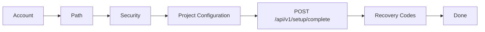

# Design Document — Project Configuration Setup Step

## Overview

Tài liệu thiết kế cho bước **Project Configuration** trong LumiBase Setup Wizard. Bước này được thêm vào luồng setup lần đầu để operator cấu hình thông tin nhận diện cơ bản của project trước khi hoàn tất instance.

Phạm vi phiên bản hiện tại:

- Cho phép nhập **default language**.
- Cho phép nhập **site URL**.
- Cho phép nhập **display title** hiển thị trong Studio và metadata project.
- Hiển thị vùng **theme overview** ở trạng thái disabled để giới thiệu hướng nâng cấp sau.
- Chưa implement chọn/sửa/applied theme trong phiên bản hiện tại.

Mục tiêu UX: sau khi tạo admin account, chọn private admin path, và cấu hình security, operator có một bước rõ ràng để đặt nhận diện mặc định cho site. Theme xuất hiện như một capability có định hướng nhưng không tạo kỳ vọng rằng nó đã dùng được.

## Setup Flow

Luồng setup dự kiến sau khi thêm bước này:

1. Account — tạo bootstrap admin.
2. Path — chọn private admin path.
3. Security — cấu hình login lockout/anomaly policy.
4. Project — cấu hình project metadata.
5. Recovery — lưu backup codes.
6. Done — hoàn tất setup.

Project step phải chạy trước Recovery vì `POST /api/v1/setup/complete` là điểm commit setup duy nhất. Recovery chỉ hiển thị backup codes sau khi setup complete thành công.



## User Experience

### Step Layout

Route đề xuất: `/setup/project`.

Tên bước trong progress indicator: **Project**.

Heading: **Configure your project**.

Supporting copy: giải thích ngắn rằng các giá trị này có thể chỉnh lại sau trong Settings, còn theme hiện chỉ là preview định hướng.

Fields:

| Field | Required | Input | Notes |
| --- | --- | --- | --- |
| Default language | Yes | Select/search select | Mặc định `en`. Lưu dạng BCP 47 cơ bản như `en`, `vi`, `ja`, `fr`. |
| Site URL | Yes | URL input | Canonical public URL, ví dụ `https://example.com`. Dùng cho metadata, preview, webhook/email link sau này. |
| Display title | Yes | Text input | Tên hiển thị của project trong Studio, browser title, và future public metadata. |
| Theme | No | Disabled theme preview | Không submit theme ở phiên bản hiện tại. |

### Validation

Client-side validation mirror backend rules:

- `defaultLanguage`: required, lowercase language tag, allow common BCP 47 subset: `^[a-z]{2,3}(-[A-Z]{2})?$`.
- `siteUrl`: required, must parse as `http:` or `https:`, no trailing whitespace, normalized by removing trailing slash except root.
- `displayTitle`: required, trimmed length 2–80, no control characters.
- `theme`: omitted from request or sent as `null`; server ignores it for now.

Validation should behave like the updated Path step: errors clear while the user is still focused in the field after a short debounce, not only on blur.

### Disabled Theme Area

The Theme section should be visible but disabled:

- Show selected future theme name: **Horizon**.
- Show a short preview card using static tokens from the design overview below.
- Disable all theme controls.
- Add copy: **Theme customization is coming in a future release.**
- Do not store theme values in setup payload yet.
- Do not apply theme CSS variables to the running Studio UI yet.

This gives product direction without silently introducing a half-working theme system.

## Data Model

Use an existing settings/config table if available. If setup needs a dedicated shape, store under a single project-level key:

```ts
type ProjectConfiguration = {
  defaultLanguage: string;
  siteUrl: string;
  displayTitle: string;
  theme: null;
};
```

Suggested settings key:

```text
project_configuration
```

Canonical JSON:

```json
{
  "defaultLanguage": "en",
  "siteUrl": "https://example.com",
  "displayTitle": "LumiBase",
  "theme": null
}
```

Do not persist the disabled Horizon theme object in the current release. Theme design tokens live in this design document until the theme system is implemented.

## API Contract

Extend `POST /api/v1/setup/complete` request body:

```ts
{
  setupToken?: string;
  account: {
    email: string;
    password: string;
    firstName: string;
    lastName: string;
  };
  adminPath: string;
  policy: LockoutPolicyFormValues;
  project: {
    defaultLanguage: string;
    siteUrl: string;
    displayTitle: string;
    theme?: null;
  };
}
```

Response remains compatible:

```ts
{
  user: {
    id: string;
    email: string;
    firstName: string;
    lastName: string;
  };
  adminPath: string;
  backupCodes: string[];
  setupToken: null;
}
```

Future extension may include returned project config, but current setup flow does not need it to proceed.

Error handling:

- `400 VALIDATION_ERROR`: malformed project config.
- `404 ALREADY_INITIALIZED`: setup already completed.
- `409 SETUP_IN_PROGRESS`: concurrent setup attempt.
- Existing path/security errors remain unchanged.

## Frontend Design

Add files following the current setup step pattern:

```text
apps/studio/src/modules/setup/steps/step-project.tsx
apps/studio/src/modules/setup/schemas/project.ts
apps/studio/src/modules/setup/steps/__tests__/step-project.test.tsx
```

Step state mirrors existing in-memory draft pattern:

```ts
let projectDraft: ProjectConfigurationFormValues | null = null;

export function getProjectDraft(): ProjectConfigurationFormValues | null;
export function clearProjectDraft(): void;
```

`setup-store.ts` should add a persisted boolean:

```ts
projectValid: boolean;
setProjectValid(value: boolean): void;
```

No secret values live in this step, but keeping the draft in memory maintains consistency with existing setup steps and avoids accidental stale setup payloads after refresh.

Routing updates:

- Register `/setup/project`.
- Change Security submit navigation from `/setup/recovery` to `/setup/project`.
- Project submit calls `POST /setup/complete`, stores returned backup codes in memory, then navigates to `/setup/recovery`.
- Deep-link guard order becomes Account → Path → Security → Project → Recovery → Done.

## Backend Design

Setup service updates:

1. Validate `project` payload inside `SetupService.complete`.
2. Normalize `siteUrl` before persistence.
3. Persist project config in the same transaction as user/admin path/policy.
4. Include project config write in setup audit metadata, excluding future theme token bodies.

Transaction order:

1. Lock `system_state`.
2. Validate account, admin path, policy, project.
3. Create bootstrap user.
4. Store admin path and policy.
5. Store project configuration.
6. Generate and hash backup codes.
7. Mark setup initialized.
8. Commit.
9. Emit non-blocking audit events.

## Theme Overview — Horizon

Theme support is intentionally disabled in the current version. The following overview is a future-facing design reference for the first bundled theme.

### Theme Metadata

```yaml
name: Horizon
colors:
  surface: '#f9f9f9'
  surface-dim: '#dadada'
  surface-bright: '#f9f9f9'
  surface-container-lowest: '#ffffff'
  surface-container-low: '#f3f3f4'
  surface-container: '#eeeeee'
  surface-container-high: '#e8e8e8'
  surface-container-highest: '#e2e2e2'
  on-surface: '#1a1c1c'
  on-surface-variant: '#5a413b'
  inverse-surface: '#2f3131'
  inverse-on-surface: '#f0f1f1'
  outline: '#8e7069'
  outline-variant: '#e3beb6'
  surface-tint: '#b42907'
  primary: '#b42907'
  on-primary: '#ffffff'
  primary-container: '#ff5e3a'
  on-primary-container: '#5c0e00'
  inverse-primary: '#ffb4a3'
  secondary: '#635d5a'
  on-secondary: '#ffffff'
  secondary-container: '#e6ded9'
  on-secondary-container: '#67625e'
  tertiary: '#615e57'
  on-tertiary: '#ffffff'
  tertiary-container: '#98938b'
  on-tertiary-container: '#2f2c26'
  error: '#ba1a1a'
  on-error: '#ffffff'
  error-container: '#ffdad6'
  on-error-container: '#93000a'
  background: '#f9f9f9'
  on-background: '#1a1c1c'
  surface-variant: '#e2e2e2'
typography:
  fontFamily: Plus Jakarta Sans
rounded:
  sm: 0.5rem
  DEFAULT: 1rem
  md: 1.5rem
  lg: 2rem
  xl: 3rem
  full: 9999px
spacing:
  unit: 8px
  container-max: 1280px
  gutter: 24px
  margin-mobile: 20px
  margin-desktop: 40px
```

### Brand and Style

Horizon follows a **Solar Modernism** aesthetic: luminous, warm, tactile, and premium. It combines high-end glassmorphism with organic warmth. The UI should feel optimistic and technically polished without becoming corporate or cold.

### Colors

The palette centers on a high-energy orange, supported by soft whites, warm greys, and deep charcoal text.

- Primary action and brand highlight: `#FF5E3A`.
- Base surfaces: clean whites and soft greys.
- Typography and icon color: deep charcoal for reliable contrast.
- Future implementation should map these tokens to LumiBase semantic CSS variables rather than hardcoding raw color values across components.

### Typography

Horizon uses **Plus Jakarta Sans**. Headlines use strong weights and tight-but-readable spacing. Body text uses generous line height. Mobile headings should cap around 32px to avoid awkward wrapping.

### Layout and Spacing

Layout follows an 8px spacing rhythm, with breathable desktop margins and reduced mobile margins. Theme preview cards in setup should use stable dimensions so the disabled state does not shift the form layout.

### Elevation and Depth

The future theme system may support:

- Glass surfaces with 20px–30px blur.
- Soft translucent borders.
- Ambient shadows using low-opacity warm tones.

These effects are not applied globally in the current release.

### Shapes

Horizon favors soft roundedness:

- Buttons and inputs: 16px radius.
- Cards: 32px radius.
- Large featured surfaces: 48px radius.

Current setup UI should not adopt these values automatically until theme application is implemented.

## Non-Goals

- No live theme switching in current setup.
- No custom theme editor.
- No importing/exporting theme JSON.
- No applying Horizon tokens to Studio runtime.
- No public site rendering changes.
- No per-user language preference; `defaultLanguage` is project-level only.

## Testing Strategy

Frontend:

- Schema tests for default language, URL normalization, and display title.
- Component tests for required fields and disabled theme controls.
- Router guard tests for Account → Path → Security → Project → Recovery → Done.
- Mutation test verifying `project` is included in setup complete payload.

Backend:

- Setup integration test persists project configuration atomically.
- Validation tests reject invalid language, URL, and title.
- Regression test confirms `theme` is ignored or stored as `null`.
- Audit metadata test confirms project config summary is logged without future theme token bodies.

## Rollout Plan

Phase 1 — Current release:

- Add Project Configuration step.
- Persist language, site URL, and display title.
- Show disabled Horizon theme preview.

Phase 2 — Future release:

- Add theme registry.
- Store selected theme id.
- Apply theme tokens to Studio via semantic CSS variables.
- Add theme preview and import/export workflow.

