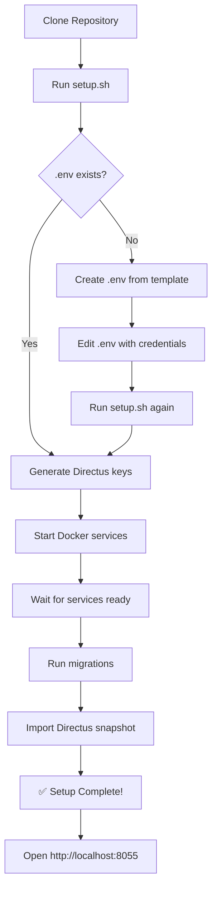
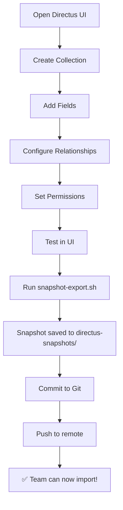
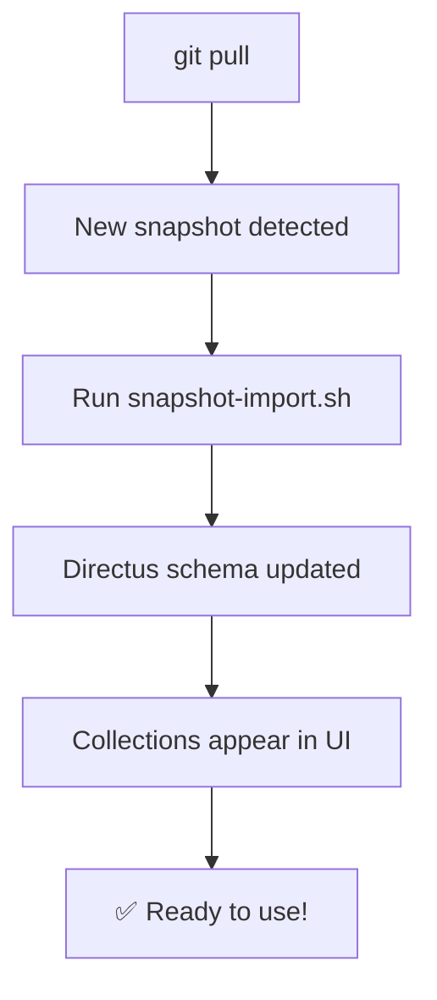
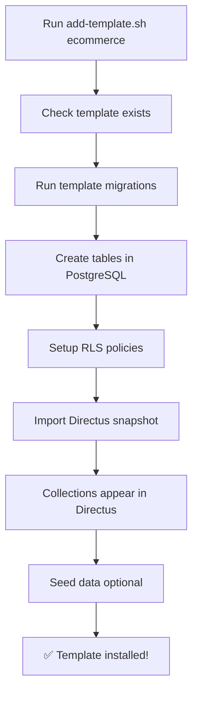

# 🔄 LumiBase Packaging Workflow

## 📊 Visual Workflows

### Workflow 1: Initial Setup (End User)



### Workflow 2: Create Collections (Developer)



### Workflow 3: Use Collections (Team Member)



### Workflow 4: Add Template



## 🏗️ Architecture Layers

```
┌─────────────────────────────────────────────────────────┐
│                     End User Layer                       │
│  (Clone → Setup → Use)                                   │
└─────────────────────────────────────────────────────────┘
                          ↓
┌─────────────────────────────────────────────────────────┐
│                   Automation Layer                       │
│  (Scripts: setup.sh, migrate.sh, snapshot-*.sh)         │
└─────────────────────────────────────────────────────────┘
                          ↓
┌─────────────────────────────────────────────────────────┐
│                   Template Layer                         │
│  (Pre-built: ecommerce, blog, saas)                     │
└─────────────────────────────────────────────────────────┘
                          ↓
┌─────────────────────────────────────────────────────────┐
│                   Migration Layer                        │
│  (SQL files: 001_*.sql, 002_*.sql)                      │
└─────────────────────────────────────────────────────────┘
                          ↓
┌─────────────────────────────────────────────────────────┐
│                   Snapshot Layer                         │
│  (Directus YAML: base-snapshot.yaml)                    │
└─────────────────────────────────────────────────────────┘
                          ↓
┌─────────────────────────────────────────────────────────┐
│                   Infrastructure Layer                   │
│  (Docker: PostgreSQL + Directus)                        │
└─────────────────────────────────────────────────────────┘
```

## 🔄 Data Flow

### Creating Collections

```
Developer
    ↓
Directus UI (Create Collection)
    ↓
PostgreSQL (Table created)
    ↓
snapshot-export.sh
    ↓
YAML file (directus-snapshots/)
    ↓
Git commit
    ↓
Remote repository
```

### Using Collections

```
Remote repository
    ↓
git pull
    ↓
YAML file (directus-snapshots/)
    ↓
snapshot-import.sh
    ↓
Directus (Schema applied)
    ↓
PostgreSQL (Tables created)
    ↓
User sees collections in UI
```

## 📦 Template System Flow

```
Template Definition
    ├── migrations/
    │   ├── 001_create_tables.sql
    │   └── 002_setup_rls.sql
    ├── directus-snapshot.yaml
    ├── seed-data.sql (optional)
    └── README.md
         ↓
add-template.sh <template-name>
         ↓
    ┌────┴────┐
    ↓         ↓
Migrations  Snapshot
    ↓         ↓
PostgreSQL  Directus
    ↓         ↓
    └────┬────┘
         ↓
  ✅ Template Ready
```

## 🎯 Resource Optimization Strategies

### Strategy 1: Shared PostgreSQL

```
┌─────────────────────────────────────────┐
│     Shared PostgreSQL Container         │
│  ┌─────────┬─────────┬─────────────┐   │
│  │ DB: app1│ DB: app2│ DB: app3    │   │
│  └─────────┴─────────┴─────────────┘   │
└─────────────────────────────────────────┘
         ↓           ↓           ↓
    ┌────────┐  ┌────────┐  ┌────────┐
    │Directus│  │Directus│  │Directus│
    │  App1  │  │  App2  │  │  App3  │
    └────────┘  └────────┘  └────────┘

Saves: ~500MB RAM per project
```

### Strategy 2: Cloud-Based

```
┌──────────────┐
│  Your App    │
└──────┬───────┘
       │
   ┌───┴────────────────────────────┐
   │                                 │
   ↓                                 ↓
┌──────────────┐            ┌──────────────┐
│  Supabase    │            │  Railway.app │
│  (PostgreSQL)│            │  (Directus)  │
└──────────────┘            └──────────────┘
   Free: 500MB                Free tier

Saves: All local resources
```

### Strategy 3: Docker Profiles

```bash
# Development: Only what you need
docker-compose --profile db up      # PostgreSQL only
docker-compose --profile cms up     # Directus only
docker-compose --profile full up    # Everything

# Production: Cloud-based
# No local Docker needed
```

## 🔐 Security Flow

### Row Level Security (RLS)

```
User Request
    ↓
JWT Token (from Firebase)
    ↓
Supabase API
    ↓
Extract firebase_uid from JWT
    ↓
PostgreSQL RLS Policy Check
    ↓
    ├─ Match: Return data
    └─ No match: Return 403
```

### RLS Policy Example

```sql
-- Users can only see own orders
CREATE POLICY "Users can view own orders"
    ON public.orders FOR SELECT
    USING (auth.uid() = user_id);

-- Flow:
-- 1. User sends request with JWT
-- 2. Supabase extracts firebase_uid from JWT
-- 3. PostgreSQL checks: auth.uid() = user_id
-- 4. If true: return data
-- 5. If false: return empty result
```

## 📊 Comparison Matrix

### Distribution Methods

| Method | Setup Time | Update Ease | Customization | Resource Usage |
|--------|-----------|-------------|---------------|----------------|
| **GitHub Template** | 5 min | Manual | ⭐⭐⭐⭐⭐ | Medium |
| **NPM Package** | 2 min | Automatic | ⭐⭐⭐ | Medium |
| **Docker Image** | 1 min | Automatic | ⭐⭐ | High |
| **Shared PostgreSQL** | 10 min | Manual | ⭐⭐⭐⭐⭐ | Low |
| **Cloud-Based** | 15 min | Automatic | ⭐⭐⭐⭐ | None |

### Template Complexity

| Template | Tables | Relations | RLS Policies | Setup Time |
|----------|--------|-----------|--------------|------------|
| **Base** | 1 | 0 | 4 | Included |
| **E-commerce** | 7 | 6 | 15 | 2 min |
| **Blog** | 5 | 4 | 10 | 2 min |
| **SaaS** | 6 | 5 | 12 | 2 min |
| **Social** | 8 | 8 | 20 | 3 min |

## 🎨 Template Architecture

### E-commerce Template

```
users (base)
    ↓
products ← product_images
    ↓
product_categories → categories
    ↓
order_items → orders → order_status_history
```

### Blog Template (Coming Soon)

```
users (base)
    ↓
posts ← post_tags → tags
    ↓
comments
```

### SaaS Template (Coming Soon)

```
users (base)
    ↓
organizations ← organization_members
    ↓
teams ← team_members
    ↓
subscriptions
```

## 🚀 Deployment Flow

### Development → Production

```
Development (Local)
    ↓
Git commit & push
    ↓
CI/CD Pipeline
    ├─ Run tests
    ├─ Build Docker images
    └─ Deploy to staging
         ↓
Manual approval
    ↓
Production Deployment
    ├─ Run migrations
    ├─ Import snapshots
    └─ Start services
         ↓
    ✅ Live!
```

## 📈 Scaling Strategy

### Phase 1: Single Instance (MVP)

```
┌─────────────────────────┐
│   Single Server         │
│  ┌──────────────────┐   │
│  │   PostgreSQL     │   │
│  └──────────────────┘   │
│  ┌──────────────────┐   │
│  │   Directus       │   │
│  └──────────────────┘   │
└─────────────────────────┘

Users: 0-1,000
Cost: $0-20/month
```

### Phase 2: Separated Services (Growth)

```
┌──────────────┐     ┌──────────────┐
│  Supabase    │     │  Railway.app │
│  (Database)  │ ←── │  (Directus)  │
└──────────────┘     └──────────────┘

Users: 1,000-10,000
Cost: $20-100/month
```

### Phase 3: Distributed (Scale)

```
┌──────────────┐     ┌──────────────┐
│  Supabase    │     │  Directus    │
│  (Primary)   │     │  (Multiple)  │
└──────┬───────┘     └──────────────┘
       │
       ├─ Read Replica 1
       ├─ Read Replica 2
       └─ Read Replica 3

Users: 10,000+
Cost: $100+/month
```

## 💡 Best Practices Flow

### Development Workflow

```
1. Create feature branch
    ↓
2. Make changes in Directus
    ↓
3. Export snapshot
    ↓
4. Write migration (if needed)
    ↓
5. Test locally
    ↓
6. Commit & push
    ↓
7. Create PR
    ↓
8. Review & merge
    ↓
9. Team pulls & imports
```

### Migration Workflow

```
1. Identify change needed
    ↓
2. Write SQL migration
    ↓
3. Test migration locally
    ↓
4. Test rollback (if possible)
    ↓
5. Commit migration
    ↓
6. Document in README
    ↓
7. Team runs migrate.sh
```

## 🎯 Success Metrics

### For End Users

- ✅ Setup time < 5 minutes
- ✅ Zero configuration needed
- ✅ Works out of the box
- ✅ Clear documentation

### For Developers

- ✅ Easy to add collections
- ✅ Easy to share changes
- ✅ Easy to customize
- ✅ Easy to maintain

### For Teams

- ✅ Consistent environments
- ✅ Version controlled schema
- ✅ Easy onboarding
- ✅ Collaborative workflow

---

**Visual guides help understanding! 📊**
