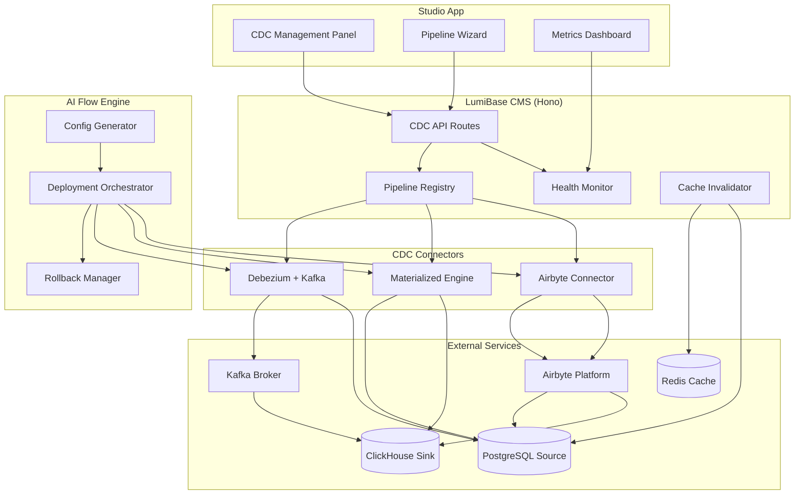

# CDC Architecture Overview

The ClickHouse CDC system is a multi-layered subsystem of the LumiBase CMS (`apps/cms`). It captures row-level changes from PostgreSQL and delivers them to ClickHouse for analytics, while keeping the Redis cache fresh. This page covers the system diagram, the role of each component, the data flow, and the deployment topology. It satisfies the architecture-overview portion of **Requirement 9.1**.

## System layers

1. **Pipeline Registry** — Configuration store for CDC pipeline definitions, persisted in PostgreSQL with encrypted connection parameters.
2. **CDC Connectors** — Three pluggable replication strategies (Debezium+Kafka, ClickHouse Materialized Engine, Airbyte) behind a common `CdcConnector` interface.
3. **Cache Invalidator** — A CDC event consumer that automatically refreshes Redis cache when configuration tables change.
4. **Studio CDC Panel** — A React management UI in the Studio app for pipeline CRUD, monitoring, and guided setup.
5. **AI Flow Engine** — An automation layer that generates deployment configurations and orchestrates provisioning.
6. **Health Monitor** — A metrics emission and alerting subsystem that tracks pipeline health and triggers notifications.

## System diagram



If your viewer does not render Mermaid, the same topology in ASCII:

```
                +-------------------- LumiBase CMS (Hono) --------------------+
   Studio UI -->| CDC API Routes --> Pipeline Registry --> [ Connectors ]     |
   AI Flow   -->|        |                  |               Debezium+Kafka    |
                |        +--> Health Monitor |               Materialized Eng |
                |             Cache Invalidator               Airbyte         |
                +------------|----------------|---------------|---------------+
                             v                v               v
                          Redis           PostgreSQL       ClickHouse
                          Cache         (Source WAL /      (Sink / OLAP)
                                         replication slot)
                                              ^   Debezium publishes to
                                              |   Kafka topics --> ClickHouse
                                           Kafka Broker
```

## Component responsibilities

### Pipeline Registry (`packages/database/src/schema/cdc.ts`, `apps/cms/src/modules/cdc/registry/`)

Stores pipeline configurations in PostgreSQL. Connection parameters for the Source_Database, ClickHouse_Sink, and intermediary services (Kafka or Airbyte) are stored **encrypted**. Pipeline identifiers are `nanoid` strings. Limits: 128-character maximum pipeline name and at most 50 pipelines per site.

**Delete flow (Requirement 1.8):** `delete(siteId, pipelineId)` resolves the pipeline's connector and calls `connector.destroy(pipelineId)` **before** removing the registry record. For replication-slot-based approaches (Debezium+Kafka and Materialized Engine), `destroy()` releases and drops the corresponding PostgreSQL replication slot (e.g. via `pg_drop_replication_slot`) so the Source_Database does not retain WAL files indefinitely. The record is deleted only after slot cleanup succeeds.

### CDC Connectors (`apps/cms/src/modules/cdc/connectors/`)

A strategy pattern abstracting the three approaches behind a common interface:

```typescript
interface CdcConnector {
  readonly type: CdcConnectorType; // 'debezium_kafka' | 'materialized_engine' | 'airbyte'
  provision(config: ConnectorConfig): Promise<ProvisionResult>;
  start(pipelineId: string): Promise<void>;
  stop(pipelineId: string): Promise<void>;
  healthCheck(pipelineId: string): Promise<HealthCheckResult>;
  getMetrics(pipelineId: string): Promise<PipelineMetrics>;
  destroy(pipelineId: string): Promise<void>;
}
```

- **`DebeziumKafkaConnector`** — Registers the Debezium connector, creates per-table Kafka topics, and wires the ClickHouse Kafka table engine. Buffers events locally during a Kafka outage (1 hour / 500 MB cap) and preserves order on recovery. `destroy()` drops the PostgreSQL replication slot.
- **`MaterializedEngineConnector`** — Manages the ClickHouse `MaterializedPostgreSQL` database/table creation and the replication-slot lifecycle, including exponential-backoff reconnection and schema-drift detection. `destroy()` detaches the database and drops the replication slot.
- **`AirbyteConnector`** — Manages the Airbyte source/destination/connection via the Airbyte API. Not replication-slot-based, so `destroy()` removes the Airbyte resources without slot cleanup.

### Cache Invalidator (`apps/cms/src/modules/cdc/cache-invalidator.ts`)

Translates CDC change events into Redis operations: INSERT → SET (pre-warm), UPDATE → SET (refresh), DELETE → DEL. It deduplicates **consecutive UPDATE** events for the same key within a 1-second window; INSERT/DELETE events are never deduplicated and flush any pending UPDATE first to preserve ordering. During a Redis outage it buffers up to 10,000 events (dropping the oldest on overflow) and replays them in order on reconnection.

### Health Monitor (`apps/cms/src/modules/cdc/health-monitor.ts`)

Emits metrics (replication lag, events/sec, error count) at 30-second intervals, raises a warning when lag exceeds the configured threshold (default 60s, range 10s–3600s), raises a critical alert when a pipeline stays in error for more than 5 minutes, and emits a recovery notification on an error→active transition. Health history is retained for at least 7 days.

### AI Flow Engine (`apps/cms/src/modules/cdc/ai-flow/`)

- **Config Generator** (`config-generator.ts`) — Pure function `generateConfig(approach, target)` that returns the full `EnvironmentConfig` (variables + services) for a given approach and deployment target. It is the source of truth for the [Environment Variables](./environment-variables.md) reference.
- **Deployment Orchestrator** (`deployment-orchestrator.ts`) — Provisions each service as an ordered step (honouring `dependsOn`), rolls back completed steps in reverse order on failure, and runs a post-deployment connectivity health check (30s budget).
- **Rollback Manager** (`rollback-manager.ts`) — Undoes completed steps in reverse order within a 60-second budget.

### CDC API Routes (`apps/cms/src/modules/cdc/routes.ts`)

RESTful endpoints mounted under `/api/v1/cdc/`. The router is admin-gated and site-scoped; connection secrets are write-only and never echoed back.

| Method | Path | Description |
|--------|------|-------------|
| POST | `/pipelines` | Create a new pipeline |
| GET | `/pipelines` | List all pipelines for the site |
| GET | `/pipelines/:id` | Get pipeline details |
| PATCH | `/pipelines/:id` | Update pipeline config |
| DELETE | `/pipelines/:id` | Delete pipeline (+ replication slot cleanup) |
| POST | `/pipelines/:id/start` | Start replication |
| POST | `/pipelines/:id/stop` | Stop replication |
| GET | `/pipelines/:id/health` | Run a connectivity health check |
| GET | `/pipelines/:id/metrics` | Get current metrics |
| GET | `/pipelines/:id/metrics/history` | Get historical metrics |
| POST | `/deploy` | Trigger an AI deployment flow |
| POST | `/deploy/validate-env` | Validate environment variables |
| POST | `/deploy/:id/rollback` | Roll back a deployment |

## Data flow per approach

**Debezium + Kafka:** PostgreSQL WAL → Debezium (Kafka Connect) → Kafka topics (one per table) → ClickHouse Kafka table engine → materialized view → ClickHouse target table. Events are ingested within 30 seconds of publication under normal operation.

**Materialized Engine:** PostgreSQL replication slot → ClickHouse `MaterializedPostgreSQL` engine → replicated tables. Replication lag stays ≤ 10 seconds under normal conditions.

**Airbyte:** Airbyte source (PostgreSQL) → Airbyte connection (full-refresh or incremental CDC, on a 5-minute–24-hour schedule) → Airbyte destination (ClickHouse). The Pipeline Registry records the last-sync timestamp and record count on completion.

**Cache invalidation (all approaches):** Configuration-table changes in PostgreSQL are observed and turned into Redis cache operations within 5 seconds of commit.

## Deployment topology

The CDC system supports two deployment targets that map to a scoped split of responsibilities, aligned with LumiBase's dual-runtime architecture:

- **Docker Compose / managed-services target (`docker_compose`)** — Hosts the **full stateful CDC stack**: Kafka Broker, Debezium Connector, ClickHouse Sink, Materialized Engine, and Airbyte Connector. These run as Docker Compose containers on a shared network or as external managed services (Confluent Cloud for Kafka, ClickHouse Cloud for the sink, Airbyte Cloud). All stateful connectors, the message bus, and replication engines live here because they require long-lived TCP connections, persistent local buffers, and replication-slot ownership.
- **Cloudflare Workers target (`cloudflare_workers`)** — Hosts **only the lightweight edge components**: the CDC API/control-plane endpoints and the Cache_Invalidator (webhook/event-driven logic). The Workers runtime talks to the stateful stack over HTTPS. Because of V8 isolate CPU/memory limits and the absence of long-lived TCP connections, Cloudflare Workers **cannot** host stateful CDC connectors, the Kafka message bus, or the replication engines. A `cloudflare_workers` deployment therefore **always depends on** a companion `docker_compose` (or managed-services) deployment for the stateful stack.

```
   docker_compose / managed services            cloudflare_workers
   (full stateful stack)                         (edge components only)
   +-------------------------------+             +--------------------------+
   | Kafka Broker                  |   HTTPS     | CDC API / Control Plane  |
   | Debezium Connector            |<------------| Cache_Invalidator        |
   | ClickHouse Sink               |             +--------------------------+
   | Materialized Engine           |                        |
   | Airbyte Connector             |                        v
   +-------------------------------+                      Redis Cache
```

See the two deployment guides for step-by-step instructions:

- [Deployment — Docker Compose / managed services](./deployment-docker-compose.md)
- [Deployment — Cloudflare Workers (edge only)](./deployment-cloudflare-workers.md)

## Next steps

- Choose an approach with the [decision-criteria table](./README.md#decision-criteria-choosing-an-approach).
- Follow the matching setup guide: [Debezium+Kafka](./setup-debezium-kafka.md), [Materialized Engine](./setup-materialized-engine.md), or [Airbyte](./setup-airbyte.md).
- Review the [Environment Variables](./environment-variables.md) reference.
