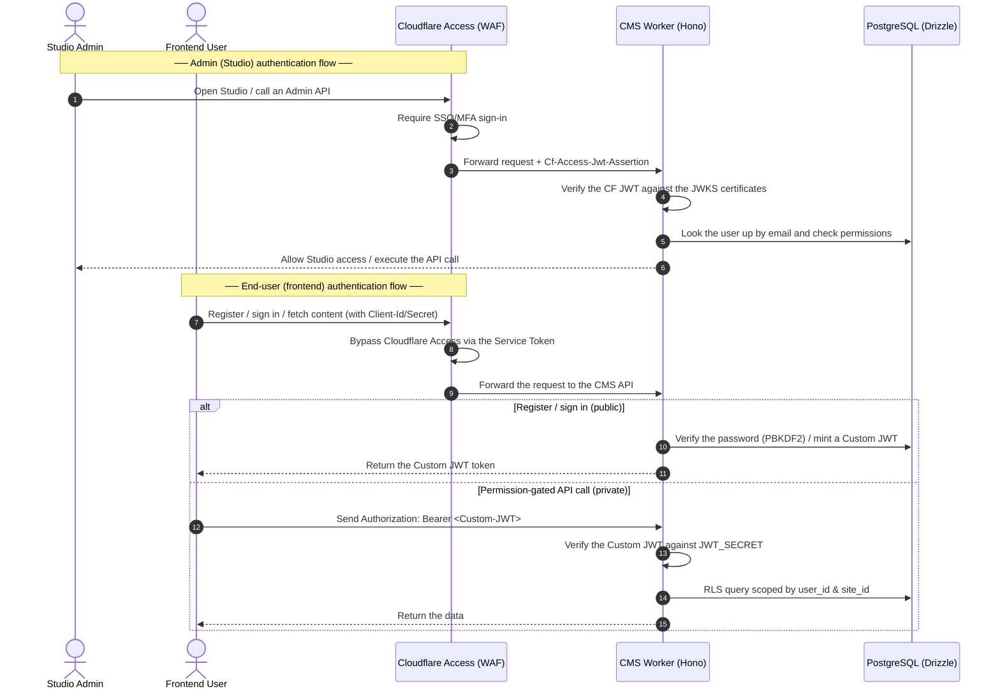

# Cloudflare Access & Custom JWT Authentication

This document explains in detail how to configure — and how the system behaves for — authentication and authorization combining **Cloudflare Access** (for Admin/Studio) with **Custom JWT** (for frontend end-users).

---

## 1. Architecture overview

Lumibase uses a hybrid authentication model:
1. **Studio admins (the management surface)**: protected by Cloudflare Zero Trust (Access). On successful sign-in, Cloudflare Access automatically attaches a JWT assertion in the `Cf-Access-Jwt-Assertion` header.
2. **Frontend end-users**: register and sign in directly through the Hono CMS API's custom auth endpoints (`/auth/register`, `/auth/login`). These return a Custom JWT signed with the Web Crypto API (HS256).
3. **Bypassing Cloudflare Access for API calls**: frontend clients calling the API need to bypass Cloudflare Access using a **Cloudflare Service Token** (sent in the `CF-Access-Client-Id` and `CF-Access-Client-Secret` headers).



---

## 2. Authentication

### A. Configuring Cloudflare Access (for Studio & the Admin API)

To configure Cloudflare Access in the Cloudflare dashboard:

1. **Create an application**:
   - Go to **Zero Trust** → **Access** → **Applications**.
   - Click **Add an application** → choose **Self-hosted**.
   - Configure the domains:
     - Application URL: `studio.yourdomain.com` (your Studio hostname).
     - Application URL: `api.yourdomain.com/api/v1/admin/*` (the dangerous admin endpoints).
2. **Configure identity providers**:
   - Add providers such as Google Workspace, GitHub, Microsoft Azure AD, or Email OTP.
3. **Configure a policy**:
   - Choose who may access it (for example, only emails on your company domain `@yourcompany.com`).
4. **Collect the configuration values for the CMS Worker**:
   - **Audience (AUD)**: taken from **Application Audience (AUD)** in the application's settings in Cloudflare.
   - **Certificates URL**: Cloudflare's public JWKS address, used to verify the token signature:
     `https://<your-team-domain>.cloudflareaccess.com/cdn-cgi/access/certs`
   - Put these into `.dev.vars` (for local runs) or into Cloudflare environment variables:
     - `CF_ACCESS_CERTS_URL`
     - `CF_ACCESS_AUDIENCE`

### B. Configuring a bypass Service Token (for frontend clients)

So your frontend applications can call the CMS API (fetch articles, register a user, …) without Cloudflare Access intercepting them with a login page:

1. **Create a Service Token**:
   - In Cloudflare Zero Trust → **Access** → **Service Tokens** → choose **Create Service Token**.
   - Name it (e.g. `lumibase-frontend-api`) and copy the `Client ID` and `Client Secret`.
2. **Add a policy for the public endpoints**:
   - Open the application protecting your API.
   - Create a new policy with the action **Bypass**.
   - Under **Rules** → choose **Include** → choose **Service Token** → select the `lumibase-frontend-api` token you just created.
3. **Call the API from the frontend**:
   - Every request your frontend sends to the CMS API must carry these two headers:
     ```http
     CF-Access-Client-Id: <client-id>
     CF-Access-Client-Secret: <client-secret>
     ```

### C. Local development (dev mock)
When running locally (with `LUMIBASE_DEV_AUTH="true"` in `.dev.vars`), you can skip Cloudflare Access entirely by sending a mock token:
- Send the header `Authorization: Bearer dev:<email>:<role>` (e.g. `Authorization: Bearer dev:admin@lumibase.dev:admin`).
- The CMS Worker resolves it to an admin user on the site being operated on.

---

## 3. Authorization

Once a request passes through the `withAuth()` middleware, the system sets a uniform authentication object on the context at `c.get('auth')` (the `AuthPrincipal` interface):

```typescript
export interface AuthPrincipal {
  externalId?: string; // For admins (holds sub/email from Cloudflare Access)
  userId?: string;     // For frontend users (holds the underlying PostgreSQL id)
  email?: string;      // Identifying email
  roles?: string[];    // Role list (e.g. ['admin'] or ['member'])
  isFrontendUser?: boolean; // true when signed in via Custom JWT
}
```

### A. Baseline authorization (role-based access control)
How a user's permissions are checked:
1. **Admin (isFrontendUser = false)**:
   - The system matches the `externalId` (or email) from the Cloudflare Access JWT against the `users` table in Postgres.
   - If the user does not exist in the DB yet, it is registered automatically (JIT provisioning) with status `active`.
   - Roles/policies are configured directly from the Studio admin pages.
2. **End-users (isFrontendUser = true)**:
   - The register and sign-in APIs are exempt from the auth check via path bypasses:
     `/api/v1/auth/register` and `/api/v1/auth/login`.
   - All other APIs verify the Custom JWT signature (`JWT_SECRET`).
   - By default, after a successful sign-in an end-user is assigned the `member` role bound to the request's `site_id`.

### B. Multi-tenancy security (row-level security)
Lumibase enforces strict multi-tenancy at the database layer, using Hono's `withRls()` middleware together with PostgreSQL row-level security (RLS):

1. **Resolve the site**: the `withTenant()` middleware reads the `X-Lumi-Site` header to get the current `siteId`.
2. **Set the DB context**: `withRls()` executes:
   ```sql
   SELECT set_config('app.site_id', '<siteId>', true);
   ```
3. **RLS policy**: every subsequent query (via Drizzle ORM) is filtered automatically by Postgres according to:
   ```sql
   CREATE POLICY tenant_isolation_policy ON <table_name>
   FOR ALL USING (site_id = current_setting('app.site_id'));
   ```
   *This means a user or admin of one site cannot read or write another site's data at all — even if some code is buggy and omits its WHERE clause.*
