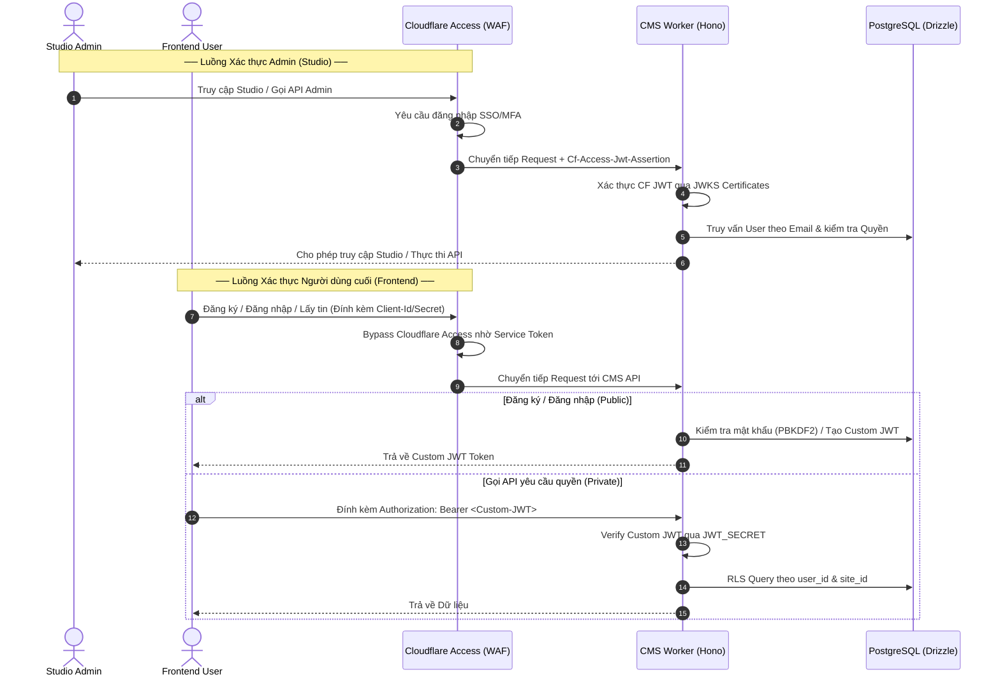

# Cloudflare Access & Custom JWT Authentication

Tài liệu này hướng dẫn chi tiết cách cấu hình và hoạt động của hệ thống xác thực (Authentication) và phân quyền (Authorization) kết hợp giữa **Cloudflare Access** (dành cho Admin/Studio) và **Custom JWT** (dành cho Frontend End-Users).

---

## 1. Tổng quan Kiến trúc (Architecture Overview)

LumiBase sử dụng mô hình xác thực Hybrid:
1. **Studio Admins (Môi trường Quản lý)**: Được bảo vệ bởi Cloudflare Zero Trust (Access). Khi đăng nhập thành công, Cloudflare Access tự động đính kèm JWT assertion trong header `Cf-Access-Jwt-Assertion`.
2. **Frontend End-Users (Người dùng cuối)**: Đăng ký và đăng nhập trực tiếp qua Custom Auth endpoints (`/auth/register`, `/auth/login`) của Hono CMS API. Trả về Custom JWT ký bằng Web Crypto API (HS256).
3. **Bypass Cloudflare Access cho API**: Các client ở frontend gọi API cần bypass Cloudflare Access thông qua **Cloudflare Service Token** (được đính kèm trong header `CF-Access-Client-Id` và `CF-Access-Client-Secret`).



---

## 2. Phần Xác thực (Authentication)

### A. Cấu hình Cloudflare Access (Cho Studio & Admin API)

Để cấu hình Cloudflare Access trên Cloudflare Dashboard:

1. **Tạo Application**:
   - Truy cập **Zero Trust** -> **Access** -> **Applications**.
   - Nhấp vào **Add an application** -> Chọn **Self-hosted**.
   - Cấu hình Domain:
     - Application URL: `studio.yourdomain.com` (Tên miền của Studio).
     - Application URL: `api.yourdomain.com/api/v1/admin/*` (Các endpoints Admin nguy hiểm).
2. **Cấu hình Identity Providers**:
   - Thêm các nhà cung cấp như Google Workspace, GitHub, Microsoft AzureAD, hoặc Email OTP.
3. **Cấu hình Policy**:
   - Chọn đối tượng được truy cập (ví dụ: chỉ cho phép email thuộc domain công ty `@yourcompany.com`).
4. **Lấy tham số cấu hình cho CMS Worker**:
   - **Audience (AUD)**: Lấy từ mục **Application Audience (AUD)** ở phần settings của Application trên Cloudflare.
   - **Certificates URL**: Địa chỉ JWKS công khai của Cloudflare để xác thực chữ ký của token:
     `https://<your-team-domain>.cloudflareaccess.com/cdn-cgi/access/certs`
   - Cấu hình các tham số này vào file `.dev.vars` (khi chạy local) hoặc Cloudflare Environment Variables:
     - `CF_ACCESS_CERTS_URL`
     - `CF_ACCESS_AUDIENCE`

### B. Cấu hình Bypass Service Token (Cho Frontend Client)

Để các ứng dụng Frontend của bạn có thể gọi API tới CMS (ví dụ: lấy bài viết, đăng ký người dùng) mà không bị Cloudflare Access chặn lại hiển thị trang login:

1. **Tạo Service Token**:
   - Tại Cloudflare Zero Trust -> **Access** -> **Service Tokens** -> Chọn **Create Service Token**.
   - Đặt tên (ví dụ: `lumibase-frontend-api`) và copy lấy `Client ID` cùng `Client Secret`.
2. **Cấu hình Policy cho Endpoint công khai**:
   - Mở Application đã cấu hình bảo vệ API của bạn.
   - Tạo một Policy mới có Action là **Bypass**.
   - Trong phần **Rules** -> Chọn **Include** -> Chọn **Service Token** -> Chọn Token `lumibase-frontend-api` vừa tạo.
3. **Gọi API từ Frontend**:
   - Mọi request từ ứng dụng Frontend gửi lên API của CMS bắt buộc phải đính kèm 2 headers sau:
     ```http
     CF-Access-Client-Id: <client-id>
     CF-Access-Client-Secret: <client-secret>
     ```

### C. Môi trường Local Development (Dev Mock)
Khi chạy local dev (với biến `LUMIBASE_DEV_AUTH="true"` trong file `.dev.vars`), bạn có thể bỏ qua hoàn toàn Cloudflare Access bằng cách đính kèm token giả lập:
- Gửi header: `Authorization: Bearer dev:<email>:<role>` (ví dụ: `Authorization: Bearer dev:admin@lumibase.dev:admin`).
- CMS Worker sẽ tự động giải mã thành một Admin User thuộc site đang thao tác.

---

## 3. Phần Phân quyền (Authorization)

Khi một request đi qua middleware `withAuth()`, hệ thống sẽ thiết lập đối tượng xác thực đồng nhất vào context `c.get('auth')` (Interface `AuthPrincipal`):

```typescript
export interface AuthPrincipal {
  externalId?: string; // Dành cho Admin (chứa sub/email từ Cloudflare Access)
  userId?: string;     // Dành cho Frontend User (chứa id gốc trong PostgreSQL)
  email?: string;      // Email định danh
  roles?: string[];    // Danh sách vai trò (ví dụ: ['admin'] hoặc ['member'])
  isFrontendUser?: boolean; // true nếu đăng nhập qua Custom JWT
}
```

### A. Phân quyền ở mức Căn bản (Role-Based Access Control)
Quy trình kiểm tra quyền hạn của User:
1. **Admin (isFrontendUser = false)**:
   - Hệ thống so khớp `externalId` (hoặc email) lấy từ Cloudflare Access JWT với bảng `users` trong Postgres.
   - Nếu user chưa tồn tại trong DB, hệ thống sẽ tự động đăng ký mới (JIT provisioning) với trạng thái `active`.
   - Quyền hạn (Roles/Policies) được cấu hình trực tiếp từ trang quản trị Studio.
2. **End-Users (isFrontendUser = true)**:
   - Các API đăng ký và đăng nhập được miễn kiểm tra xác thực nhờ cấu hình bypass đường dẫn:
     `/api/v1/auth/register` và `/api/v1/auth/login`.
   - Các API còn lại kiểm tra tính hợp lệ của chữ ký Custom JWT (`JWT_SECRET`).
   - Mặc định sau khi đăng nhập thành công, End-user được gán vai trò `member` gắn với `site_id` của request.

### B. Bảo mật Multi-Tenancy (Row-Level Security)
LumiBase thực thi multi-tenancy nghiêm ngặt ở tầng database nhờ middleware `withRls()` của Hono kết hợp với cơ chế Row-Level Security (RLS) của PostgreSQL:

1. **Xác định Site**: `withTenant()` middleware đọc header `X-Lumi-Site` để lấy `siteId` hiện tại.
2. **Thiết lập DB context**: `withRls()` thực thi câu lệnh SQL:
   ```sql
   SELECT set_config('app.site_id', '<siteId>', true);
   ```
3. **RLS Policy**: Mọi câu lệnh truy vấn dữ liệu sau đó (Drizzle ORM) sẽ được Postgres tự động lọc điều kiện RLS dựa trên cấu hình:
   ```sql
   CREATE POLICY tenant_isolation_policy ON <table_name>
   FOR ALL USING (site_id = current_setting('app.site_id'));
   ```
   *Điều này đảm bảo người dùng hoặc admin của site này hoàn toàn không thể đọc/ghi dữ liệu của site khác, ngay cả khi viết code lỗi thiếu điều kiện WHERE.*
