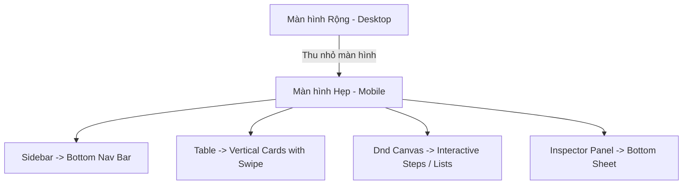

# Đánh giá UI/UX và Định hướng Cải tiến Lumibase Studio

Tài liệu này đánh giá hiện trạng trải nghiệm người dùng (UX) và giao diện (UI) của Lumibase Studio hiện tại, chỉ ra các điểm nghẽn (Friction Points) và đưa ra các đề xuất thiết kế cụ thể để nâng cao chất lượng sản phẩm.

---

## 1. Đánh giá Hiện trạng & Điểm nghẽn (Friction Points)

Qua phân tích cấu trúc mã nguồn của `apps/studio` và đặc tả cũ, chúng tôi nhận thấy các vấn đề trải nghiệm người dùng sau đây cần được cải tiến triệt để:

### 1.1 Khó khăn trên Thiết bị Di động (Mobile Limitations)
* **Sidebar dạng cứng (Static Sidebar)**: Navigation sidebar chiếm nhiều diện tích ngang, không tối ưu cho điện thoại màn hình nhỏ.
* **Bảng dữ liệu (Data Tables)**: Chế độ xem danh sách nội dung dạng bảng phẳng (Table) bị tràn ngang nghiêm trọng trên màn hình hẹp, bắt buộc người dùng phải cuộn ngang liên tục để đọc dữ liệu.
* **Kéo thả mô hình & luồng (Data Model & Flows Canvas)**: Việc dựng bảng dữ liệu hoặc vẽ luồng tự động hóa bằng kéo thả chuột trên Canvas gần như bất khả thi trên màn hình cảm ứng di động.

### 1.2 Điểm nghẽn trong Luồng Soạn thảo (Content Editor Friction)
* **Lưu thay đổi thụ động**: Việc thiếu thanh trạng thái lưu trữ nổi khiến người dùng bối rối không biết dữ liệu đã được lưu hay chưa. Trải nghiệm bấm nút "Lưu" thủ công và đợi tải trang làm gián đoạn dòng tập trung (flow state).
* **Ghi đè dữ liệu realtime (Overwrite Collision)**: Khi nhiều admin cùng mở một bài viết để biên tập, việc thiếu cảnh báo trực quan dễ dẫn đến tình huống người lưu sau ghi đè đè lên nội dung người lưu trước.

### 1.3 Thiếu Phản hồi Động & Tải bất đồng bộ (Missing State Feedback)
* **Giao diện đơ khi tải nặng**: Khi truy vấn danh sách lớn hoặc lưu cấu hình hệ thống phức tạp, giao diện thường hiển thị spinner xoay tròn toàn màn hình (blocking loader), làm mất cảm giác liền mạch.
* **Xử lý lỗi thiếu ngữ cảnh**: Các thông báo lỗi từ API (như lỗi quyền, lỗi validate trường dữ liệu) thường hiển thị chung chung ở góc màn hình qua Toast, thay vì trỏ trực tiếp đến trường dữ liệu bị lỗi trong form.

---

## 2. Giải pháp Cải tiến UI/UX Toàn diện

Để khắc phục các điểm nghẽn trên, Lumibase thiết kế lại trải nghiệm với các cải tiến cụ thể:

### 2.1 Thiết kế Thích ứng Thông minh (Adaptive Design)

* **Bottom Navigation Bar (Mobile)**: Trên thiết bị di động, Sidebar điều hướng chính sẽ ẩn đi và chuyển thành một thanh tab điều hướng dưới đáy (Bottom Navigation Bar) chứa các module chính (Content, Files, Users, Settings) giúp dễ dàng thao tác bằng một ngón tay cái.
* **Card Swipe & Action Sheets**: Màn hình List View dạng bảng phẳng sẽ tự động chuyển thành danh sách các Thẻ (Card Layout) xếp dọc. Người dùng có thể vuốt (swipe) thẻ sang phải để sửa nhanh, vuốt sang trái để xóa nhanh. Bấm giữ thẻ sẽ mở Action Sheet chứa các tùy chọn bổ sung.
* **Mobile-friendly Canvas**: Trình dựng mô hình dữ liệu (Collections Builder) và thiết kế Flows sẽ tự động kích hoạt chế độ xem danh sách phân cấp (Hierarchy List view) trên thiết bị di động để người dùng có thể nhấp chọn thay vì bắt buộc phải kéo thả bằng chuột.

### 2.2 Luồng Soạn thảo Liền mạch (Frictionless Editor)
* **Realtime Avatars & Lock**: Ở đầu bài viết, hiển thị avatar động của các biên tập viên khác đang cùng xem bài viết đó. Khi một người bắt đầu gõ vào một trường dữ liệu (field), trường đó sẽ hiển thị đường viền màu và tên người đó (ví dụ: "Alex đang nhập...") đồng thời tạm thời khóa quyền chỉnh sửa trường đó từ các máy khách khác để tránh xung đột.
* **Sticky Action Bar**: Thanh lưu trữ nổi (floating action bar) được đặt cố định ở đáy màn hình biên tập với các phím nóng lưu nhanh. Đi kèm là chỉ báo trạng thái tự động lưu nháp (Auto-saved Draft) giúp người dùng yên tâm soạn thảo không lo mất dữ liệu.

### 2.3 Phản hồi Động & Phím tắt Nâng cao (State Feedback & Hotkeys)
* **Optimistic UI (Cập nhật lạc quan)**: Khi người dùng bấm Like, Thay đổi trạng thái bài viết hoặc Kéo thả thay đổi thứ tự hàng dữ liệu, giao diện sẽ phản hồi trạng thái thành công ngay lập tức trước khi nhận được phản hồi từ server. Nếu server báo lỗi, giao diện sẽ cuộn ngược (rollback) nhẹ nhàng và hiển thị thông báo.
* **Interactive Tooltips & Field Errors**: Các lỗi validate trường dữ liệu từ API sẽ được ánh xạ trực tiếp và hiển thị ngay dưới nhãn của trường đó bằng chữ màu đỏ kèm biểu tượng cảnh báo, đồng thời tự động cuộn form đưa trường bị lỗi vào vùng nhìn thấy của người dùng.
* **Hệ thống phím tắt toàn cục**:
  * `Cmd + K` hoặc `Ctrl + K`: Mở bảng tìm kiếm thông minh nhanh.
  * `Cmd + S` hoặc `Ctrl + S`: Lưu nhanh nội dung hiện tại mà không cần click chuột.
  * `Esc`: Đóng nhanh các drawer, modal, hoặc hủy tiêu điểm tìm kiếm.

### 2.4 Trải nghiệm Hiệu ứng Chuyển động Vi mô (Micro-animations Spec)

| Tương tác | Hiệu ứng Animation | Tần suất & Thời gian | Mục tiêu trải nghiệm |
| :--- | :--- | :--- | :--- |
| **Hover Button/Card** | Co giãn nhẹ (`scale(1.02)`), tăng nhẹ độ đổ bóng và độ sáng của nền. | `ease-out`, `150ms` | Tạo cảm giác phản hồi vật lý khi rê chuột. |
| **Open Modal/Drawer** | Modal: Phóng to từ tâm (`scale(0.95)` -> `1.0`); Drawer: Trượt từ mép phải màn hình sang trái. | `cubic-bezier(0.16, 1, 0.3, 1)`, `300ms` | Tạo cảm giác mượt mà, định hình không gian giao diện. |
| **Delete Row/Card** | Hàng co ngắn chiều cao (`height` về 0) đồng thời mờ dần (`opacity` về 0). | `ease-in`, `200ms` | Giúp mắt người dùng theo kịp sự thay đổi dữ liệu mà không bị giật màn hình. |
| **Realtime Indicator** | Nhịp thở nhẹ (`pulse`) đối với chấm xanh chỉ báo người dùng đang trực tuyến. | Vòng lặp liên tục, `2000ms` | Thu hút sự chú ý nhẹ nhàng vào chỉ báo trạng thái. |
