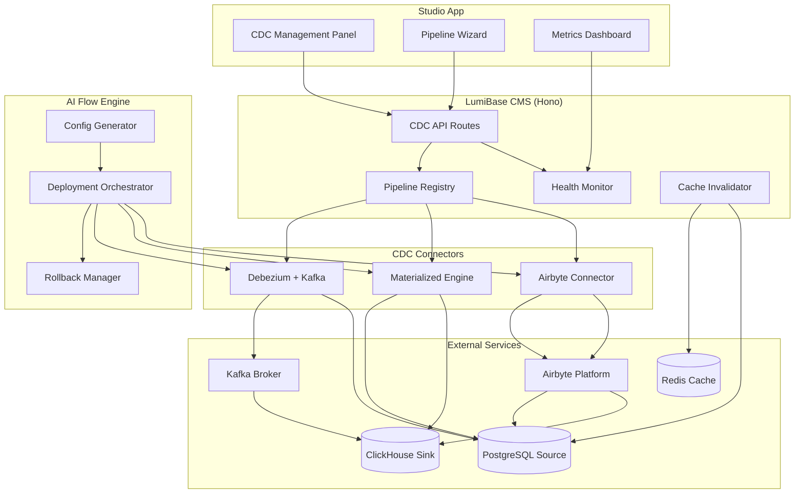

# Tổng quan kiến trúc CDC

Hệ thống ClickHouse CDC là một subsystem nhiều tầng của LumiBase CMS (`apps/cms`). Nó bắt các thay đổi ở mức row từ PostgreSQL và đưa chúng tới ClickHouse để phân tích, đồng thời giữ cho Redis cache luôn mới. Trang này nói về sơ đồ hệ thống, vai trò của từng thành phần, luồng dữ liệu, và topology deploy. Nó đáp ứng phần tổng quan kiến trúc của **Requirement 9.1**.

## Các tầng của hệ thống

1. **Pipeline Registry** — Nơi lưu cấu hình cho các định nghĩa CDC pipeline, được persist trong PostgreSQL với tham số kết nối đã mã hoá.
2. **CDC Connectors** — Ba chiến lược replication cắm-thay-được (Debezium+Kafka, ClickHouse Materialized Engine, Airbyte) nằm sau một interface `CdcConnector` chung.
3. **Cache Invalidator** — Một consumer của CDC event, tự động refresh Redis cache khi các table cấu hình đổi.
4. **Studio CDC Panel** — Một UI quản lý bằng React trong app Studio, để CRUD pipeline, monitor, và setup có hướng dẫn.
5. **AI Flow Engine** — Một tầng tự động hoá sinh ra cấu hình deploy và điều phối việc provision.
6. **Health Monitor** — Một subsystem phát metric và cảnh báo, theo dõi sức khoẻ pipeline và kích hoạt notification.

## Sơ đồ hệ thống



Nếu trình xem của bạn không render Mermaid, đây là cùng topology dưới dạng ASCII:

```
                +-------------------- LumiBase CMS (Hono) --------------------+
   Studio UI -->| CDC API Routes --> Pipeline Registry --> [ Connectors ]     |
   AI Flow   -->|        |                  |               Debezium+Kafka    |
                |        +--> Health Monitor |               Materialized Eng |
                |             Cache Invalidator               Airbyte         |
                +------------|----------------|---------------|---------------+
                             v                v               v
                          Redis           PostgreSQL       ClickHouse
                          Cache         (Source WAL /      (Sink / OLAP)
                                         replication slot)
                                              ^   Debezium publish lên
                                              |   Kafka topics --> ClickHouse
                                           Kafka Broker
```

## Trách nhiệm của từng thành phần

### Pipeline Registry (`packages/database/src/schema/cdc.ts`, `apps/cms/src/modules/cdc/registry/`)

Lưu cấu hình pipeline trong PostgreSQL. Tham số kết nối tới Source_Database, ClickHouse_Sink, và các service trung gian (Kafka hoặc Airbyte) được lưu **đã mã hoá**. Định danh pipeline là chuỗi `nanoid`. Giới hạn: tên pipeline dài tối đa 128 ký tự và tối đa 50 pipeline cho mỗi site.

**Luồng xoá (Requirement 1.8):** `delete(siteId, pipelineId)` resolve connector của pipeline rồi gọi `connector.destroy(pipelineId)` **trước khi** bỏ record trong registry. Với các cách tiếp cận dựa trên replication slot (Debezium+Kafka và Materialized Engine), `destroy()` giải phóng và drop replication slot tương ứng của PostgreSQL (ví dụ qua `pg_drop_replication_slot`) để Source_Database không giữ file WAL vô hạn. Record chỉ bị xoá sau khi việc dọn slot thành công.

### CDC Connectors (`apps/cms/src/modules/cdc/connectors/`)

Một strategy pattern trừu tượng hoá ba cách tiếp cận sau một interface chung:

```typescript
interface CdcConnector {
  readonly type: CdcConnectorType; // 'debezium_kafka' | 'materialized_engine' | 'airbyte'
  provision(config: ConnectorConfig): Promise<ProvisionResult>;
  start(pipelineId: string): Promise<void>;
  stop(pipelineId: string): Promise<void>;
  healthCheck(pipelineId: string): Promise<HealthCheckResult>;
  getMetrics(pipelineId: string): Promise<PipelineMetrics>;
  destroy(pipelineId: string): Promise<void>;
}
```

- **`DebeziumKafkaConnector`** — Đăng ký connector Debezium, tạo Kafka topic theo từng table, và nối Kafka table engine của ClickHouse. Buffer event cục bộ khi Kafka mất kết nối (cap 1 giờ / 500 MB) và giữ đúng thứ tự khi phục hồi. `destroy()` drop replication slot của PostgreSQL.
- **`MaterializedEngineConnector`** — Quản lý việc tạo database/table `MaterializedPostgreSQL` của ClickHouse và vòng đời của replication slot, bao gồm kết nối lại theo exponential backoff và phát hiện schema drift. `destroy()` detach database và drop replication slot.
- **`AirbyteConnector`** — Quản lý source/destination/connection của Airbyte qua Airbyte API. Không dựa trên replication slot, nên `destroy()` bỏ các tài nguyên Airbyte mà không cần dọn slot.

### Cache Invalidator — đã bị loại bỏ

Từng có module `CacheInvalidator` mirror các row change của CDC vào Redis dưới
`config:${table}:${recordId}`. Nó đã bị **loại bỏ** ở 0.26.0 và chưa bao giờ
được nối vào pipeline nào: key của nó thiếu `siteId` (vi phạm multi-tenancy) và
không khớp với các key theo tag mà đường đọc của CMS thực sự dùng. Việc
invalidate application cache diễn ra ở đường ghi qua API bằng
`CacheProvider.invalidateByTag`; với các đường ghi vòng qua API, hãy purge thủ
công bằng `POST /api/v1/utils/cache/purge`.

Xem [ADR-012](../architecture/decisions/adr-012-remove-cdc-cache-invalidator.md)
để biết quyết định và điều kiện để đưa nó trở lại. Phần dispatch change-feed của
CDC (webhook, extension) không bị ảnh hưởng.

### Health Monitor (`apps/cms/src/modules/cdc/health-monitor.ts`)

Phát metric (replication lag, event/giây, số lỗi) mỗi 30 giây, đưa ra cảnh báo khi lag vượt ngưỡng đã cấu hình (mặc định 60s, khoảng 10s–3600s), đưa ra cảnh báo critical khi một pipeline ở trạng thái lỗi hơn 5 phút, và phát notification phục hồi khi chuyển từ error→active. Lịch sử sức khoẻ được giữ ít nhất 7 ngày.

### AI Flow Engine (`apps/cms/src/modules/cdc/ai-flow/`)

- **Config Generator** (`config-generator.ts`) — Hàm thuần `generateConfig(approach, target)` trả về toàn bộ `EnvironmentConfig` (biến + service) cho một cách tiếp cận và một deployment target cho trước. Nó là source of truth cho tham chiếu [Environment Variables](./environment-variables.md).
- **Deployment Orchestrator** (`deployment-orchestrator.ts`) — Provision từng service như một bước có thứ tự (tôn trọng `dependsOn`), rollback các bước đã xong theo thứ tự ngược khi thất bại, và chạy một lượt health check kết nối sau khi deploy (ngân sách 30s).
- **Rollback Manager** (`rollback-manager.ts`) — Hoàn tác các bước đã xong theo thứ tự ngược, trong ngân sách 60 giây.

### CDC API Routes (`apps/cms/src/modules/cdc/routes.ts`)

Các endpoint RESTful mount dưới `/api/v1/cdc/`. Router bị chặn ở mức admin và scope theo site; secret kết nối là write-only và không bao giờ được trả lại.

| Method | Path | Mô tả |
|--------|------|-------------|
| POST | `/pipelines` | Tạo một pipeline mới |
| GET | `/pipelines` | Liệt kê mọi pipeline của site |
| GET | `/pipelines/:id` | Lấy chi tiết pipeline |
| PATCH | `/pipelines/:id` | Cập nhật config của pipeline |
| DELETE | `/pipelines/:id` | Xoá pipeline (+ dọn replication slot) |
| POST | `/pipelines/:id/start` | Khởi động replication |
| POST | `/pipelines/:id/stop` | Dừng replication |
| GET | `/pipelines/:id/health` | Chạy một lượt health check kết nối |
| GET | `/pipelines/:id/metrics` | Lấy metric hiện tại |
| GET | `/pipelines/:id/metrics/history` | Lấy metric lịch sử |
| POST | `/deploy` | Kích hoạt một AI deployment flow |
| POST | `/deploy/validate-env` | Validate các biến môi trường |
| POST | `/deploy/:id/rollback` | Rollback một lần deploy |

## Luồng dữ liệu theo từng cách tiếp cận

**Debezium + Kafka:** PostgreSQL WAL → Debezium (Kafka Connect) → Kafka topic (một cho mỗi table) → Kafka table engine của ClickHouse → materialized view → table đích trong ClickHouse. Event được ingest trong vòng 30 giây kể từ lúc publish, ở điều kiện vận hành bình thường.

**Materialized Engine:** Replication slot của PostgreSQL → engine `MaterializedPostgreSQL` của ClickHouse → các table được replicate. Replication lag giữ ở mức ≤ 10 giây trong điều kiện bình thường.

**Airbyte:** Airbyte source (PostgreSQL) → Airbyte connection (full-refresh hoặc incremental CDC, theo lịch 5 phút–24 giờ) → Airbyte destination (ClickHouse). Pipeline Registry ghi lại timestamp lần sync gần nhất và số record khi hoàn tất.

**Cache invalidation (mọi cách tiếp cận):** Các thay đổi ở table cấu hình trong PostgreSQL được quan sát và biến thành operation trên Redis cache trong vòng 5 giây kể từ lúc commit.

## Topology deploy

Hệ thống CDC hỗ trợ hai deployment target, tương ứng một cách chia trách nhiệm có phạm vi rõ ràng, khớp với kiến trúc dual-runtime của LumiBase:

- **Target Docker Compose / managed services (`docker_compose`)** — Host **toàn bộ stack CDC có state**: Kafka Broker, Debezium Connector, ClickHouse Sink, Materialized Engine, và Airbyte Connector. Chúng chạy như các container Docker Compose trên một network chung, hoặc như các managed service bên ngoài (Confluent Cloud cho Kafka, ClickHouse Cloud cho sink, Airbyte Cloud). Mọi connector có state, message bus, và các engine replication đều nằm ở đây vì chúng cần kết nối TCP sống lâu, buffer cục bộ bền, và quyền sở hữu replication slot.
- **Target Cloudflare Workers (`cloudflare_workers`)** — Chỉ host **các thành phần edge nhẹ**: các endpoint CDC API/control-plane và Cache_Invalidator (logic dạng webhook/event-driven). Runtime Workers nói chuyện với stack có state qua HTTPS. Vì giới hạn CPU/memory của V8 isolate và việc không có kết nối TCP sống lâu, Cloudflare Workers **không thể** host các CDC connector có state, message bus Kafka, hay các engine replication. Do đó một lần deploy `cloudflare_workers` **luôn phụ thuộc vào** một lần deploy `docker_compose` (hoặc managed services) đi kèm để có stack có state.

```
   docker_compose / managed services            cloudflare_workers
   (toàn bộ stack có state)                      (chỉ thành phần edge)
   +-------------------------------+             +--------------------------+
   | Kafka Broker                  |   HTTPS     | CDC API / Control Plane  |
   | Debezium Connector            |<------------| Cache_Invalidator        |
   | ClickHouse Sink               |             +--------------------------+
   | Materialized Engine           |                        |
   | Airbyte Connector             |                        v
   +-------------------------------+                      Redis Cache
```

Xem hai hướng dẫn deploy để có chỉ dẫn từng bước:

- [Deployment — Docker Compose / managed services](./deployment-docker-compose.md)
- [Deployment — Cloudflare Workers (chỉ edge)](./deployment-cloudflare-workers.md)

## Bước tiếp theo

- Chọn một cách tiếp cận bằng [bảng tiêu chí quyết định](./README.md#decision-criteria-choosing-an-approach).
- Làm theo hướng dẫn setup tương ứng: [Debezium+Kafka](./setup-debezium-kafka.md), [Materialized Engine](./setup-materialized-engine.md), hoặc [Airbyte](./setup-airbyte.md).
- Đọc lại tham chiếu [Environment Variables](./environment-variables.md).
